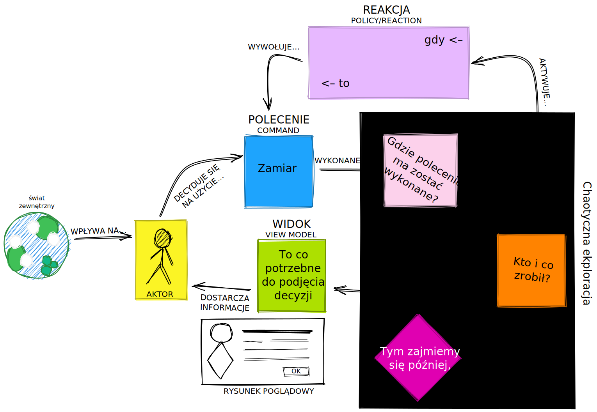
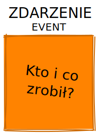

:toc:
== Wstęp

[quote, Alexey Zimarew, Domain-Driven Design dla .NET Core (DDDNetCore)]
Podstawowa koncepcja techniki EventStorming polega na zapewnieniu prostej notacji modelującej, używanej do wizualizacji zachowań systemu w sposób zrozumiały dla każdego.

[quote, Tomasz Stolarczyk, NAJobszerniejsze wprowadzenie do Event Stormingu. Z przykładem! [DevStyleStolarczyk]]
Jeśli chcemy pisać dobry kod, musimy rozumieć proces i model biznesowy, a tego nie dowiemy się lepiej od nikogo innego jak od biznesu i ekspertów domenowych.

indexterm:[Event Storming]
Metodę Event Stormingu opracował w 2013 roku Alberto Brandolini, polega ona na zebraniu faktów (zwanych także _zdarzeniami dziedzinowymi_), które się wydarzyły i są *nieodwracalne* w rozumieniu per se. 

Warsztaty w postaci Event Stormingu służą do wymiany wiedzy między uczestnikami, dlatego ważne jest, aby zaprosić ludzi z różnych kręgów: zarówno programistów jak i ekspertów dziedzinowych. 
W konsekwencji powodują one otwarcie silosów wiedzowych, wymiany doświadczeń pomiędzy nimi, co prowadzi dalej do zidentyfikowania możliwych problemów i usprawnień <<DDDNetCore>><<DevStyleStolarczyk>>.
W dalszej perspektywie Event storming pozwala na zamodelowanie architektury aplikacji, która zostanie przeniesiona do kodu – ta część nazywa się Event Storming: Desing Level i nie będzie tutaj omawiana. 

=== Jak wygląda główna część warsztatów – po krótce

indexterm:[Event Storming, Chaotic Exploration]
Na początku uczestnicy umieszają *pomarańczowe karteczki* z zdarzeniami domenowymi na ścianie.
Zależy nam tutaj, aby tej wiedzy pojawiło się jak najwięcej, dlatego nie przejmujemy się duplikacją lub chronologią. 
Każdy z uczestników w tym momencie będzie najpewniej zajmował się fragmentem, który zna najlepiej. 
Kiedy dojdzie do konfliktów związanych z tym, że nie wiadomo jak jakiś podsystem ma działać zaznaczamy to karteczką zwaną _hotspotem_ (z ang. _hot spot_ – gorące miejsce) lub karteczką _system zewnętrzny_ jeśli dotyczy to zewnętrznej integracji. 
Ważne jest to, abyśmy skupili się na *zdarzeniach, które dotyczą naszego systemu*, nie na tych, które dzieją się w świecie rzeczywistym lub w systemie towarzyszącym – choć i te warto umieścić na tablicy aby uzyskać lepszy kontekst. 
Tę część nazywamy *chaotyczną eksploracją* <<DevStyleStolarczyk>>.

Następnie na tablicy wprowadzamy oś czasu: układamy karteczki zgodnie z chronologią i wstępnie grupujemy w podsystemy. 
Przy okazji można usunąć duplikaty i ujednolicić język niektórych karteczek. 

indexterm:[Event Storming, Big Picture]
indexterm:[Event Storming, Process Level]
Te dwa elementy dają nam część zwaną *Big picture*. Po czym przechodzimy do *Process Level*. 
W tym momencie będziemy wchodzić w szczegóły związane z każdym z zdarzeń poprzez dodanie karteczek z:

* aktorami – osobami i systemami wywołującymi lub odbierającymi dane zdarzenie, 
* systemami – identyfikując zakresy odpowiedzialności, 
* reakcjami naszego systemu na poszczególne zdarzenia domenowe,
* widokami – na podstawie których użytkownik podejmuje decyzje. 

Dopiero mając tak usystematyzowany system zdarzeń przechodzimy do szczegółowego wyszukiwania możliwości i problemów, które również oznaczamy jako gorące miejsca. 
Na koniec wybieramy zagadnienie, którym będziemy chcieli się zająć – po krótkiej przerwie lub na osobnym spotkaniu <<DevStyleStolarczyk>>. 

Na koniec przechodzimy do etapu *Desing Level* na którym tworzymy model, który można przeniesć bezpośrednio do kodu.

NOTE: Ze względu na objętość tego artykułu oraz wiedzę z zakresu DDD potrzebną do wykorzystania tego etapu warsztatów pominąłem tę część warsztatów. 
Nie mniej, element *Big picture* można z powodzeniem wykorzystać do zamodelowania już istniejacego systemu w celu jego diagnozy i wymiany wiedzy. 

== Notacja 
Z racji, że Event Storming ma za zadanie zapewnić prostą notację, to przedstawmy ją poniżej: 

W trakcie przeglądu spotkałem się z dwoma podejściami do notacji. 
Oba w gruncie rzeczy reprezentują to samo:

#TODO: Dodać drugi obrazek#

.Obrazek, który wjaśnia wszystko – Alberto Brandolini – „Introducting Event Storming”

Cóż tu może się stać? Na początku mamy świat zwewnętrzny, który wpływa na naszego _aktora_.
Ten mając na uwadze, to co się dzieje w okół niego oraz patrząc na _widok_ podejmuje decyzję o wykonaniu pewnego _polecenia_. 
To _polecenie_ jest wykonywane na którymś z _systemów_, czy to naszym, czy zewnętrznym. 
_System_ generuje _zdarzenie domenowe_, które jest tłumaczone na _widok_ oraz może wyzwolić jakąś _reakcję_ naszego _systemu_.  
I tak koło się zamyka. 
_Aktor_ po wykonaniu jakiejś akcji otrzymuje odświeżony _widok_, przez co może chcieć podjąć nową nową akcję poprzez zlecenie _polecenia_ <<stolarczykProcessLevelEvent2021>>.

Osobno istnieją _gorące miejsce_ oraz _rysunki poglądowe_, które możemy umieszczać odpowiednio w miejscach zapalnych, co do których, trzeba podjąć pewne decyzje lub nikt nie wie co tam się dzieje, oraz przy widokach, aby podkreślić co na nich musi się znaleźć.

Zdarzenie domenowe::
+
.Zdarzenie domenowe

+
Jak już napisałem we wstępie, zdarzenie domenowe reprezentuje fakt nieodwracalny.
Mówiąc że fakt jest nieodwracalny znaczy to że, gdy użytkownik kupił produkt – nie może już tego cofnąć (maszyna pakowania i nadawania numerów przesyłki już ruszyła), może on rozpocząć procedurę przeciwną, to znaczy zwrotu zakupionego produktu. 
Co niezwykle ważne, fakty zapisujemy za pomocą *formy przeszłej*, czyli „użytkownik zapłacił za produkt”, „użytkownik zgłosił żądanie zwrotu zakupu”.
Pozwala to uciać dywagację na temat tego, co jeśli zdarzenie się nie udało, lub zaszło częściowo – w takim przypadku mamy do czynienia z innym zdarzeniem (na przykłąd: „użytkownik zapłaci połowę kwoty”).
Zdarzenie domenowe musi być *zrozumiałe przez ludzi nietechnicznych* więc w konsekwencji nie może ono odnosić się do szczegółow implementacyjnych. 
Mimo iż w przykładach znajduje się *kto* i *co*, zrobił, co zwiększa czytelność, jednak nie zapominajmy, że twórca danego zdarzenia zostanie jasno określony w dalszym etapie za pomocą karteczki _aktora_ <<DDDNetCore>>.

Mimo iż piszę o tym, że fakt już się stał, to nie należy się bać dodawania zdarzeń, które reprezentują pomysły i funkcje zaplanowane do realizacji w przyszłości.
Dobrze jest je odpowiednio oznaczyć, na przykład, poprzez inny kolor karteczki.

Gorące miejsce::
+
.Gorące miejsce

+ 
Jest to zazwyczaj fioletowa lub jaskraworóżowa karteczka (ważne, aby miała wyróżniający się kolor), która służy do oznaczania miejsc spornych, gdzie znalezienie odpowiedzi w trakcie warsztatów nie jest możliwe <<bourgauDetailedAgendaDDD2018>>.

#TODO: Opisać każdą z karteczek#

== Planowanie warsztatów

indexterm:[Warsztaty]
indexterm:[Karteczki samoprzylepne]
W trakcie warsztatów niezwykle problematyczna może być ilość miejsca, której będziesz potrzebować do zaprezentowania wszystkich zdarzeń. 
Dlatego zawczasu zadbaj o *bardzo dużo przestrzeni* i odpowiednią przyczepność karteczek do ściany. Jak podaje Zimarev warto kupić rolkę papieru do plotera, którą umocujesz jako podkład, w przypadku, gdy goła ściana nie jest w stanie zapewnić odpowiedniej przyczepności <<DDDNetCore>>.

Dlaczego to takie ważne?
Ponieważ jak się okazuje, gdy ludziom zacznie brakować miejsca, to zaczną się ograniczać z swoją kreatywnością.
Może się to skońćzyć tym, że część systemu w ogóle nie zostanie zamodelowana, gdyż zostanie uznana za nieważną, a z racji ograniczonego miejsca, pominięta.

NOTE: Pamiętaj, że pojedyncza sesja nie powinna przekraczać 2 godzin.

=== Lista rzeczy do zrobienia

.Koncepcja
* [ ] Określ cel warsztatów (znalezienie problemów lub miejsc zapalnych) i nie zapomnij umieścić go w agendzie! 
* [ ] Jeśli nie wszyscy mają pojęcie o domenie, roześlij jej krótki opis oraz zestaw widoków dla uczestników

.Zakupy
* [ ] Sprawdź, czy karteczki trzymają się ściany,
** [ ] jak nie, to zakup papier do plotera.
* [ ] Przygotuj spory zapas karteczek samo przylepnych:
** [ ] pomarańczowych zwykłych do zapisu zdarzeń (faktów),
** [ ] jaskraworóżowych do oznaczania hotspotów,
** [ ] niebieskich do zapisu poleceń (z ang. _comamnds_), 
** [ ] łososiowe lub zwykłe różowe do oznaczania systemów wewnętrznych,
** [ ] fioletowe do zapisywania reakcji naszego systemu na zdarzenia
** [ ] zielone do reprezentacji widoków,
** [ ] żółte wąskie do zaprezentowania aktorów,
** [ ] białe do rysowania szkiców interfejsów użytkownika,
** Opcjonalnie
*** [ ] Karteczki do zapisu zdarzeń środowiskowych, 
*** [ ] Karteczki do zapisu wspólnego języka domenowego. 
* [ ] Pisaki do pisania po karteczkach.
* [ ] Coś słodkiego do jedzenia.

== Rozpoczęcie warsztatów

W celu uprzedniego przygotowania sali warto przyjść do niej nawet 30 minut przed planowanym startem. 
Rzeczy, które trzeba zrobić to:

.Przed startem
* [ ] Jeśli karteczki nie trzymają się ściany, przymocuj papier,
* [ ] Umieść notację w widocznym miejscu,
* [ ] Usuń krzesła #TODO: Napisać dlaczego usunąć krzesła#,
* [ ] Rozmieść pisaki, karteczki i coś do zjedzenia.

Kiedy wszyscy już się zbiorą i warsztaty się zaczną niezapomnij o:

.Przy rozpoczynaniu warsztatów:
* [ ] Przedstawienie celu, uczestników 
* [ ] Krótkiej zabawy aby pobudzić ludzi (możesz znaleźć je na stronie https://www.funretrospectives.com/category/energizer/[funretrospectives.com]) <<bourgauDetailedAgendaDDD2018>>,
  Najmniej wymagająca zabawa, według mnie, to „Poszedłem na plaże i wziałem…" footnote:[źródło zabawy: https://www.funretrospectives.com/went-to-the-beach-and/[], w skrócie polega ona na tym, że prowadzący mówi: „Poszedłem na plaże i wziąłem ze sobą…"  i następnie wymienia jedną rzecz. 
  Osoba stojąca obok prowadzącego powtarza to co powiedział prowadzący dodająć swoją rzecz. 
  Zabawa trwa aży wszyscy się wypowiedzą.],
* [ ] Przedstawienie metody Event Stormingu i wymaganej części notacji wraz z zasadami ich użycia, to jest: _zdarzenia domenowego_, _gorącego miejsca_ oraz _zewnętrznego systemu_.

Z racji, że Event Storming to warsztat grupowy, gdzie wszyscy powinni brać udział należy zachęcić ludzi do tego, aby sami zapisywali zdarzenia na ścianie.
Aby to osiągnąć należy zacząć od siebie – zapisz karteczkę jednym zdarzeniem, które znajduje się gdzieś *w środku systemu*, np. „użytkownik dodał przedmiot do koszyka”. 
Jest to niezwykle ważne, aby nie próbować zaczynać od początku lub od końca, gdyż _zawsze_ będzie coś wcześniej i później. 
Dzięki takiemu podejściu można próbować zachęcić uczestników, aby zapisali zdarzenia, które następują lub są przed twoim <<DDDNetCore>><<bourgauHowPrepareDDD2018>>. 

== W trakcie warsztatów

Jak zostało to powiedziane we wstępie, warsztaty dzielą się na trzy zasadnicze części: _Big Picture_, _Process Level_ i _Desing Level_. 
Nie muszą one występować jednego dnia, gdyż może to być zwyczajnie niemożliwe w przypadku dużych systemów. 

W warsztatach Event Stormingu niezwykle ważne jest to, aby udział brali wszyscy uczestnicy, przez to prowadzący powinien ich obserwować i dawać wskazówki, a nie próbować kierować całością dyskusji.

W trakcie warsztatów, niezależnie od etapu, zwróć szczególną uwagę na:

* Ludzie mają tendencję do kreślenia drogi w przypadku gdy wszystko idzie po ich myśli, dlatego zachęć ich aby prześledzili przypadki poza właściwą ścieżką, takie jak „dokonano płatności na dwukrotność kwoty”, bądź „login i hasło zostało odrzucone” <<DDDNetCore>>.
Szczególnie przydatna może być tutaj metoda „fantastycznej czwórki” Matuesza Gila, zwaną również 0, 50, 100 i 150, która polega na szukaniu możliwości zdarzenia w wersji na 0% (gdy zdarzenie nie zaszło), 50% (zdarzenie zaszło w wersji częściowej) lub 150% (zdarzenie zaszło w wersji przesadzonej), np. co się stanie, gdy użytkownik zapłaci za mało, lub za dużo, bądź wcale <<DevStyleStolarczyk>>?  

* Gdy zobaczysz ożywioną dyskusję, zwłaszcza taką, która kręci się w kółko i nie generuje nowych karteczek najpewniej jest to punkt zapalny zwany z angielskiego _hot spot_, który według propozycji twórcy metody Event Stormingu Alberto Brandolini należy oznaczyć jaskrawym kolorem (np. jaskrawy róż) <<DDDNetCore>>.

* Należy wyłapywać karteczki, których formy sugerują życzenia czy reprezentują całe funkcjonalności (np. „zaloguj użytkownika” lub „lista produktów”) a ich twórcom wyjaśnić, że interesuje nas przepływ zdarzeń, którego nie można cofnąć.

Jeśli natomiast widzisz, że dyskusja powoli się wypala, to możesz spróbować dwóch sposobów:

. Poproś uczestników o prześledzenie zdarzeń wstecz (od początku do końca) – może nie umieszczono jakiegoś, z pozoru nieistotnego, zdarzenia? Może ktoś zapomniał, że przed dokonaniem zakupu należy wybrać metodę dostawy? 
. Wyśledź pieniądze – poproś uczestników aby prześledzili te ścieżki, które bezpośrednio generują przychód <<DDDNetCore>>.

Podczas porządkowania tablicy po pierwszym etapie burzy mózgów może pojawic się wątpliwość, czy dane zdarzenie należy do naszego systemu, czy też nie.
Wcześniej już wspomniany Mateusz Gil zaprezentował podział na 4 poziomy (więcej na https://www.youtube.com/watch?v=31PNdWaUrTY[YouTube]) <<DevStyleStolarczyk>>:

1. Zdarzenia środowiskowe, które występują poza systemem (samochód wjechał na parking), 
2. Zdarzenia interfejsowe, które nie wpływają na stan systemu (użytkownik wybrał opcję w formularzu),
3. Zdarzenia infrastrukturalne, które również nie mają wpływu na system i reprezentują typowe technikalia (plik został załadowany na dysk),
4. Zdarzenia domenowe – te, które nas interesują – reprezentują domenę i zmieniają stan systemu.

== Po zakończeniu warsztatów

Jak wskazuje Zimarev, najważniejsze jest to, aby programiści zadawali pytania.
Jeśli na twoich warsztatach nie było dyskusji to możliwe, że problem był zbyt prosty lub zaproszeni byli nieodpowiedni ludzie <<DDDNetCore>>.

Niebój się również rozszerzać całości warsztatów. 
Na przykład, gdy domena mocno operuje na bazach danych można spróbować zaprezentować je w trakcie warsztatów za pomocą osbnych karteczek, gdzie każda z operacji, jak SELECT czy UPDATE, ma swój własny kolor <<DevStyleStolarczyk>>. 

[bibliography]
== Bibliografia
Artykuł na podstawie:

* [[[DDDNetCore]]] 
  Zimarev, Alexej. Domain-Driven Design dla .NET Core: Jak rozwiązywać złożone problemy podczas projektowania architektury aplikacji. Warszawa: Helion S.A., 2021.
* [[[DevStyleStolarczyk]]]
  Stolarczyk, Tomasz. „NAJobszerniejsze wprowadzenie do Event Stormingu. Z przykładem!” devstyle.pl, 12 październik 2020. https://devstyle.pl/2020/10/12/najobszerniejsze-wprowadzenie-do-event-stormingu-z-przykladem/.
* [[[stolarczykProcessLevelEvent2021]]] 
  Stolarczyk, Tomasz. „Process Level Event Storming – Wielka Piguła Wiedzy”. devstyle.pl, 14 styczeń 2021. https://devstyle.pl/2021/01/14/process-level-event-storming/.
* [[[bourgauHowPrepareDDD2018]]]
  Bourgau, Philippe. „How to Prepare a DDD Big Picture Event Storming Workshop”. Philippe Bourgau’s XP Coaching Blog, 6 grudzień 2018. http://philippe.bourgau.net/how-to-prepare-a-ddd-big-picture-event-storming-workshop/.
* [[[bourgauHowPrepareRoom2018]]]
  Bourgau, Philippe. „How to Prepare the Room for a DDD Big Picture Event Storming”. Philippe Bourgau’s XP Coaching Blog, 13 grudzień 2018. http://philippe.bourgau.net/how-to-prepare-the-room-for-a-ddd-big-picture-event-storming/.
* [[[bourgauDetailedAgendaDDD2018]]]
  Bourgau, Philippe. „Detailed Agenda of a DDD Big Picture Event Storming - Part 1”. Philippe Bourgau’s XP Coaching Blog, 20 grudzień 2018. http://philippe.bourgau.net/detailed-agenda-of-a-ddd-big-picture-event-storming-part-1/.

[index]
== Index
