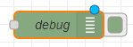
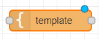
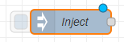
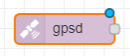
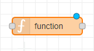
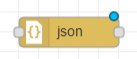
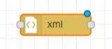

= Początek z ((NodeRed))'em
Mikołaj Dalecki <mikolaj.dalecki@outlook.com>
:toc:
:source-highlighter: pygments

[.lead]
W tym artykule zamierzam przedstawić moje początki z NodeRedem, które również powinny wystarczyć innym do tego, aby łatwo wystartować.

== Instalacja i konfiguracja
Standardowo, tak jak lubię najbardziej, Node-RED'a można uruchomić w ((Doker))ze (więcej na https://nodered.org/docs/getting-started/docker[oficjalnej stronie]):

[source, bash]
----
docker run -d -p 1880:1880 -v node_red_data:/data --name mynodered nodered/node-red
----

== Podstawowe elementy

=== Ogólnego użytku

.Klocek debug

debug:: wypisuje odebrane dane do zakładki debug.
Zwróć uwage, że po jego prawej stronie znajduje się kwadracik, który pozwala łatwo go włączyć lub wyłączyć.

.Klocek template

template:: klocek ten pozwala zastosować pewien szablon w połaczeniu z przychodzącą wiadomością. 
Domyslnie stosowany silnik to https://mustache.github.io/[Mustache], gdzie warto pamiętać, że domyślnie dokonuje on zakodowania znaków specjalnych (np. `<` do `&amp;lt;`).
Aby wymusić na tym silniku przerzucenie elementów bez zmiany należy umieścić zmienną w trzech nawiasach: `{{{trzy}}}`.

=== Wyzwalacze

.Klocek Inject

Inject:: pozwala na wyzwolenie zdarzenia wraz z zawartościa co pewien określony czas i po pewnym określonym czasie.

=== Pozycja ((GPS))

.Klocek GPS

GPSD:: do uzyskiwania pozycji GPS z systemu (trzeba wczesniej doinstalować).

=== Własne operacje

.Klocek function

function:: klocek ten pozwala nam zdefiniować kod JavaScript,  który będzie uruchomiony w: • momencie jego uruchomienia, • na każdą z odebranych wiadomości, • na zatrzymanie klocka.
+
Klocek `function` przewiduje trzy funkcje do informacji zwrotnych: 

[source,JavaScript]
----
node.log("Log message")
node.warn("Warning")
node.error("Error")
----

=== Konwersje

Dokonać konwersji z string'a ((JSON))/((XML)) na obiekt bądź w drugą stronę z obiektu na JSON/XML można dokonać za pomocą klocków o tej samej nazwie:

.Klocek JSON

JSON:: Do konwersji do/z Json'a.

.Klocek XML

XML:: Do konwersji do/z XML'a.
+ 
Za dokumentacją, tag `
Hello World
` zostanie zamieniony na obiekt:
+
[source,JSON]
----
{
  "p": {
    "$": {
      "class": "tag"
    },
    "_": "Hello World"
  }
}
----
+ 
Co ważne, to samo dzieje się w druga stronę, czyli tak przygotowany JSON zostanie zamieniony na odpowiedniego XML'a.
