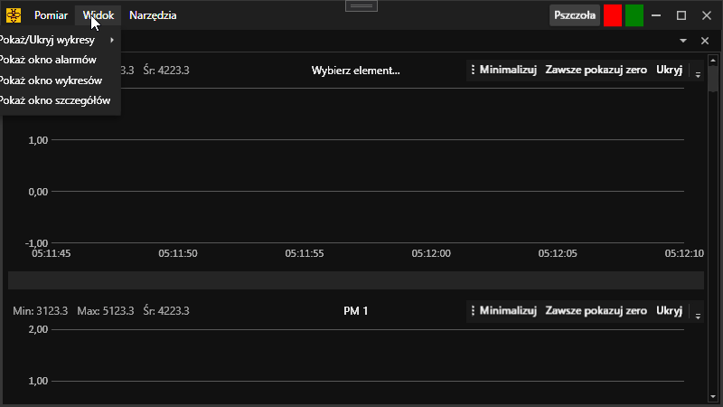

= Kiedy chcesz ładnie pokazać, że wartość jest NULL

[.lead]
XAML posiada ogromne możliwości i chyba większość z nich nie jest mi jeszcze znana, a nieliczne, które poznaję, często wylatują mi z głowy ze względu na jednostkowe użycie. 
W tym artykule chciałbym zachować na dłużej moją wiedzę na temat `{((Binding TargetNullValue="..."))}` ponieważ uważam ją za przydatną i stanowczo przyśpieszającą rozwój aplikacji. 

== `((TargetNullValue))`

Standardowo w większości przykładów widziałem, że `TargetNullValue` jest wykorzystywany tak:

[source,xml]
.Przykład wykorzystania `((TargetNullValue))`
----
<Label Content="{Binding MyText TargetNullValue=Nie podałeś wartości}" />
----

Nigdzie dotychczas nie spotkałem się z tym, aby w miejsce `TargetNullValue` stosować inną kontrolkę, a jest to możliwe!
Przy takiej sytuacji czeka nas kilka pułapek, ale wszystko wyjaśnia poniższy przykład:

[source,xml]
.Przykład wykorzystania `((TargetNullValue))`, gdzie wartością jest inna kontrolka XAML
----
<ListView ItemsSource="{Binding Properties}">
    <ListView.ItemTemplate>
        <DataTemplate>
            <Label>
                <Label.Resources>
                    <ResourceDictionary>
                        <Syncfusion:SfBusyIndicator x:Key="Busy" x:Shared="False" IsBusy="True" AnimationType="Message" /> <1>
                    </ResourceDictionary>
                </Label.Resources>
                <Label.Content>
                    <Binding Path="Value" TargetNullValue="{StaticResource Busy}" /> <2>
                </Label.Content>
            </Label>
        </DataTemplate>
    </ListView.ItemTemplate>
</ListView>
----
<1> Element, który chcemy wyświetlić, kiedy nasza wartość będzie `null`. 
Zwróć uwagę, że jest ona wewnątrz słownika `((ResourceDictionary))`, a co *najważniejsze* jest ona oznaczona jako `((x:Shared))="False"` – jest to niezbędne, bez tego, wykorzystując dany element wielokrotnie, mogą pojawić się takie błędy jak, to, że nasz `((SfBusyIndicator))` będzie wyświetlał się tylko w jednym miejscu. 
<2> Właściwa definicja łączenia – zwróć uwagę, że wartość jest ustawiona standardowo, a `TargetNullValue` odwołuje się bezpośrednio do naszego słownika za pomocą konstrukcji `((StaticResource))`. 

Dzięki takiemu rozwiązaniu uzyskujemy niezależny wskaźnik ładowania w każdym miejscu, gdzie wartość jest `null`!
Zwróć uwagę również, że przy wykorzystaniu tej techniki byłem zmuszony do zrobienia własnego szablonu kolumny dla `((GridView))` – w toku moich działań nie udało mi się uruchomić tego w prostszy sposób.

.Przykład działania kodu, gdzie kontrolka jest wartością dla `((TargetNullValue))`. To jest gif, więc powinien się ruszać.

