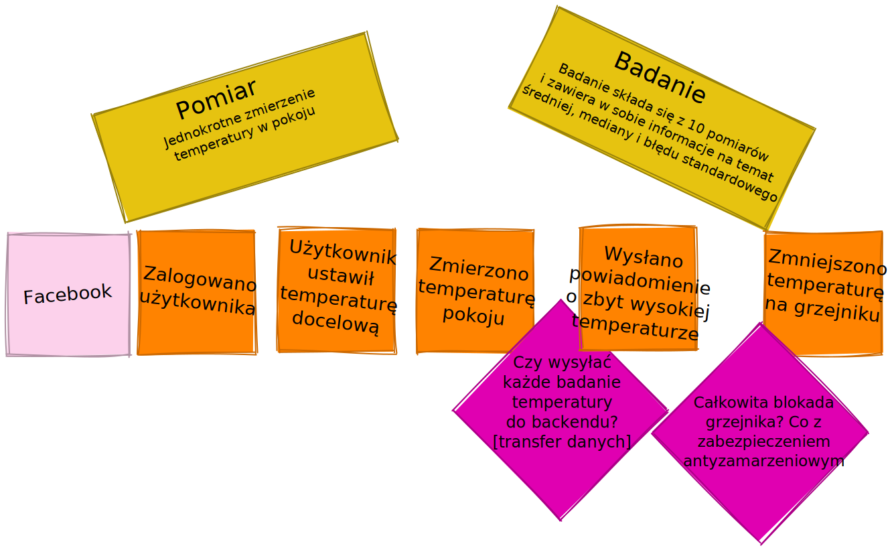
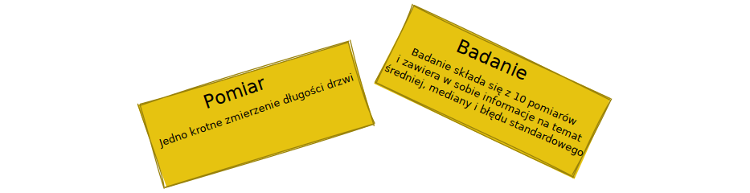
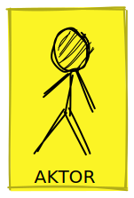
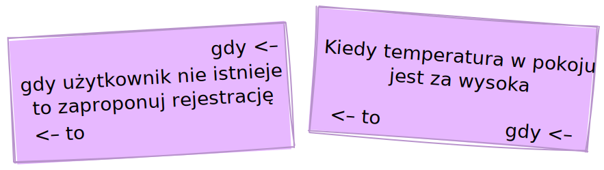
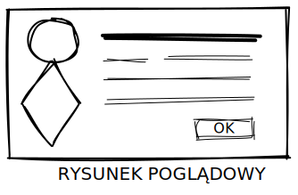

:toc:
== Introduction

[quote, Alexey Zimarew, Domain-Driven Design dla .NET Core (DDDNetCore) – own translation]
The basic concept of the EventStorming technique is to provide a simple modeling notation used to visualize system behavior in a way that anyone can understand.

[quote, Tomasz Stolarczyk, NAJobszerniejsze wprowadzenie do Event Stormingu. Z przykładem! [DevStyleStolarczyk] – own translation]
If we want to write good code, we need to understand the process and the business model, and we won't learn that better from anyone but business and domain experts.

indexterm:[Event Storming]
The Event Storming method was developed in 2013 by Alberto Brandolini, it involves collecting facts (also called _domain events_) that have happened and are *unreversible* in a per se sense.

Workshops in the form of Event Storming serve to exchange knowledge between participants, so it is important to invite people from different circles: both developers and domain experts. 
Consequently, they cause the opening of knowledge silos, the exchange of experiences between them, which further leads to the identification of possible problems and improvements <<DDDNetCore>><DevStyleStolarczyk>>.
In a further perspective, Event Storming allows for the modeling of the application architecture that will be transferred to the code - this part is called Event Storming: Desing Level and will not be discussed here. 

=== How the main part of the workshop looks like - in a nutshell

indexterm:[Event Storming, Chaotic Exploration]
At the beginning, participants place *orange cards* with domain events on the wall.
We want as much knowledge as possible to appear here, so we do not care about duplication or chronology. 
However, let's not insist that all possible events appear here at this moment- they will also be added gradually during the next stages.
Each participant at this point will most likely be dealing with the part they know best. 
When there are conflicts about how a subsystem should work, we mark it with a card called _hot spot_, or with _external system_ if it involves external integration. 
It's important that we focus on *events that involve our system*, not on those that happen in the real world or in a companion system - although it's useful to put those on the board too to get more context. 
We call this part *chaotic exploration* <<DevStyleStolarczyk>>. 
Sometimes it can be treated as a proper warm-up before the next stages aimed at getting participants familiar with each other <<KolinskaEventStormingGuide>>.

Next, we introduce a timeline on the board: we arrange the cards according to chronology and pre-group them into subsystems. 
By the way, you can remove duplicates and standardize the language of some cards. 

indexterm:[Event Storming, Big Picture]
indexterm:[Event Storming, Process Level]
These two items give us the part called *Big picture*. After that, we move on to the *Process Level*.
At this point, we will go into the details associated with each event by adding cards with:

* actors - the people and systems causing or receiving an event, 
* systems - identifying areas of responsibility, 
* reactions of our system to particular domain events,
* views - based on which the user makes decisions. 

Only when we have such a structured system of events do we move on to a detailed search for opportunities and problems, which we also mark as hot spots. 
Finally, we choose the issue we want to address - after a short break or at a separate meeting <<DevStyleStolarczyk>>. 

NOTE: Jeżeli zdecydowałeś się zamodelować cały system dojście do tego momentu może zająć Ci nawet kilka dni, dlatego warto rozważyć, czy aby część Process Level nie przeprowadzać etapami, nad kolejnymi elementami systemu.

Na koniec przechodzimy do etapu *Desing Level* na którym tworzymy model, który można przenieść bezpośrednio do kodu.

NOTE: Ze względu na objętość tego artykułu oraz wiedzę z zakresu DDD potrzebną do pełnego wykorzystania tego etapu warsztatów pominąłem tę część warsztatów. 
Nie mniej, element *Big picture* można z powodzeniem wykorzystać do zamodelowania już istniejącego systemu w celu jego diagnozy i wymiany wiedzy. 

=== Jak może wyglądać rezultat warsztatów

W tej sekcji pokażę mocno uproszczony i wymyślony przykład w celu zachowania pewnej spójności. 
Ilustrację bardziej rozbudowanej sesji Event Stormingu planuję pokazać w przyszłości w osobnej serii artykułów.

.Przykładowy element systemu po chaotycznej eksploracji

Jak widać na początku napisaliśmy możliwie dużo zdarzeń. 
Pojawiły się przy tym dwie wątpliwości oraz uściśliliśmy słownictwo, które mogło być problematyczne w trakcie warsztatów. 
Jedyny system, który nam się pojawił to _Facebook_ jako dostawca logowania – został tutaj umieszczony, ponieważ jest systemem zewnętrznym, od którego zależy nasz przepływ.

Następnie postępujemy zgodnie z tym, co zostało napisane wcześniej: dodajemy pozostałe karteczki.
Dobrze jest dadać je wszystkie od razu, ponieważ dodawanie ich pojedynczo może stanowczo przedłużyć warsztat i doprowadzić do lekkiej irytacji uczesników ciągłym przekładaniem karteczek.

.Przykładowy element systemu po uporządkowaniu (obrazek należy otworzyć w osobnym oknie aby zobaczyć coś więcej)
image:process-level-example.svg[]

Rozbudowaliśmy logowanie o rejestrację oraz przypadek, w którym próbował zalogować się użytkownik, który jeszcze nie jest w naszej bazie. 
Każdą swoją akcję mógł podjąć na podstawie pewnego widoku, z którego wykonywał polecenie na pewnym systemie, co generowało zdarzenia.
Każde z nich może wygenerować kolejny widok lub politykę/reakcję, gdzie ta znów może kontynuować ciąg przyczynowo skutkowy. 

Opis każdego typu karteczki znajduje się w dalszej części artykułu.

[#notacja-w-chaotycznej-eksploracji]
== Notacja w chaotycznej eksploracji
Z racji, że Event Storming ma za zadanie zapewnić prostą notację, to przedstawiam ją poniżej.
W tej sekcji znajduje się opis karteczek, które są używane w trakcie chaotycznej eksploracji oraz podczas części Process Level.

.Obrazek, który wjaśnia wszystko – Alberto Brandolini – „Introducting Event Storming”
image::notacja_01.svg[]

Cóż tu może się stać? Na początku mamy świat zewnętrzny, który wpływa na naszego _aktora_.
Ten mając na uwadze, to co się dzieje wokół niego oraz patrząc na _widok_ podejmuje decyzję o wykonaniu pewnego _polecenia_. 
To _polecenie_ jest wykonywane na którymś z _systemów_, czy to naszym, czy zewnętrznym. 
_System_ generuje _zdarzenie domenowe_, które jest tłumaczone na _widok_ oraz może wyzwolić jakąś _reakcję_ naszego _systemu_.  
I tak koło się zamyka. 
_Aktor_ po wykonaniu jakiejś akcji otrzymuje odświeżony _widok_, przez co może chcieć podjąć nową akcję poprzez zlecenie _polecenia_ <<stolarczykProcessLevelEvent2021>>.

Osobno istnieją _gorące miejsce_ oraz _rysunki poglądowe_, które możemy umieszczać odpowiednio w miejscach zapalnych, co do których, trzeba podjąć pewne decyzje lub na ten moment nie wiadomo co tam się dzieje, oraz przy widokach, aby podkreślić, co na nich musi się znaleźć.

=== Zdarzenie domenowe

.Przedstawienie zzdarzenia domenowego
image::domain-event.svg[align="center"]

Jak już napisałem we wstępie, zdarzenie domenowe reprezentuje fakt nieodwracalny.
Mówiąc, że fakt jest nieodwracalny, znaczy to, że gdy użytkownik kupił produkt – nie może już tego cofnąć (maszyna pakowania i nadawania numerów przesyłki już ruszyła), może on rozpocząć procedurę przeciwną, to znaczy zwrotu zakupionego produktu. 
Co niezwykle ważne, fakty zapisujemy za pomocą *formy przeszłej*, czyli „użytkownik zapłacił za produkt”, „użytkownik zgłosił żądanie zwrotu zakupu”.
Pozwala to uciąć dywagację na temat tego, co jeśli zdarzenie się nie udało, lub zaszło częściowo – w takim przypadku mamy do czynienia z innym zdarzeniem (na przykład: „użytkownik zapłaci połowę kwoty”).
Zdarzenie domenowe musi być *zrozumiałe przez ludzi nietechnicznych* więc w konsekwencji nie może ono odnosić się do szczegółów implementacyjnych. 
Mimo iż w przykładach znajduje się *kto* i *co*, zrobił, co zwiększa czytelność, jednak nie zapominajmy, że twórca danego zdarzenia zostanie jasno określony w dalszym etapie za pomocą karteczki _aktora_ <<DDDNetCore>>.

Mimo iż piszę o tym, że fakt już się stał, to nie należy się bać dodawania zdarzeń, które reprezentują pomysły i funkcje zaplanowane do realizacji w przyszłości.
Dobrze jest je odpowiednio oznaczyć, na przykład, poprzez inny kolor karteczki.

.Przykłady zdarzeń
====
image:events-example.svg[align="center"]

W przykładzie mamy już uszeregowany ciąg zdarzeń, tak, że każde ze zdarzeń następuje po sobie. 
Karteczki są zapisane w formie przeszłej i do tego są krótkie i zwięzłe.
====

=== Gorące miejsce

.Przedstawienie gorącego miejsca

Jest to zazwyczaj fioletowa lub jaskraworóżowa karteczka (ważne, aby miała wyróżniający się kolor), która służy do oznaczania miejsc spornych, gdzie znalezienie odpowiedzi w trakcie warsztatów nie jest możliwe <<bourgauDetailedAgendaDDD2018>>.

.Przykłady gorących miejsc
====
image:hotspot-example.svg[ scaledwidth="50%"]

Takie gorące miejsce zostało użyte w przykładzie. 
Pojawiło się pytanie, na które odpowiedź Event Storming nie koniecznie przyniesie (bo jest pytaniem mocno technicznym), jednak to, jak dużo transferu używamy, może być już kwestią domenową, na przykład wtedy, gdy chcemy konstruować system wyróżniający się oszczędnością.
====

=== System

.Przedstawienie systemu
image::system.svg[align="center"]

Początkowo, podczas *chaotycznej eksploracji*, karteczka ta służy do określania systemów zewnętrznych, które generują zdarzenia dla naszego systemu. 
Następnie, w trakcie porządkowania, będziemy na niej zapisywać nasze systemy, takie jak „wyszukiwarka”, „użytkownicy”, „zamówienia”. 
Uzupełnienie tej karteczki pozwoli nam jasno zobaczyć, które zdarzenia i operacje są wykonywane w tym samym miejscu, a które są w jakiś sposób niezależne. 
Doprowadzi nas to do wyodrębnienia subdomen, które mogą później posłużyć jako punkt zaczepienia dla luźniejszej architektury aplikacji.

.Przykłady systemów podczas chaotycznej eksploracji
====

Powyżej widać przykłady systemów. 
W tym przypadku pierwszy system to po prostu czujnik, który stanowi samodzielny moduł, backend – który stanowi aplikację internetową oraz Termostat, który również jest samodzielnym urządzeniem. 

NOTE: Czasem można spotkać się z propozycją, aby zewnętrzne systemy oznaczać innym kolorem karteczek.
Jednak ile kolorów można znaleźć w sklepie? 
====

.Przykłady systemów po *Process Level*
====
image::system-processlevelexample.svg[]

Tutaj mamy już dużo więcej systemów, które wyraźnie pokazują ich zakres odpowiedzialności. 
Użycie nazw jak _Backend_ czy _Frontend_ nie jest może najszczęśliwsze, ale w przypadku najprostszych systemów wystarczające.
====

=== Słowo domenowe

.Przedstawienie słowa domenowego
image::domain-word.svg[align="center"]

Z umieszczeniem słowa domenowego spotkałem się raz (<<bourgauDetailedAgendaDDD2018>>) i traktuje je jako rozszerzenie podstawowej notacji Event Stormingu.
Niemniej, uważam je za ciekawy, acz nieobowiązkowy element, gdyż w przypadku niektórych projektów może pojawić się problem ze słownictwem szczegółowym.

.Przykład problemu z słownictwem domenowym
====

W niektórych miejscach spotykałem się z problemem rozróżnienia słów _badanie_ i _pomiar_, które przez niektórych były stosowane zamiennie, mimo iż ostatecznie jedno było składową drugiego.
====

== Notacja w Process Level

W tej sekcji znajdziesz elementy notacji wykorzystywane głównie podczas części Process Level, co nie znaczy, że przedstawione <<notacja-w-chaotycznej-eksploracji,chwilę wczesniej>> karteczki już nie obowiązują. 
Podziału dokonałem głównie ze względu na objętość materiału.

=== Aktor

.Przedstawienie aktora

Aktor, mimo iż brzmi po ludzki, to nie musi być to człowiek – jest to karteczka, która reprezentuje, *kto* może wyzwolić daną akcję.
Także może to być zarówno człowiek (na przykład poprzez interakcję z aplikacją), jak i na przykład czujka zalania mieszkania może wyzwolić alarm bądź powiadomienie. 

.Przykłady aktorów
====
image::actors-example.svg[align="center"]

Aktorem może być zarówno użytkownik, jak i pewne zdarzenie jak na przykład czasomierz (z ang. _timer_). 
Aktor jest karteczką, która pojawia się na samym początku łańcucha przyczynowo-skutkowego co pokazuje, kto jest twórcą danej akcji.
====

=== Polecenie
image::command.svg[align="center"]

Polecenie służy do pokazania zamiaru. 
Umieszczenie ich na tablicy powoduje, że łatwiej zobaczyć jakie zdarzenia mogą zostać wykonane w przypadku, kiedy zamiar się nie powiedzie, lub powiedzie się częściowo.
Doklejanie karteczek z poleceniem może wydawać się czysto mechaniczne, jednak nie musi takie być, dzięki metodzie 0, 50, 100 i 150 (więcej o niej w sekcji <<w-trakcie-warsztatow,W trakcie warsztatów>>).
Dlatego zaczynamy od zdarzeń, a nie od poleceń, ponieważ taka kolejność może prowadzić do zbytniego skupienia się nad nowymi funkcjami <<kolinskaEventStormingGuide>>. 

.Przykłady poleceń
====
image::commands-example.svg[align="center"]

Polecenia są pisane w formie rozkazującej (czasem z ang. imperatywnej) i mają za zadanie ukazać zamiar wykonania czegość. 
A z zamiarem bywa tak, że czasem się nie udaje. 
====

=== Reakcja
image::policy.svg[align="center"]

Reakcja (czasem zwana również polityką) pozwala nam zaprezentować to, jak system reaguje automatycznie na pewne zdarzenia. 
Łatwo rozpoznać reakcję po tym, że zaczynamy używać składki "kiedy, …, to…". 
Ważne jest to, aby karteczka ta trafiała pomiędzy zdarzeniem, którego jest adresatem, oraz poleceniem, które ma wykonać <<EventStormingDomaindriven2019>>. 

.Przykłady polityk
====

W przykładowym systemie mamy tylko dwie polityki, które mówią nam jasno, że:

* użytkownik, który jest niezalogowany, powinien zostać przekierowany do strony zakładania konta. 
Tutaj można by się pokusić, że jest to część typowo oparta na kontrolkach (niezmieniająca nic w systemie), jednak jeśli biznesowi zależy na takiej funkcji, to czemu nie?
* mamy wysyłać powiadomienie, kiedy wartość temperatury przekroczy tę zadaną. 
====

=== Widok
image::view.svg[align="center"]

W widokach, we wszelkiej literaturze, znalazłem najmniej. 
Jednak uważam je za tyle ciekawe, że pozwalają nam powiedzieć, czy dany widok istnieje w naszej aplikacji oraz, czy pewne rzeczy są uruchamiane ręcznie, czy też automatycznie (przed widokiem stoi człowiek a za nim polecenie). 

.Przykłady widoków
====
image::views-example.svg[align="center"]

Na karteczkach przykładowych mamy cztery widoki, które jasno pokazują, co użytkownik widzie.
Poza ostatnim, który jest *widokiem sprzętowym* dla zdarzenia czasowego.
Alternatywnie można by za modelować to za pomocą polityki, jednak o tyle podoba mi się takie podejście, że wyraźnie wskazuje nam, że musimy mieć tutaj połączenie ze światem zewnętrznym (w końcu po to są widoki – aby łączyć się z zewnątrz, co nie?).
====

=== Rysunek poglądowy

Widokowi może towarzyszyć rysunek poglądowy. 
Dodajemy je wtedy, gdy osoby od doświadczeń użytkownika (z ang. _user experience_, zapisywane skrótem UX) uznają jakiś element za szalenie istotny. 
Taki obrazek pozwala na lepszą komunikację pomiędzy UXowcami a osobami odpowiedzialnymi za wygląd aplikacji, gdyż tym drugim pokazano, co jest najważniejsze. 

.Przykład rysunku poglądowego
====
image::mockup-example.svg[align="center"]

Mimo iż powyższy rysunek nie wystąpił w przykładach, to postanowiłem opisać go dla porządku.
Widzimy na nim wyraźnie, że jest trochę tekst, jest rysunek, który symbolizuje górną partię ciała człowieka oraz przycisk OK. 
Można z tego wysnuć wniosek, że obrazek musi być dość duży, jednak nie to jest najważniejsze – największa wartość stanowi dyskusja, która urodziła się podczas tworzenia takiej makiety.
====

=== Świat zewnętrzny
image::external-world.svg[align="center"]

Świat zewnętrzny, podobnie jak rysunek poglądowy znalazł się tylko na notacji. 
Niemniej uważam, że może być on ważny, zwłaszcza w przypadkach, gdy nasz system silnie operuje na tym, co dzieje się w świecie rzeczywistym. 
Karteczki, które mogłyby trafić pod ten szyld, powinny reprezentować swojego rodzaju zdarzenia (być sformułowane w przeszłej formie), gdyż to właśnie czasowniki napędzają nasz świat i go zmieniają, rzeczowniki natomiast stoją w miejscu.

== Warsztaty

W tej sekcji omówię wszystko to, co uważam za ważne zarówno przed, w trakcie, jak i po warsztatach

=== Planowanie warsztatów

NOTE: Pamiętaj, że pojedyncza sesja nie powinna przekraczać 2 godzin.

indexterm:[Warsztaty]
indexterm:[Karteczki samoprzylepne]
W trakcie warsztatów niezwykle problematyczna może być ilość miejsca, której będziesz potrzebować do zaprezentowania wszystkich zdarzeń. 
Dlatego zawczasu zadbaj o *bardzo dużo przestrzeni* i odpowiednią przyczepność karteczek do ściany. Jak podaje Zimarev warto kupić rolkę papieru do plotera, którą umocujesz jako podkład, w przypadku, gdy goła ściana nie jest w stanie zapewnić odpowiedniej przyczepności <<DDDNetCore>>.

Dlaczego to takie ważne?
Ponieważ jak się okazuje, gdy ludziom zacznie brakować miejsca, to zaczną się ograniczać ze swoją kreatywnością.
Może się to skończyć tym, że część systemu w ogóle nie zostanie za modelowana, gdyż zostanie uznana za nieważną, a z racji ograniczonego miejsca, pominięta.

Dlatego sala wybrana do warsztatów Event Storming powinna być jak największa. 
W skrajnym przypadku można do tego wykorzystać korytarz, jednak upewnij się, że w trakcie, gdy będziesz go wykorzystywać, nie będzie przechodzić tamtędy duża ilość osób, co może rozpraszać uczestników.

Innym pomysłem może być działanie hybrydowe – uczestnicy siadają w jednej sali z własnymi komputerami, na których będą pracować. 
Dobrze, aby znajdował się w niej też jeden duży wyświetlacz dla prowadzącego. 
Następnie wszyscy równocześnie działają na jednej tablicy, na przykład przy pomocy oprogramowania https://miro.com/. 
Dlaczego mówię o siedzeniu w jednej sali?
W trakcie warsztatów jest niesamowita ilość dyskusji, która wydaje się niemożliwa przy użyciu tradycyjnych form pracy i komunikacji zdalnej, gdzie jedna osoba mówi, a reszta musi słuchać. 

==== Lista rzeczy do zrobienia

.Koncepcja
* [ ] Określ cel warsztatów (znalezienie problemów lub miejsc zapalnych) i nie zapomnij umieścić go w agendzie! 
* [ ] Jeśli nie wszyscy mają pojęcie o domenie, roześlij jej krótki opis oraz zestaw widoków dla uczestników

.Zakupy
* [ ] Sprawdź, czy karteczki trzymają się ściany,
** [ ] jak nie, to zakup papier do plotera.
* [ ] Przygotuj spory zapas karteczek samo przylepnych:
** [ ] pomarańczowych zwykłych do zapisu zdarzeń (faktów),
** [ ] jaskraworóżowych do oznaczania hotspotów,
** [ ] niebieskich do zapisu poleceń (z ang. _comamnds_), 
** [ ] łososiowe lub zwykłe różowe do oznaczania systemów wewnętrznych,
** [ ] fioletowe do zapisywania reakcji naszego systemu na zdarzenia
** [ ] zielone do reprezentacji widoków,
** [ ] żółte wąskie do zaprezentowania aktorów,
** [ ] białe do rysowania szkiców interfejsów użytkownika,
** Opcjonalnie
*** [ ] Karteczki do zapisu zdarzeń środowiskowych, 
*** [ ] Karteczki do zapisu wspólnego języka domenowego. 
* [ ] Pisaki do pisania po karteczkach.
* [ ] Taśma malarska do pisania etykiet wszelakich
* [ ] Coś słodkiego do jedzenia.

=== Rozpoczęcie warsztatów

image::workshop.jpg[]

W celu uprzedniego przygotowania sali warto przyjść do niej nawet 30 minut przed planowanym startem. 
Rzeczy, które trzeba zrobić to:

.Przed startem
* [ ] Jeśli karteczki nie trzymają się ściany, przymocuj papier,
* [ ] Umieść notację w widocznym miejscu,
* [ ] Usuń krzesła, jeśli chcesz pracować przy pomocy karteczek, w przypadku gdy je zostawisz, to zobaczysz, że niektórzy odłączą się od grupy i zaczną sobie po cichu robić własne rzeczy,
* [ ] Rozmieść pisaki, karteczki i coś do zjedzenia.

Kiedy wszyscy już się zbiorą i warsztaty się zaczną nie zapomnij o:

.Przy rozpoczynaniu warsztatów:
* [ ] Przedstawienie celu, uczestników 
* [ ] Krótkiej zabawy, aby pobudzić ludzi (możesz znaleźć je na stronie https://www.funretrospectives.com/category/energizer/[funretrospectives.com]) <<bourgauDetailedAgendaDDD2018>>,
  Najmniej wymagająca zabawa, według mnie, to „Poszedłem na plaże i wziąłem…" footnote:[źródło zabawy: https://www.funretrospectives.com/went-to-the-beach-and/[], w skrócie polega ona na tym, że prowadzący mówi: „Poszedłem na plaże i wziąłem ze sobą…" i następnie wymienia jedną rzecz. 
  Osoba stojąca obok prowadzącego powtarza to, co powiedział prowadzący, dodając swoją rzecz. 
  Zabawa trwa aż wszyscy się wypowiedzą.],
* [ ] Przedstawienie metody Event Stormingu i wymaganej *całości* notacji wraz z zasadami ich użycia. 
Na początek skup się na: _zdarzenia domenowego_, _gorącego miejsca_ oraz _zewnętrznego systemu_.

Zauważyłem, że niezwykle ważne jest, aby przedstawić całość notacji uczestnikom warsztatów. 
Nie próbuj „chować” przed nimi tego, co będą robić w późniejszych etapach – pozwoli im to od razu układać karteczki w większych odstępach oraz załapać kontekst tego, co będą robić. 
Jedną z formą przedstawienia notacji, z którą się spotkałem, jest poproszenie jednego z uczestników o to, aby przedstawił, co widzi na rysunku. 
Jeśli czegoś nie rozumie, może zadawać pytania prowadzącemu.

Z racji, że Event Storming to warsztat grupowy, gdzie wszyscy powinni brać udział, należy zachęcić ludzi do tego, aby sami zapisywali zdarzenia na ścianie.
Aby to osiągnąć, należy zacząć od siebie – zapisz karteczkę jednym zdarzeniem, które znajduje się gdzieś *w środku systemu*, np. „użytkownik dodał przedmiot do koszyka”. 
Jest to niezwykle ważne, aby nie próbować zaczynać od początku lub od końca, gdyż _zawsze_ będzie coś wcześniej i później. 
Dzięki takiemu podejściu można próbować zachęcić uczestników, aby zapisali zdarzenia, które następują lub są przed twoim <<DDDNetCore>><<bourgauHowPrepareDDD2018>>. 

NOTE: Uważaj na pomysł z cichą burzą mózgów, gdy masz do czynienia z grupą niedoświadczoną w Event Stormingu.
Może się to skończyć dużą ilością karteczek, które nijak nie wpasowują się w notację.

[#w-trakcie-warsztatow]
=== W trakcie warsztatów

Jak zostało to powiedziane we wstępie, zajmiemy dwoma zasadniczymi częściami warsztatów Event Stormign: _Big Picture_ i _Process Level_.
W warsztatach niezwykle ważne jest to, aby udział brali wszyscy uczestnicy, przez to prowadzący powinien ich obserwować i dawać wskazówki, a nie próbować kierować całością dyskusji.

W trakcie warsztatów, niezależnie od etapu, zwróć szczególną uwagę na to, że:

* Ludzie mają tendencję do kreślenia drogi w przypadku gdy wszystko idzie po ich myśli, dlatego zachęć ich aby prześledzili przypadki poza właściwą ścieżką, takie jak „dokonano płatności na dwu krotność kwoty”, bądź „login i hasło zostało odrzucone” <<DDDNetCore>>.
Szczególnie przydatna może być tutaj metoda „fantastycznej czwórki” Mateusza Gila, zwaną również 0, 50, 100 i 150, która polega na szukaniu możliwości zdarzenia w wersji na 0% (gdy zdarzenie nie zaszło), 50% (zdarzenie zaszło w wersji częściowej) lub 150% (zdarzenie zaszło w wersji przesadzonej), np. co się stanie, gdy użytkownik zapłaci za mało, lub za dużo, bądź wcale <<DevStyleStolarczyk>>?  

* Gdy zobaczysz ożywioną dyskusję, zwłaszcza taką, która kręci się w kółko i nie generuje nowych karteczek, najpewniej jest to punkt zapalny zwany z angielskiego _hot spot_, który według propozycji twórcy metody Event Stormingu Alberto Brandolini należy oznaczyć jaskrawym kolorem (np. jaskrawy róż) <<DDDNetCore>>.

* Należy wyłapywać karteczki, których formy sugerują życzenia czy reprezentują całe funkcjonalności (np. „zaloguj użytkownika” lub „lista produktów”) a ich twórcom wyjaśnić, że interesuje nas przepływ zdarzeń, którego nie można cofnąć.

Jeśli natomiast widzisz, że dyskusja powoli się wypala, to możesz spróbować dwóch sposobów:

. Poproś uczestników o prześledzenie zdarzeń wstecz (od początku do końca) – może nie umieszczono jakiegoś, z pozoru nieistotnego, zdarzenia? Może ktoś zapomniał, że przed dokonaniem zakupu należy wybrać metodę dostawy? 
. Wyśledź pieniądze – poproś uczestników, aby prześledzili te ścieżki, które bezpośrednio generują przychód <<DDDNetCore>>.
. Zwróć uwagę na polecenia, przy których jest tylko jedno zdarzenie: czy na pewno jest tylko jedna ścieżka wykonania polecenia (pamiętaj o „fantastycznej czwórce”)?

Podczas porządkowania tablicy po pierwszym etapie burzy mózgów może pojawic się wątpliwość, czy dane zdarzenie należy do naszego systemu, czy też nie.
Wcześniej już wspomniany Mateusz Gil zaprezentował podział na 4 poziomy (więcej na https://www.youtube.com/watch?v=31PNdWaUrTY[YouTube]) <<DevStyleStolarczyk>>:

1. Zdarzenia środowiskowe, które występują poza systemem (samochód wjechał na parking), 
2. Zdarzenia interfejsowe, które nie wpływają na stan systemu (użytkownik wybrał opcję w formularzu),
3. Zdarzenia infrastrukturalne, które również nie mają wpływu na system i reprezentują typowe technikalia (plik został załadowany na dysk),
4. Zdarzenia domenowe – te, które nas interesują – reprezentują domenę i zmieniają stan systemu.

=== Na zakończenie warsztatów

Podobno ludzki mózg uwielbia historię, dlatego w celu utrwalenia treści, które pojawiły się w trakcie warsztatów, warto poprosić któregoś z uczestników (lub wspólnie całą grupą), aby opowiedział historię, która dzieje się od początku do końca, od lewej do prawej <<bourgauDetailedAgendaDDD2019c>>.
W przypadku gdy idzie to dość niemrawo, warto zaproponować zmianę opowiadającego.

=== Po zakończeniu warsztatów

Jak wskazuje Zimarev, najważniejsze jest to, aby programiści zadawali pytania.
Jeśli na twoich warsztatach nie było dyskusji to możliwe, że problem był zbyt prosty lub zaproszeni byli nieodpowiedni ludzie <<DDDNetCore>>.

Nie obawiaj się również rozszerzać notacji warsztatów. 
Na przykład, gdy domena mocno operuje na bazach danych można spróbować zaprezentować je w trakcie warsztatów za pomocą osobnych karteczek, gdzie każda z operacji, jak _SELECT_ czy _UPDATE_, ma swój własny kolor <<DevStyleStolarczyk>>. 

[bibliography]
== Bibliografia
Artykuł na podstawie:

* [[[DDDNetCore]]] 
  Zimarev, Alexej. Domain-Driven Design dla .NET Core: Jak rozwiązywać złożone problemy podczas projektowania architektury aplikacji. Warszawa: Helion S.A., 2021.
* [[[DevStyleStolarczyk]]]
  Stolarczyk, Tomasz. „NAJobszerniejsze wprowadzenie do Event Stormingu. Z przykładem!” devstyle.pl, 12 październik 2020. https://devstyle.pl/2020/10/12/najobszerniejsze-wprowadzenie-do-event-stormingu-z-przykladem/.
* [[[stolarczykProcessLevelEvent2021]]] 
  Stolarczyk, Tomasz. „Process Level Event Storming – Wielka Piguła Wiedzy”. devstyle.pl, 14 styczeń 2021. https://devstyle.pl/2021/01/14/process-level-event-storming/.
* [[[bourgauHowPrepareDDD2018]]]
  Bourgau, Philippe. „How to Prepare a DDD Big Picture Event Storming Workshop”. Philippe Bourgau’s XP Coaching Blog, 6 grudzień 2018. http://philippe.bourgau.net/how-to-prepare-a-ddd-big-picture-event-storming-workshop/.
* [[[bourgauHowPrepareRoom2018]]]
  Bourgau, Philippe. „How to Prepare the Room for a DDD Big Picture Event Storming”. Philippe Bourgau’s XP Coaching Blog, 13 grudzień 2018. http://philippe.bourgau.net/how-to-prepare-the-room-for-a-ddd-big-picture-event-storming/.
* [[[bourgauDetailedAgendaDDD2018]]]
  Bourgau, Philippe. „Detailed Agenda of a DDD Big Picture Event Storming - Part 1”. Philippe Bourgau’s XP Coaching Blog, 20 grudzień 2018. http://philippe.bourgau.net/detailed-agenda-of-a-ddd-big-picture-event-storming-part-1/.
* [[[bourgauDetailedAgendaDDD2019b]]]
  Bourgau, Philippe. „Detailed Agenda of a DDD Big Picture Event Storming - Part 2”. Philippe Bourgau’s XP Coaching Blog, 3 styczeń 2019. http://philippe.bourgau.net/detailed-agenda-of-a-ddd-big-picture-event-storming-part-2/.
* [[[bourgauDetailedAgendaDDD2019c]]]
  Bourgau, Philippe. „Detailed Agenda of a DDD Big Picture Event Storming - Part 3”. Philippe Bourgau’s XP Coaching Blog, 10 styczeń 2019. http://philippe.bourgau.net/detailed-agenda-of-a-ddd-big-picture-event-storming-part-3/.
* [[[kolinskaEventStormingGuide]]]
  Kolińska, Natalia. „Event Storming Guide”. Udostępniono 20 lipiec 2021. https://www.boldare.com/blog/event-storming-guide.
* [[[EventStormingDomaindriven2019]]]
  IBM Developer. „Event Storming & Domain-Driven Design: Reactive in Practice - Event Storming the Stock Trader Domain”, 12 luty 2019. https://developer.ibm.com/tutorials/reactive-in-practice-1/.
