:toc:
== Introduction

[quote, Alexey Zimarew, Domain-Driven Design dla .NET Core (DDDNetCore) – own translation]
The basic concept of the EventStorming technique is to provide a simple modeling notation used to visualize system behavior in a way that anyone can understand.

[quote, Tomasz Stolarczyk, NAJobszerniejsze wprowadzenie do Event Stormingu. Z przykładem! [DevStyleStolarczyk] – own translation]
If we want to write good code, we need to understand the process and the business model, and we won't learn that better from anyone but business and domain experts.

indexterm:[Event Storming]
The Event Storming method was developed in 2013 by Alberto Brandolini, it involves collecting facts (also called _domain events_) that have happened and are *unreversible* in a per se sense.

Workshops in the form of Event Storming serve to exchange knowledge between participants, so it is important to invite people from different circles: both developers and domain experts. 
Consequently, they cause the opening of knowledge silos, the exchange of experiences between them, which further leads to the identification of possible problems and improvements <<DDDNetCore>><DevStyleStolarczyk>>.
In a further perspective, Event Storming allows for the modeling of the application architecture that will be transferred to the code - this part is called Event Storming: Desing Level and will not be discussed here. 

=== How the main part of the workshop looks like - in a nutshell

indexterm:[Event Storming, Chaotic Exploration]
At the beginning, participants place *orange cards* with domain events on the wall.
We want as much knowledge as possible to appear here, so we do not care about duplication or chronology. 
However, let's not insist that all possible events appear here at this moment- they will also be added gradually during the next stages.
Each participant at this point will most likely be dealing with the part they know best. 
When there are conflicts about how a subsystem should work, we mark it with a card called _hot spot_, or with _external system_ if it involves external integration. 
It's important that we focus on *events that involve our system*, not on those that happen in the real world or in a companion system - although it's useful to put those on the board too to get more context. 
We call this part *chaotic exploration* <<DevStyleStolarczyk>>. 
Sometimes it can be treated as a proper warm-up before the next stages aimed at getting participants familiar with each other <<KolinskaEventStormingGuide>>.

Next, we introduce a timeline on the board: we arrange the cards according to chronology and pre-group them into subsystems. 
By the way, you can remove duplicates and standardize the language of some cards. 

indexterm:[Event Storming, Big Picture]
indexterm:[Event Storming, Process Level]
These two items give us the part called *Big picture*. After that, we move on to the *Process Level*.
At this point, we will go into the details associated with each event by adding cards with:

* actors - the people and systems causing or receiving an event, 
* systems - identifying areas of responsibility, 
* reactions of our system to particular domain events,
* views - based on which the user makes decisions. 

Only when we have such a structured system of events do we move on to a detailed search for opportunities and problems, which we also mark as hot spots. 
Finally, we choose the issue we want to address - after a short break or at a separate meeting <<DevStyleStolarczyk>>. 

NOTE: If you have decided to model the whole system, it may take you a few days to get to this point, so you should consider whether to run the Process Level part in stages, over different elements of the system.

Finally, we move to the *Desing Level* step, where we create a model that can be transferred directly into the code.

NOTE: Due to the size of this article, I skipped this part of the workshop. 
No less, the *Big picture* element can be successfully used to model an already existing system for diagnosis and knowledge sharing. 

=== What the outcome of the workshop might look like

In this section I will show a highly simplified and contrived example for the sake of some consistency. 
I plan to show an illustration of a more complex Event Storming session in a separate series of articles in the future.

.Example of a system element after chaotic exploration
image:chaotic-exploration-example.svg[]

As you can see, we wrote as many events as possible at the beginning. 
In doing so, we raised two concerns and clarified vocabulary that may have been problematic during the workshop. 
The only system that came up for us was _Facebook_ as a login provider - it was put here because it is an external system that our flow depends on.

Then, as written before, add the remaining cards.
It's a good idea to add them all at once, because adding them one by one can definitely prolong the workshop and lead to a slight annoyance by participants constantly rearranging the cards.

.An example of a system component after cleaning (the image must be opened in a separate window to see the details)
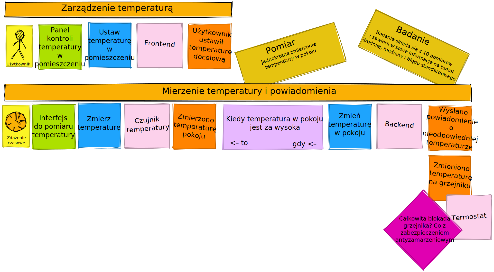

We extended logging to include registration and the case where a user who is not yet in our database tried to log in. 
He could take each of his actions based on the view from which he executed the command on some system, which generates events.
Each of these could generate another view or policy/reaction, where this again could continue the cause and effect sequence. 

A description of each type of card is provided below.

[#notacja-w-chaotycznej-eksploracji]
== Notation in chaotic exploration
Since Event Storming is intended to provide simple notation, I present it below.
This section provides a description of the cards that are used during the chaotic exploration and during the Process Level portions.

.A picture that explains everything – Alberto Brandolini – „Introducting Event Storming”
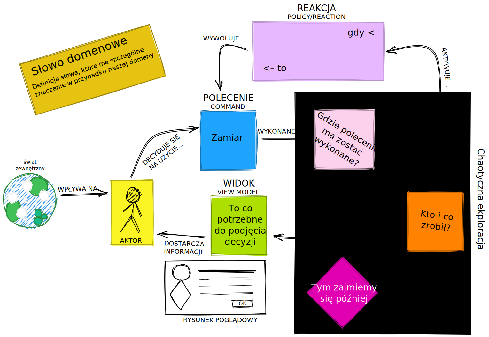

What can happen here? In the beginning we have the external world, which influences our _actor_.
This one, having in mind what is going on around him and looking at the _view_, makes a decision to execute some _command_. 
This _command_ is executed on some _system_, be it ours or the external one. 
The _System_ generates a _domain event_, which is translated to the _view_ and may trigger some _reaction_ of our _system_.  
And so the circle closes. 
The _Actor_, after performing some action, receives a refreshed _view_, which allows it to take a new action by ordering a _command_ <<processLevelEvent2021>>.

Separately, there are _hot spot_ and _view drawings_, which we can place at hot spots about which, some decisions need to be made or at this point it is not known what is going on there, and at views to emphasize what needs to be on them.

=== Domain event

.Representation of a domain event
image::domain-event.svg[align="center"]

As I wrote in the introduction, a domain event represents an irreversible fact.
When we say that a fact is irreversible, it means that once the user has bought a product - he cannot undo it anymore (the packing and shipping machine has already started), he can start the opposite procedure, i.e. return the purchased product. 
Extremely importantly, we record the facts using the *past* form, i.e. "the user paid for the product", "the user made a request to return the purchase".
This cuts off the discussion about what if the event failed, or occurred partially - in which case we are dealing with a different event (for example, "the user will pay half the amount").
The domain event must be *understood by non-technical people* so it cannot refer to implementation details. 
Although the examples include *who* and *what* they did, which increases readability, but don't forget that the creator of the event will be made clear later with the _actor_ card <<DDNetCore>>.

Although I am writing about a fact that has already happened, don't be afraid to add events that represent ideas and functions planned for future implementation.
It's a good idea to label them appropriately, for example, by having a different color card.

.Examples of events
====
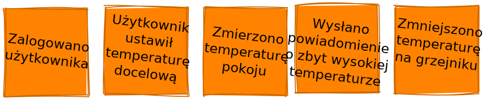

In the example, we already have a sequence of events arranged so that each event follows one another. 
The cards are written in past form and are short and concise.
====

=== Hot spot

.Introducing the hot spot
image::hotspot.svg[align="center"]

This is usually a purple or bright pink card (it is important that it has a distinctive color) that is used to mark areas of disagreement where it is not possible to find answers during the workshop <<bourgauDetailedAgendaDDD2018>>.

.Examples of hot spots
====
image:hotspot-example.svg[ scaledwidth="50%"]

Such a hot spot was used in the example. 
There was a question that Event Storming will not necessarily bring an answer to (because it is a highly technical question), but how much transfer we use may already be a domain issue, for example when we want to construct a system distinguished by economy.
====

=== System

.Presentation of the system
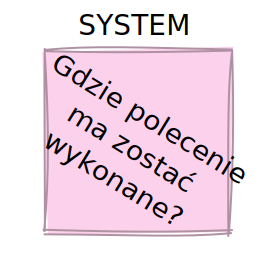

Initially, during *chaotic exploration*, this card is used to identify external systems that generate events for our system. 
Later, during organizing, we will record our systems on it, such as "search engine", "users", "orders". 
Completing this sheet will allow us to clearly see which events and operations are performed in the same place, and which are somehow independent. 
This will lead us to isolate subdomains, which can later serve as an anchor for a looser application architecture.

.Examples of systems during chaotic exploration
====
image::systems-example.svg[align="center"]

Above you can see examples of systems. 
In this case, the first system is simply the sensor, which is a standalone module, the backend - which is a web application, and the Thermostat, which is also a standalone device. 

NOTE: Sometimes you may encounter the suggestion that external systems should be labeled with a different color of card.
However, how many colors can you find in a shop? 
====

.Examples of systems after *Process Level*
====
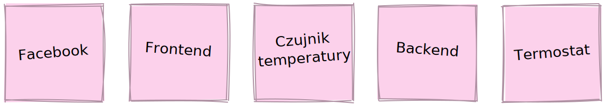

Here we already have many more systems that clearly show their responsibilities. 
Using names like _Backend_ or _Frontend_ is not the best, but for the simplest systems it is sufficient.
====

=== Domain word

.Representation of the domain word
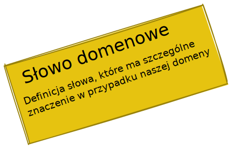

I have encountered the inclusion of the domain word once (<<bourgauDetailedAgendaDDD2018>>) and I treat it as an extension of the basic Event Storming notation.
Nonetheless, I find them an interesting, albeit optional, feature, as some projects may have a problem with detail vocabulary.

.Example of a domain-specific vocabulary problem
====
image::domain-word-example.svg[]

In some places I encountered the problem of distinguishing between the words _research_ and _measurement_, which were used interchangeably by some, even though one was ultimately a component of the other.
====

== Notation in Process Level

In this section, you will find elements of notation used mainly during the Process Level part of the course, which doesn't mean that the cards presented <<notacja-w-chaotycznej-eksploracji,a while ago>> are no longer valid. 
I made the division mainly because of the volume of the material.

=== Actor

.Introducing the actor
image::aktor.svg[align="center"]

An actor, although it sounds human, doesn't have to be a human - it's a card that represents *who* can trigger a particular action.
Also, it can be both a human (for example, by interacting with the app) and, for example, an apartment flood detector can trigger an alarm or notification. 

.Examples of actors
====
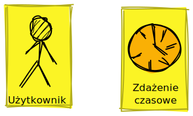

An actor can be either a user or an empowered event source, such as a timer (from _timer_), which can invoke actions periodically.
An actor is a card that appears at the very beginning of the cause-effect chain, which shows who is the creator of a given action.
====

=== Command
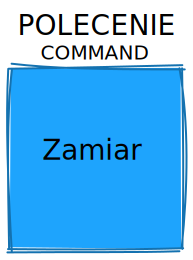

Polecenie służy do pokazania zamiaru. 
Umieszczenie ich na tablicy powoduje, że łatwiej zobaczyć jakie zdarzenia mogą zostać wykonane w przypadku, kiedy zamiar się nie powiedzie, lub powiedzie się częściowo.
Doklejanie karteczek z poleceniem może wydawać się czysto mechaniczne, jednak nie musi takie być, dzięki metodzie 0, 50, 100 i 150 (więcej o niej w sekcji <<w-trakcie-warsztatow,During the workshop>>).
Dlatego zaczynamy od zdarzeń, a nie od poleceń, ponieważ taka kolejność może prowadzić do zbytniego skupienia się nad nowymi funkcjami <<kolinskaEventStormingGuide>>. 

.Przykłady poleceń
====
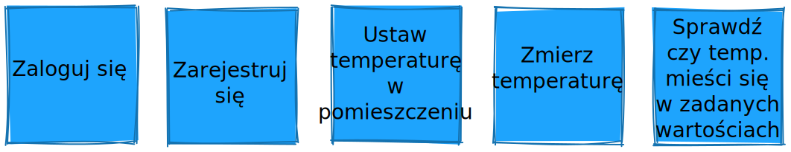

Polecenia są pisane w formie rozkazującej (czasem z ang. imperatywnej) i mają za zadanie ukazać zamiar wykonania czegość. 
A z zamiarem bywa tak, że czasem się nie udaje. 
====

=== Reakcja
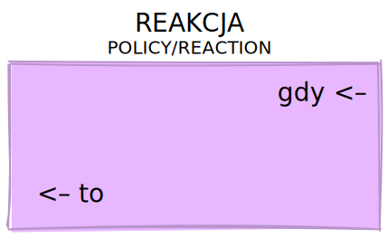

Reakcja (czasem zwana również polityką) pozwala nam zaprezentować to, jak system reaguje automatycznie na pewne zdarzenia. 
Łatwo rozpoznać reakcję po tym, że zaczynamy używać składki "kiedy, …, to…". 
Ważne jest to, aby karteczka ta trafiała pomiędzy zdarzeniem, którego jest adresatem, oraz poleceniem, które ma wykonać <<EventStormingDomaindriven2019>>. 

.Przykłady polityk
====
image::policy-example.svg[align="center"]

W przykładowym systemie mamy tylko dwie polityki, które mówią nam jasno, że:

* użytkownik, który jest niezalogowany, powinien zostać przekierowany do strony zakładania konta. 
Tutaj można by się pokusić, że jest to część typowo oparta na kontrolkach (niezmieniająca nic w systemie), jednak jeśli biznesowi zależy na takiej funkcji, to czemu nie?
* mamy wysyłać powiadomienie, kiedy wartość temperatury przekroczy tę zadaną. 
====

=== Widok
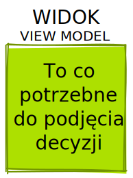

W widokach, we wszelkiej literaturze, znalazłem najmniej. 
Jednak uważam je za tyle ciekawe, że pozwalają nam powiedzieć, czy dany widok istnieje w naszej aplikacji oraz, czy pewne rzeczy są uruchamiane ręcznie, czy też automatycznie (przed widokiem stoi człowiek a za nim polecenie). 

.Przykłady widoków
====
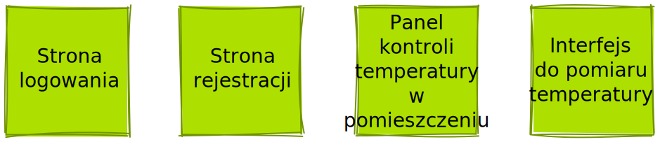

Na karteczkach przykładowych mamy cztery widoki, które jasno pokazują, co użytkownik widzie.
Poza ostatnim, który jest *widokiem sprzętowym* dla zdarzenia czasowego.
Alternatywnie można by za modelować to za pomocą polityki, jednak o tyle podoba mi się takie podejście, że wyraźnie wskazuje nam, że musimy mieć tutaj połączenie ze światem zewnętrznym (w końcu po to są widoki – aby łączyć się z zewnątrz, co nie?).
====

=== Rysunek poglądowy
image::mockup.svg[align="center"]

Widokowi może towarzyszyć rysunek poglądowy. 
Dodajemy je wtedy, gdy osoby od doświadczeń użytkownika (z ang. _user experience_, zapisywane skrótem UX) uznają jakiś element za szalenie istotny. 
Taki obrazek pozwala na lepszą komunikację pomiędzy UXowcami a osobami odpowiedzialnymi za wygląd aplikacji, gdyż tym drugim pokazano, co jest najważniejsze. 

.Przykład rysunku poglądowego
====
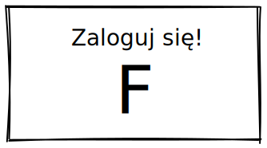

Mimo iż powyższy rysunek nie wystąpił w przykładach, to postanowiłem opisać go dla porządku.
Widzimy na nim wyraźnie, że jest trochę tekst, jest rysunek, który symbolizuje górną partię ciała człowieka oraz przycisk OK. 
Można z tego wysnuć wniosek, że obrazek musi być dość duży, jednak nie to jest najważniejsze – największa wartość stanowi dyskusja, która urodziła się podczas tworzenia takiej makiety.
====

=== Świat zewnętrzny
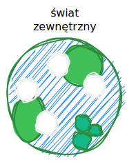

Świat zewnętrzny, podobnie jak rysunek poglądowy znalazł się tylko na notacji. 
Niemniej uważam, że może być on ważny, zwłaszcza w przypadkach, gdy nasz system silnie operuje na tym, co dzieje się w świecie rzeczywistym. 
Karteczki, które mogłyby trafić pod ten szyld, powinny reprezentować swojego rodzaju zdarzenia (być sformułowane w przeszłej formie), gdyż to właśnie czasowniki napędzają nasz świat i go zmieniają, rzeczowniki natomiast stoją w miejscu.

== Warsztaty

W tej sekcji omówię wszystko to, co uważam za ważne zarówno przed, w trakcie, jak i po warsztatach

=== Planowanie warsztatów

NOTE: Pamiętaj, że pojedyncza sesja nie powinna przekraczać 2 godzin.

indexterm:[Warsztaty]
indexterm:[Karteczki samoprzylepne]
W trakcie warsztatów niezwykle problematyczna może być ilość miejsca, której będziesz potrzebować do zaprezentowania wszystkich zdarzeń. 
Dlatego zawczasu zadbaj o *bardzo dużo przestrzeni* i odpowiednią przyczepność karteczek do ściany. Jak podaje Zimarev warto kupić rolkę papieru do plotera, którą umocujesz jako podkład, w przypadku, gdy goła ściana nie jest w stanie zapewnić odpowiedniej przyczepności <<DDDNetCore>>.

Dlaczego to takie ważne?
Ponieważ jak się okazuje, gdy ludziom zacznie brakować miejsca, to zaczną się ograniczać ze swoją kreatywnością.
Może się to skończyć tym, że część systemu w ogóle nie zostanie za modelowana, gdyż zostanie uznana za nieważną, a z racji ograniczonego miejsca, pominięta.

Dlatego sala wybrana do warsztatów Event Storming powinna być jak największa. 
W skrajnym przypadku można do tego wykorzystać korytarz, jednak upewnij się, że w trakcie, gdy będziesz go wykorzystywać, nie będzie przechodzić tamtędy duża ilość osób, co może rozpraszać uczestników.

Innym pomysłem może być działanie hybrydowe – uczestnicy siadają w jednej sali z własnymi komputerami, na których będą pracować. 
Dobrze, aby znajdował się w niej też jeden duży wyświetlacz dla prowadzącego. 
Następnie wszyscy równocześnie działają na jednej tablicy, na przykład przy pomocy oprogramowania https://miro.com/. 
Dlaczego mówię o siedzeniu w jednej sali?
W trakcie warsztatów jest niesamowita ilość dyskusji, która wydaje się niemożliwa przy użyciu tradycyjnych form pracy i komunikacji zdalnej, gdzie jedna osoba mówi, a reszta musi słuchać. 

==== Lista rzeczy do zrobienia

.Koncepcja
* [ ] Określ cel warsztatów (znalezienie problemów lub miejsc zapalnych) i nie zapomnij umieścić go w agendzie! 
* [ ] Jeśli nie wszyscy mają pojęcie o domenie, roześlij jej krótki opis oraz zestaw widoków dla uczestników

.Zakupy
* [ ] Sprawdź, czy karteczki trzymają się ściany,
** [ ] jak nie, to zakup papier do plotera.
* [ ] Przygotuj spory zapas karteczek samo przylepnych:
** [ ] pomarańczowych zwykłych do zapisu zdarzeń (faktów),
** [ ] jaskraworóżowych do oznaczania hotspotów,
** [ ] niebieskich do zapisu poleceń (z ang. _comamnds_), 
** [ ] łososiowe lub zwykłe różowe do oznaczania systemów wewnętrznych,
** [ ] fioletowe do zapisywania reakcji naszego systemu na zdarzenia
** [ ] zielone do reprezentacji widoków,
** [ ] żółte wąskie do zaprezentowania aktorów,
** [ ] białe do rysowania szkiców interfejsów użytkownika,
** Opcjonalnie
*** [ ] Karteczki do zapisu zdarzeń środowiskowych, 
*** [ ] Karteczki do zapisu wspólnego języka domenowego. 
* [ ] Pisaki do pisania po karteczkach.
* [ ] Taśma malarska do pisania etykiet wszelakich
* [ ] Coś słodkiego do jedzenia.

=== Rozpoczęcie warsztatów

image::workshop.jpg[]

W celu uprzedniego przygotowania sali warto przyjść do niej nawet 30 minut przed planowanym startem. 
Rzeczy, które trzeba zrobić to:

.Przed startem
* [ ] Jeśli karteczki nie trzymają się ściany, przymocuj papier,
* [ ] Umieść notację w widocznym miejscu,
* [ ] Usuń krzesła, jeśli chcesz pracować przy pomocy karteczek, w przypadku gdy je zostawisz, to zobaczysz, że niektórzy odłączą się od grupy i zaczną sobie po cichu robić własne rzeczy,
* [ ] Rozmieść pisaki, karteczki i coś do zjedzenia.

Kiedy wszyscy już się zbiorą i warsztaty się zaczną nie zapomnij o:

.Przy rozpoczynaniu warsztatów:
* [ ] Przedstawienie celu, uczestników 
* [ ] Krótkiej zabawy, aby pobudzić ludzi (możesz znaleźć je na stronie https://www.funretrospectives.com/category/energizer/[funretrospectives.com]) <<bourgauDetailedAgendaDDD2018>>,
  Najmniej wymagająca zabawa, według mnie, to „Poszedłem na plaże i wziąłem…" footnote:[źródło zabawy: https://www.funretrospectives.com/went-to-the-beach-and/[], w skrócie polega ona na tym, że prowadzący mówi: „Poszedłem na plaże i wziąłem ze sobą…" i następnie wymienia jedną rzecz. 
  Osoba stojąca obok prowadzącego powtarza to, co powiedział prowadzący, dodając swoją rzecz. 
  Zabawa trwa aż wszyscy się wypowiedzą.],
* [ ] Przedstawienie metody Event Stormingu i wymaganej *całości* notacji wraz z zasadami ich użycia. 
Na początek skup się na: _zdarzenia domenowego_, _gorącego miejsca_ oraz _zewnętrznego systemu_.

Zauważyłem, że niezwykle ważne jest, aby przedstawić całość notacji uczestnikom warsztatów. 
Nie próbuj „chować” przed nimi tego, co będą robić w późniejszych etapach – pozwoli im to od razu układać karteczki w większych odstępach oraz załapać kontekst tego, co będą robić. 
Jedną z formą przedstawienia notacji, z którą się spotkałem, jest poproszenie jednego z uczestników o to, aby przedstawił, co widzi na rysunku. 
Jeśli czegoś nie rozumie, może zadawać pytania prowadzącemu.

Z racji, że Event Storming to warsztat grupowy, gdzie wszyscy powinni brać udział, należy zachęcić ludzi do tego, aby sami zapisywali zdarzenia na ścianie.
Aby to osiągnąć, należy zacząć od siebie – zapisz karteczkę jednym zdarzeniem, które znajduje się gdzieś *w środku systemu*, np. „użytkownik dodał przedmiot do koszyka”. 
Jest to niezwykle ważne, aby nie próbować zaczynać od początku lub od końca, gdyż _zawsze_ będzie coś wcześniej i później. 
Dzięki takiemu podejściu można próbować zachęcić uczestników, aby zapisali zdarzenia, które następują lub są przed twoim <<DDDNetCore>><<bourgauHowPrepareDDD2018>>. 

NOTE: Uważaj na pomysł z cichą burzą mózgów, gdy masz do czynienia z grupą niedoświadczoną w Event Stormingu.
Może się to skończyć dużą ilością karteczek, które nijak nie wpasowują się w notację.

[#w-trakcie-warsztatow]
=== During the workshop

Jak zostało to powiedziane we wstępie, zajmiemy dwoma zasadniczymi częściami warsztatów Event Stormign: _Big Picture_ i _Process Level_.
W warsztatach niezwykle ważne jest to, aby udział brali wszyscy uczestnicy, przez to prowadzący powinien ich obserwować i dawać wskazówki, a nie próbować kierować całością dyskusji.

W trakcie warsztatów, niezależnie od etapu, zwróć szczególną uwagę na to, że:

* Ludzie mają tendencję do kreślenia drogi w przypadku gdy wszystko idzie po ich myśli, dlatego zachęć ich aby prześledzili przypadki poza właściwą ścieżką, takie jak „dokonano płatności na dwu krotność kwoty”, bądź „login i hasło zostało odrzucone” <<DDDNetCore>>.
Szczególnie przydatna może być tutaj metoda „fantastycznej czwórki” Mateusza Gila, zwaną również 0, 50, 100 i 150, która polega na szukaniu możliwości zdarzenia w wersji na 0% (gdy zdarzenie nie zaszło), 50% (zdarzenie zaszło w wersji częściowej) lub 150% (zdarzenie zaszło w wersji przesadzonej), np. co się stanie, gdy użytkownik zapłaci za mało, lub za dużo, bądź wcale <<DevStyleStolarczyk>>?  

* Gdy zobaczysz ożywioną dyskusję, zwłaszcza taką, która kręci się w kółko i nie generuje nowych karteczek, najpewniej jest to punkt zapalny zwany z angielskiego _hot spot_, który według propozycji twórcy metody Event Stormingu Alberto Brandolini należy oznaczyć jaskrawym kolorem (np. jaskrawy róż) <<DDDNetCore>>.

* Należy wyłapywać karteczki, których formy sugerują życzenia czy reprezentują całe funkcjonalności (np. „zaloguj użytkownika” lub „lista produktów”) a ich twórcom wyjaśnić, że interesuje nas przepływ zdarzeń, którego nie można cofnąć.

Jeśli natomiast widzisz, że dyskusja powoli się wypala, to możesz spróbować dwóch sposobów:

. Poproś uczestników o prześledzenie zdarzeń wstecz (od początku do końca) – może nie umieszczono jakiegoś, z pozoru nieistotnego, zdarzenia? Może ktoś zapomniał, że przed dokonaniem zakupu należy wybrać metodę dostawy? 
. Wyśledź pieniądze – poproś uczestników, aby prześledzili te ścieżki, które bezpośrednio generują przychód <<DDDNetCore>>.
. Zwróć uwagę na polecenia, przy których jest tylko jedno zdarzenie: czy na pewno jest tylko jedna ścieżka wykonania polecenia (pamiętaj o „fantastycznej czwórce”)?

Podczas porządkowania tablicy po pierwszym etapie burzy mózgów może pojawic się wątpliwość, czy dane zdarzenie należy do naszego systemu, czy też nie.
Wcześniej już wspomniany Mateusz Gil zaprezentował podział na 4 poziomy (więcej na https://www.youtube.com/watch?v=31PNdWaUrTY[YouTube]) <<DevStyleStolarczyk>>:

1. Zdarzenia środowiskowe, które występują poza systemem (samochód wjechał na parking), 
2. Zdarzenia interfejsowe, które nie wpływają na stan systemu (użytkownik wybrał opcję w formularzu),
3. Zdarzenia infrastrukturalne, które również nie mają wpływu na system i reprezentują typowe technikalia (plik został załadowany na dysk),
4. Zdarzenia domenowe – te, które nas interesują – reprezentują domenę i zmieniają stan systemu.

=== Na zakończenie warsztatów

image::finishing.jpg[]

Podobno ludzki mózg uwielbia historię, dlatego w celu utrwalenia treści, które pojawiły się w trakcie warsztatów, warto poprosić któregoś z uczestników (lub wspólnie całą grupą), aby opowiedział historię, która dzieje się od początku do końca, od lewej do prawej <<bourgauDetailedAgendaDDD2019c>>.
W przypadku gdy idzie to dość niemrawo, warto zaproponować zmianę opowiadającego.

=== Po zakończeniu warsztatów

Jak wskazuje Zimarev, najważniejsze jest to, aby programiści zadawali pytania.
Jeśli na twoich warsztatach nie było dyskusji to możliwe, że problem był zbyt prosty lub zaproszeni byli nieodpowiedni ludzie <<DDDNetCore>>.

Nie obawiaj się również rozszerzać notacji warsztatów. 
Na przykład, gdy domena mocno operuje na bazach danych można spróbować zaprezentować je w trakcie warsztatów za pomocą osobnych karteczek, gdzie każda z operacji, jak _SELECT_ czy _UPDATE_, ma swój własny kolor <<DevStyleStolarczyk>>. 

[bibliography]
== Bibliografia
Artykuł na podstawie:

* [[[DDDNetCore]]] 
  Zimarev, Alexej. Domain-Driven Design dla .NET Core: Jak rozwiązywać złożone problemy podczas projektowania architektury aplikacji. Warszawa: Helion S.A., 2021.
* [[[DevStyleStolarczyk]]]
  Stolarczyk, Tomasz. „NAJobszerniejsze wprowadzenie do Event Stormingu. Z przykładem!” devstyle.pl, 12 październik 2020. https://devstyle.pl/2020/10/12/najobszerniejsze-wprowadzenie-do-event-stormingu-z-przykladem/.
* [[[stolarczykProcessLevelEvent2021]]] 
  Stolarczyk, Tomasz. „Process Level Event Storming – Wielka Piguła Wiedzy”. devstyle.pl, 14 styczeń 2021. https://devstyle.pl/2021/01/14/process-level-event-storming/.
* [[[bourgauHowPrepareDDD2018]]]
  Bourgau, Philippe. „How to Prepare a DDD Big Picture Event Storming Workshop”. Philippe Bourgau’s XP Coaching Blog, 6 grudzień 2018. http://philippe.bourgau.net/how-to-prepare-a-ddd-big-picture-event-storming-workshop/.
* [[[bourgauHowPrepareRoom2018]]]
  Bourgau, Philippe. „How to Prepare the Room for a DDD Big Picture Event Storming”. Philippe Bourgau’s XP Coaching Blog, 13 grudzień 2018. http://philippe.bourgau.net/how-to-prepare-the-room-for-a-ddd-big-picture-event-storming/.
* [[[bourgauDetailedAgendaDDD2018]]]
  Bourgau, Philippe. „Detailed Agenda of a DDD Big Picture Event Storming - Part 1”. Philippe Bourgau’s XP Coaching Blog, 20 grudzień 2018. http://philippe.bourgau.net/detailed-agenda-of-a-ddd-big-picture-event-storming-part-1/.
* [[[bourgauDetailedAgendaDDD2019b]]]
  Bourgau, Philippe. „Detailed Agenda of a DDD Big Picture Event Storming - Part 2”. Philippe Bourgau’s XP Coaching Blog, 3 styczeń 2019. http://philippe.bourgau.net/detailed-agenda-of-a-ddd-big-picture-event-storming-part-2/.
* [[[bourgauDetailedAgendaDDD2019c]]]
  Bourgau, Philippe. „Detailed Agenda of a DDD Big Picture Event Storming - Part 3”. Philippe Bourgau’s XP Coaching Blog, 10 styczeń 2019. http://philippe.bourgau.net/detailed-agenda-of-a-ddd-big-picture-event-storming-part-3/.
* [[[kolinskaEventStormingGuide]]]
  Kolińska, Natalia. „Event Storming Guide”. Udostępniono 20 lipiec 2021. https://www.boldare.com/blog/event-storming-guide.
* [[[EventStormingDomaindriven2019]]]
  IBM Developer. „Event Storming & Domain-Driven Design: Reactive in Practice - Event Storming the Stock Trader Domain”, 12 luty 2019. https://developer.ibm.com/tutorials/reactive-in-practice-1/.
