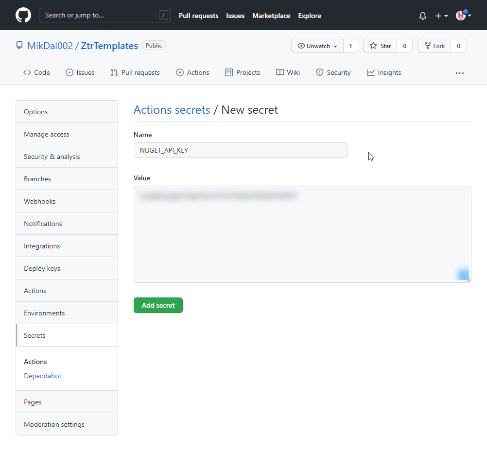
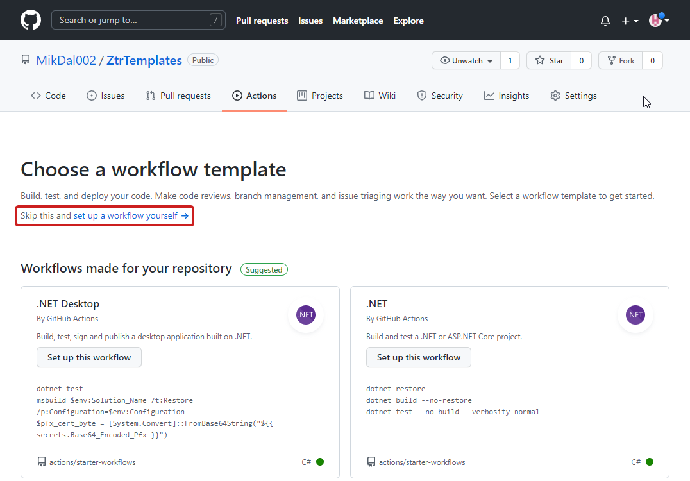

= CI/CD dla własnego szablonu
:toc: 
:sectnums:

In this article, I will not go into detail about creating Github actions. 
Nevertheless, I'd like this to be a place to start, so the following tips are suitable for any type of project that involves publishing nuget.
At this point, I'm assuming that you *already have a ready to go repository on Github* - this article will not cover pushing your changes out to a remote repository.

== In order to publish to the nuget.org repository, we must first create an account and create an API key

****
To do this, go to nuget.org - you can even log in there with your Microsoft account

.New account creation view
image::nuget-org-signin.png[align="center"]
****

==  Then go to the API keys page

****
After logging in, select your account name and from there _API Keys_.

.View of the menu after logging in
image::nuget-org-apikey-pages.png[align="center"]
****

== Then create a new API key

****
. Enter a key name in the _Key Name_ field that specifies where you used the key.
I used the name _ZtrTemplates_.
. Enter a pattern that specifies what packages can be published with this key, such as `ZTR.*`.
. Select _Create_.
. Immediately after creation, copy the key and temporarily do not close the card.
The warning clearly states that once this card is closed, it will not be possible to obtain the key again.

.View of creating a new API key
image::nuget-org-apikeys-create.png[align="center"]

.And the view after creation, when copying the key is still possible

****

== Add the API key to your repository

****
. To do this, go to the repository settings, then go to _Actions_ and select _New repository secret_.
. Then enter the key name - try not to make a mistake in it, we will use it later.
In my case I used the name `NUGET_API_KEY`, and paste the API key copied from nuget.org.

.Repository secrets page

.Adding a new key

****

== The next step is to create an action in our repository

****
The easiest way to do this is by going to the _Actions_ page and then selecting _set up a workflow yourself_.

.View adding the first action

Then paste the following code into the action and validate everything on your branch:

[source,yaml]
.The whole action on Github
----
name: Publikuj szablon do Nuget.org

on:
  push:
    branches: [ main ] <1>

jobs:
  build:
    runs-on: ubuntu-latest

    steps:
    - uses: actions/checkout@v2
    - name: Setup .NET
      uses: actions/setup-dotnet@v1
      with:
        dotnet-version: 5.0.x
    - name: Restore dependencies
      run: dotnet restore
    - name: Build
      run: dotnet build --no-restore
    - name: Test
      run: dotnet test --no-build --verbosity normal
    - name: Pack
      run: dotnet pack --no-build --configuration Release
    - name: Publish to nuget.org
      run: dotnet nuget push "./bin/Release/*.nupkg" -k ${{ secrets.NUGET_API_KEY }} -s https://api.nuget.org/v3/index.json --skip-duplicate <2>
----

<1> Here we specify that we want our action to be executed only when there are new commits on the `main` branch.
<2> This is the heart of the action, we publish all nuget packages located in the `./bin/Release` directory.
By default only our package will be there, so this design protects us from renaming it in the future.
In addition, in the `-k ${{ secrets.NUGET_API_KEY }}`, we pass our token to Nuget.org that we created earlier.

Additionally, it is worthwhile to delve into:

* `-s https://api.nuget.org/v3/index.json` - the address where we want to publish, it is required in the `nuget push` command, unless this value is defined separately in the project file (more information in the https://docs.microsoft.com/pl-pl/dotnet/core/tools/dotnet-nuget-push[documentation])
* `--skip-duplicate` - causes the attempt to push the same package (with the same version) to be skipped and the whole action to complete successfully (without returning an error code).

.The whole should look similar

The code you see below is a cluster of elements from the https://github.com/actions/setup-dotnet[setup-dotnet] repository and the https://docs.microsoft.com/pl-pl/dotnet/core/tools/dotnet-nuget-push[dotnet nuget push] documentation.

****

== Now make any changes to your code (template) and upload to the repository. 

****
One of the most important changes will definitely be the version update. 
If you are working on a project file similar to the one in the previous article, just make a minor update to the project file:

[source,xml]
----
<Project Sdk="Microsoft.NET.Sdk">
  <PropertyGroup>
    <PackageType>Template</PackageType>

    <PackageVersion>1.1</PackageVersion> <!--1-->
    <PackageId>ZTR.Utilities.Templates</PackageId>
    <Title>Zaprogramuj to raz! Core template</Title>
    <Authors>Zaprogramuj to raz!</Authors>
    <Description>Template for creating core projects</Description>
    <PackageTags>dotnet-new;ztr;templates</PackageTags>
    
    <IncludeContentInPack>true</IncludeContentInPack>
    <IncludeBuildOutput>false</IncludeBuildOutput>
    <ContentTargetFolders>content</ContentTargetFolders>

    <TargetFramework>net5.0</TargetFramework>
  </PropertyGroup>

  <ItemGroup>
    <Content Include="templates\**\*" Exclude="templates\**\bin\**;templates\**\obj\**" />
    <Compile Remove="**\*" />
  </ItemGroup>
</Project>
----
****

== Wait for a while and see if there is already an update. 

****
If so, update!

As a reminder, you can install the template as follows - it will be automatically downloaded from Nuget.org.

[source,console]
.Installing templates from Nuget.org
dotnet new --install ZTR.Utilities.Templates

You can then check for possible updates and apply them using the following two commands:

[source,console]
.Checking for updates and updating templates
----
PS C:\Users\dalec> dotnet new --update-check
Updates are available for the following:
An update is available for the template package ZTR.Utilities.Templates::1.0.0.
    command to install: dotnet new -i ZTR.Utilities.Templates::1.1.0

PS C:\Users\dalec> dotnet new --update-apply
An update to the ZTR.Utilities.Templates::1.0.0 template package is available.
    command to install: dotnet new -i ZTR.Utilities.Templates::1.1.0
Update in progress...
...Update was successful.
----

You can always preview the installed version with the `dotnet new -u` command.

[source,console]
.Preview the new version of the templates
----
PS C:\Users\dalec> dotnet new -u
 ZTR.Utilities.Templates
    Szczegóły:
      NuGetPackageId: ZTR.Utilities.Templates
      Version: 1.1.0
      Author: Zaprogramuj to raz!
----

After you push your package out, you have to wait a while before it goes through the verification process. 
When all goes well you may see something like this on the package page:

.View of the nuget package page after the update

****

