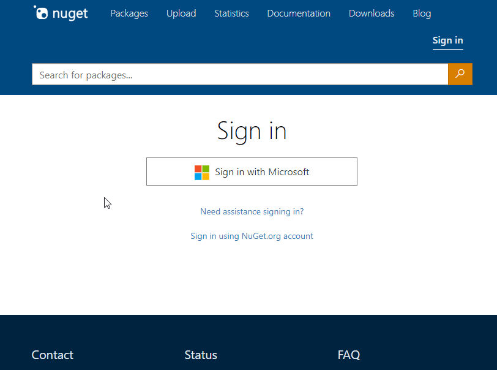
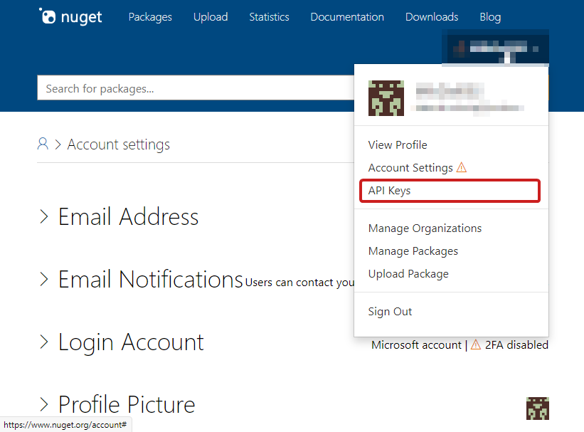
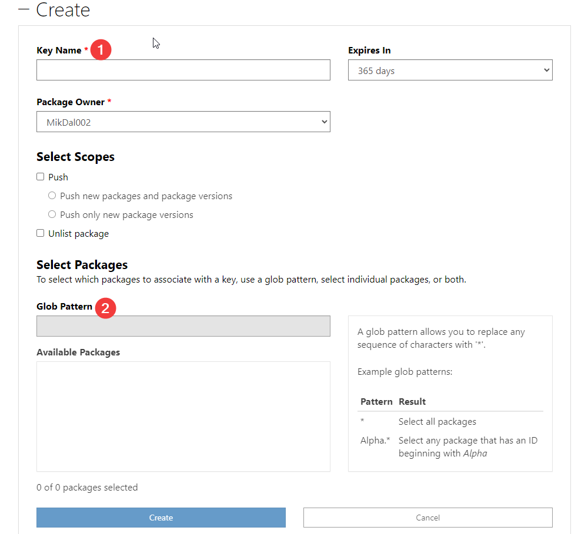

= CI/CD dla własnego szablonu
:toc: 
:sectnums:

W tym artykule nie będę szczegółowo opisywał kwestii tworzenia akcji Github. 
Niemniej chciałbym, aby było to miejsce, w którym można zacząć swoją przygodę, dlatego poniższe wskazówki nadają się do każdego typu projektu, który zakłada publikowanie nugeta.
W tym momencie zakładam, że *masz już gotowe repozytorium na Githubie* – ten artykuł nie będzie pokrywał wypychania swoich zmian na zdalne repozytorium.

== Aby móc publikować w repozytorium nuget.org musimy najpierw założyć konto i utworzyć klucz API

****
W tym celu udaj się na stronę https://www.nuget.org[Nuget.org] – możesz się tam zalogować nawet za pomocą konta Microsoft

.Widok zakładania nowego konta

****

==  Następnie przejdź do strony z kluczami API

****
Po zalogowaniu wybierz nazwę swojego konta a stamtąd _API Keys_.

.Widok menu po zalogowaniu

****

== Potem utwórz nowy klucz API 

****
. Wprowadź nazwę klucza w polu _Key Name_, która będzie określać, gdzie użyłeś danego klucza.
Ja użyłem nazwy _ZtrTemplates_.
. Wprowadź wzorzec, który określi jakie pakiety mogą być publikowane za pomocą tego klucza, np. `ZTR.*`.
. Wybierz _Create_.
. Od razu po utworzeniu skopiuj klucz i tymczasowo nie zamykaj karty.
W ostrzeżeniu jest wyraźnie napisane, że po zamknięciu tej karty ponowne uzyskanie klucza nie będzie możliwe.

.Widok tworzenia nowego klucza API

.I widok po utworzeniu, kiedy kopiowanie klucza jest jeszcze możliwe
image::nuget-org-apikey-aftercreation.png[align="center"]
****

== Dodaj klucz API do swojego repozytorium

****
. W tym celu udaj się do ustawień repozytorium, gdzie następnie przejdź do _Actions_ i wybierz _New repository secret_.
. Następnie podaj nazwę klucza – postaraj się nie zrobić w niej błędu, będziemy jej później używać.
W moim przypadku użyłem nazwy `NUGET_API_KEY`, i wklej klucz API skopiowany z nuget.org.

.Strona sekretów repozytorium
image::github-add-secrets-to-repo.png[align="center"]

.Dodawanie nowego klucza
image::github-add-secrets-to-repo-new-secret.png[align="center"]
****

== Następnym krokiem jest utworzenie akcji w naszym repozytorium

****
Najprościej jest to zrobić, udając się na stronę _Actions_ a następnie wybierając _set up a workflow yourself_.

.Widok dodawania pierwszej akcji
image::github-setup-first-action.png[align="center"]

Następnie wklej w akcję poniższy kod i zatwierdź wszystko na swojej gałęzi:

[source,yaml]
.Cała akcja na Githubie
----
name: Publikuj szablon do Nuget.org

on:
  push:
    branches: [ main ] <1>

jobs:
  build:
    runs-on: ubuntu-latest

    steps:
    - uses: actions/checkout@v2
    - name: Setup .NET
      uses: actions/setup-dotnet@v1
      with:
        dotnet-version: 5.0.x
    - name: Restore dependencies
      run: dotnet restore
    - name: Build
      run: dotnet build --no-restore
    - name: Test
      run: dotnet test --no-build --verbosity normal
    - name: Pack
      run: dotnet pack --no-build --configuration Release
    - name: Publish to nuget.org
      run: dotnet nuget push "./bin/Release/*.nupkg" -k ${{ secrets.NUGET_API_KEY }} -s https://api.nuget.org/v3/index.json --skip-duplicate <2>
----

<1> W tym miejscu określamy, że chcemy, aby nasza akcja byłą wykonywana tylko wtedy, gdy pojawią się nowe zatwierdzenia (z ang. _commits_) na gałęzi `main`.
<2> To jest serce całej akcji, publikujemy wszystkie paczki nuget znajdujace się w katalogu `./bin/Release`.
Domyślnie będzie znajdowała się tam tylko nasza paczka, więc taka konstrukcja chroni nas przed zmianą nazwy w przyszłości.
Do tego w miejscu `-k ${{ secrets.NUGET_API_KEY }}` przekazujemy nasz token do Nuget.org utworzony wcześniej.

Dodatkowo warto pochylić się jeszcze nad:

* `-s https://api.nuget.org/v3/index.json` – podanie adresu, gdzie chcemy publikować, jest wymagane w poleceniu, chyba, że wartość ta została zdefiniowana osobno w pliku projektu (więcej informacji w https://docs.microsoft.com/pl-pl/dotnet/core/tools/dotnet-nuget-push[dokumentacji])
* `--skip-duplicate` – powoduje, że próba wypchnięcia tego samego pakietu (o tej samej wersji) zostanie pominięta a cała akcja zakończy się pozytywnie (bez zwracania kodu błędu).

.Całość powinno wygądać podobnie
image::github-set-action.png[align="center"]

Kod, który widzisz poniżej jest zbitkiem elementów z repozytorium https://github.com/actions/setup-dotnet[setup-dotnet] oraz dokumentacji https://docs.microsoft.com/pl-pl/dotnet/core/tools/dotnet-nuget-push[dotnet nuget push].

****

== Teraz zrób dowolne zmiany w swoim kodzie (szablonie) i wyślij do repozytorium. 

****
Jedną z najważniejszych zmian będzie na pewno aktualizacja wersji. 
Jeśli pracujesz na pliku projektu podobnym do tego z poprzedniego artykułu, wystarczy wprowadzić drobną aktualizację w pliku projektu:

[source,xml]
----
<Project Sdk="Microsoft.NET.Sdk">
  <PropertyGroup>
    <PackageType>Template</PackageType>

    <PackageVersion>1.1</PackageVersion> <!--1-->
    <PackageId>ZTR.Utilities.Templates</PackageId>
    <Title>Zaprogramuj to raz! Core template</Title>
    <Authors>Zaprogramuj to raz!</Authors>
    <Description>Template for creating core projects</Description>
    <PackageTags>dotnet-new;ztr;templates</PackageTags>
    
    <IncludeContentInPack>true</IncludeContentInPack>
    <IncludeBuildOutput>false</IncludeBuildOutput>
    <ContentTargetFolders>content</ContentTargetFolders>

    <TargetFramework>net5.0</TargetFramework>
  </PropertyGroup>

  <ItemGroup>
    <Content Include="templates\**\*" Exclude="templates\**\bin\**;templates\**\obj\**" />
    <Compile Remove="**\*" />
  </ItemGroup>
</Project>
----
****

== Poczekaj chwilę i sprawdź, czy jest już aktualizacja. 

****
Jeśli tak, to aktualizuj!

Dla przypomnienia szablon możesz zainstalować w następujący sposób – zostanie on automatycznie pobrany z witryny Nuget.org.
[source,console]
.Instalacja szablonów z Nuget.org
dotnet new --install ZTR.Utilities.Templates

Następnie możesz sprawdzić możliwe aktualizacje i je zastosować za pomocą dwóch poniższych poleceń:

[source,console]
.Sprawdzanie aktualizacji i aktualizowanie szablonów
----
PS C:\Users\dalec> dotnet new --update-check
Dostępne są aktualizacje dla następujących elementów:
Dostępna jest aktualizacja pakietu szablonów ZTR.Utilities.Templates::1.0.0.
    polecenie instalowania: dotnet new -i ZTR.Utilities.Templates::1.1.0

PS C:\Users\dalec> dotnet new --update-apply
Dostępna jest aktualizacja pakietu szablonów ZTR.Utilities.Templates::1.0.0.
    polecenie instalowania: dotnet new -i ZTR.Utilities.Templates::1.1.0
Trwa aktualizowanie...
...Aktualizacja powiodła się.
----

Zawsze możesz podejrzeć zainstlowaną wersję za pomocą polecenia `dotnet new -u`.

[source,console]
.Podgląd nowej wersji szablonów
----
PS C:\Users\dalec> dotnet new -u
 ZTR.Utilities.Templates
    Szczegóły:
      NuGetPackageId: ZTR.Utilities.Templates
      Version: 1.1.0
      Author: Zaprogramuj to raz!
----

Po wypchnięciu swojej paczki trzeba chwilę poczekać zanim przejdzie ona przez proces weryfikacji. 
Kiedy wszystko pójdzie dobrze możesz zobaczyć na stronie paczki takie coś:

.Widok strony z paczką nugetową po aktualizacji
image::nuget-org-template-package-page.png[align="center"]

****

Gotowe!
Nie ma to jak automatyzacja, która zwalnia nas z robienia rzeczy, które w sumie nie wnoszą żadnej wartości do naszej pracy. 

