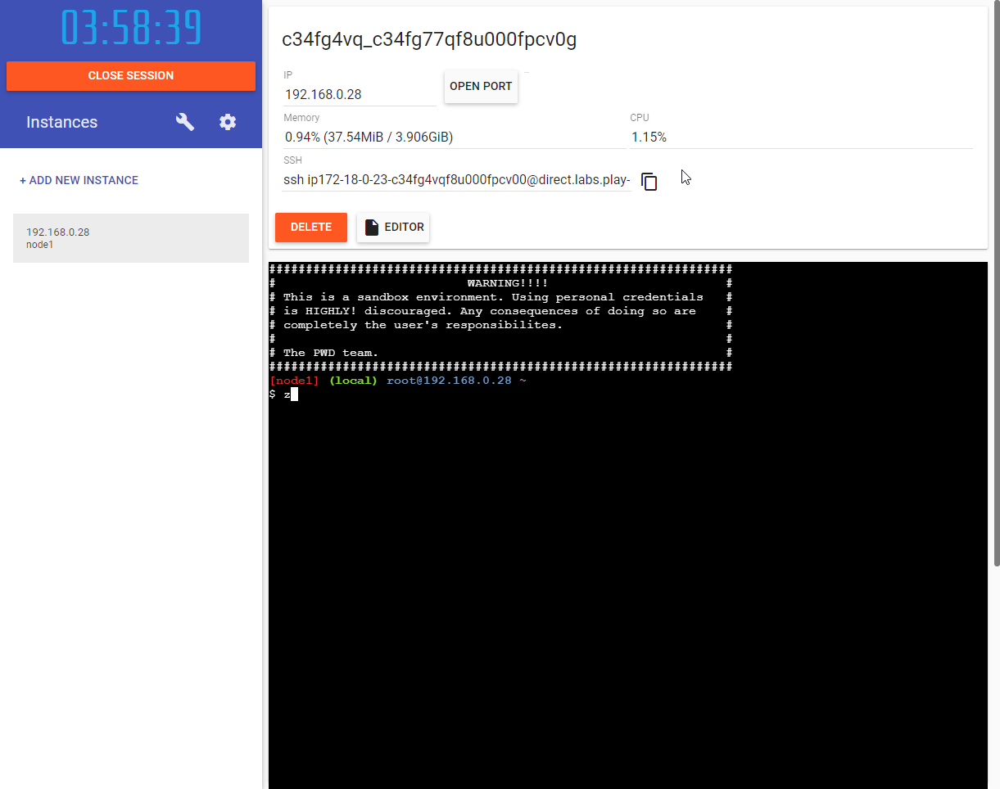
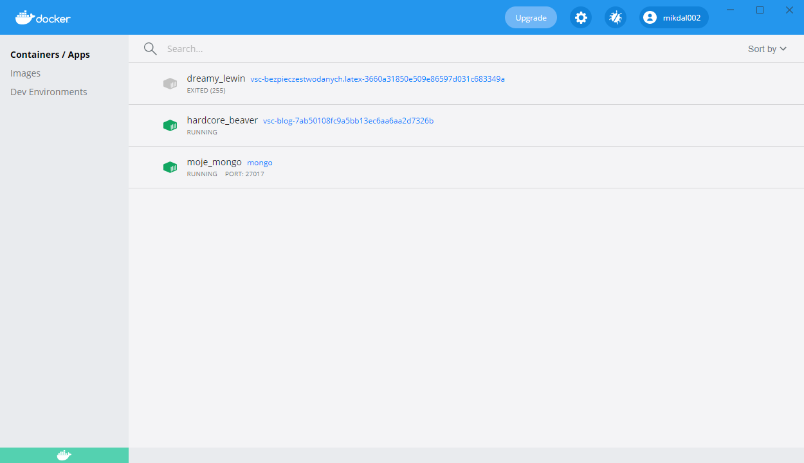

= Wykorzystanie Docker'a w celu zachowania czystości. Część 01 - Konsola
Mikołaj Dalecki <mikolaj.dalecki@outlook.com>
:toc:
:source-highlighter: pygments
:note-caption: Uwaga

== Czym jest Docker (dla tych, którzy nie wiedzą)
Docker to otwartoźródłowe darmowe oprogramowanie służące do pracy w kontenerach, a kontenery można porównać do bardzo lekkich maszyn wirtualnych.
Ich zaletą w porównaniu do maszyn wirtualnych jest dużo większa lekkość, szybkość działania i czas potrzebny na uruchomienie. Wady natomiast to: mniejsza kontrola nad wirtualizowanym środowiskiem i mniejsze bezpieczeństwo (złośliwy kod ma większe szanse na ucieczkę z kontenera). Więcej na ten temat możesz poczytać, na przykład, tutaj: https://sii.pl/blog/docker-dla-programistow-co-to-jest/[Docker dla programistów, co to jest?].

== Skąd wziąć Dockera?
Dockerem można pobawić się zarówno w chmurze, jak i lokalnie.
Jednak, gdy już postanowisz go używać do nauki/pracy stanowczo lepiej mieć go na komputerze.

=== W chmurze

Na początek chciałbym przedstawić Ci wersję chmurową.
Znajdziesz ją pod adresem https://labs.play-with-docker.com/[Play with Docker], gdzie trzeba się zalogować. 
Jeśli nie masz jeszcze konta, to jego założenie jest darmowe, tak samo, jak korzystanie z Docker'a. 

NOTE: Według mnie wersja ta jest wciąż niedojrzała i w ramach moich testów nie nadawał się do żadnej pracy. Przedstawiam ją tutaj ku potomności, bo mam nadzieję, że w końcu rozwiną tę usługę.

.Widok na stronę Play with Docker z jednym kontenerem.

Po lewej stronie możemy sobie tworzyć nowe, kolejne okna z Dockerem, natomiast u góry ekranu widzimy takie dane jak: • wewnętrzny adres IP (do komunikacji między kontenerami), • przycisk do otwierania portu (aby dostać się do poszczególnych usług), oraz adres SSH, który umożliwia nam wgranie plików lub połączenie się z Visual Studio Code.

=== Lokalnie

Dockera możemy zainstalować lokalnie, co sam uczyniłem.
Pobierzesz go z tej strony: https://docs.docker.com/docker-for-windows/install/[Docker install].
Nie będę tutaj przedstawiał całego procesu przechodzenia przez kreator – nie ma tam nic nadzwyczajnego, czego nie można zmienić później.
Na koniec procesu instalacji i po ponownym uruchomieniu warto sprawdzić, czy Docker działa za pomocą polecenia:

[source,console]
----
> docker help
----

== Docker w konsoli

Na początek odrobina formalności.
Czyli jak to wszystko uruchomić w konsoli – najbardziej podstawowym sposobem interakcji z Dockerem. 
Całe szczęście to będą tylko dwa polecenia.

=== Uruchamianie serwisów
Czyli, jak uruchomić oprogramowanie, które w rzeczywistości jest usługą/serwisem działającym w tle.
Mowa tu, na przykład o https://hub.docker.com/$$_$$/mongo/[MongoDb] czy https://hub.docker.com/$$_$$/microsoft-mssql-server/[Microsoft SQL Server].

[source,console]
----
> docker run --name moje_mongo -p 27017:27017 -d mongo 
----

.Co znaczą poszczególne elementy?
run::
    Powoduje wystartowanie kontenera.
    Jeśli nie ma obrazu kontenera na dysku, to zostanie on wpierw ściągnięty z publicznego repozytorium.

--name moje_mongo::
    Ustawia przyjazną nazwę _moje_mongo_, która później ułatwia orientowanie się w kontenerach obecnych na naszym komputerze.

-p 27017:27017::
    Określa jaki port ma zostać udostępniony – trochę tak, jakbyśmy otwierali port na firewallu. 
    Dla uproszczenia polecam ustawianie na początku takich samych wartości w obu stronach znaku ':', co ułatwi rozpoczęcie pracy z Dockerem.

-d::
    Mówi o tym, że uruchomiamy w trybie „_odłączonym_” (z ang. _detatched_), co pasuje do natury serwisów, które działają w tle.

mongo::
    Określa jakiego obrazu chcemy użyć. 
    W tym przypadku wybieramy MongoDB. 
    Wszystkie dostępne publicznie obrazy możemy przeglądać tutaj: https://hub.docker.com/search?q=&type=image. 

Uruchamiając powyższą komendę, możesz zobaczyć informację o ściąganiu kolejnych warstw (z ang. _layers_).
Na końcu tego procesu ujrzysz długi ciąg znaków <1>:
[source,console]
----
> docker run --name moje_mongo -p 27017:27017 -d mongo 
e7c364cf16898d636151d4b1be15caa5b726069c7fde2fa2cf241c4748ebd723 <1>
----

Jest on niczym innym jak całkowicie unikalnym identyfikatorem kontenera, który właśnie utworzyłeś. 
Wpisując w konsoli `docker ps` możesz podejrzeć kontenery, które działają na twoim komputerze. 
Zalecam jednak wykorzystać do tego program *Docker Dashboard*, który wyświetli Ci to w przyjaznej formie oraz pozwoli na wykonanie kilku prostych operacji za pomocą aplikacji okienkowej.

.Widok aplikacji Docker Desktop po uruchomieniu kontenera mongo i kilku innych :)

I tak dla przykładu, gdybyśmy chcieli pobawić się platformą https://hub.docker.com/_/ghost[ghost] (ciekawa usługa do obsługi bloga) wpisujemy:
[source,console]
----
> docker run -d --name some-ghost -p 2368:2368 ghost
----

Teraz w przeglądarce wystarczy wpisać https://localhost:2368 i powinniśmy zobaczyć naszą nową stronę internetową.

=== Uruchamianie obrazów interaktywnych

W ten sposób można działać, na przykład, ucząc się nowego języka programowania.

[source,console]
----
> docker run --name some-nodejs -p 3000:3000 -v "$(PWD):/mylocaldata" -it node bash
----

Wartości te zostały przedstawione powyżej, pokrótce je przypomnijmy:

run::
    Uruchamia kontener, 
--name some-nodejs::
    Nadaje mu nazwę some-nodejs
-p 3000:3000:::
    -Otwiera port 3000 – przyda się do uruchomienia przykładowego kodu z dokumentacji (z rozdziału _Getting started_, czyli z ang. _Rozpoczynanie pracy_).

Nowością są:

-v "$(PWD):/mylocaldata"::
    Powoduje, że katalog w którym, uruchomisz to polecenie, stanie się dostępny dla kontenera i będzie możliwa łatwa wymiana plików pomiędzy twoim komputerem a Dockerem.
    Udostępniony katalog będzie widoczny w kontenerze pod ścieżką `/mylocaldata`
-it node bash::
    Mówi nam, aby w trybie interaktywnym uruchomić obraz `node` z poleceniem `bash` (Node domyślnie uruchamia konsolowy program `node`).

Po uruchomieniu powyższego polecenia konsola przeniesie nas do `bash` uruchomionego na platformie gdzie zainstalowany jest `node.js`. 

W tym momencie możemy utworzyć plik `app.js` i wkleić do niego kod ze strony głównej Node. Niestety, aby uruchomić go bez problemu, należy dokonać dwóch modyfikacji

[source,javascript]
----
const http = require('http');

const hostname = '127.0.0.1'; <1>
const port = 3000;

const server = http.createServer((req, res) => {
  res.statusCode = 200;
  res.setHeader('Content-Type', 'text/plain');
  res.end('Hello World');
});

server.listen(port, /*hostname,*/ () => { <2>
  console.log(`Server running at http://${hostname}:${port}/`);
});
----

<1> Zakomentowałem `hostname` 
<2> i wyłączyłem jego użycie.
Jest to niezbędne, ponieważ adres `127.0.0.1` zakłada łączenie się z tej samej maszyny.
My jednak uruchamiamy nasz program w kontenerze, który jest widoczny jako osobna maszyna, dlatego nie możemy ograniczać się tylko do localhost. 
Pamiętaj, że powyższy plik możesz śmiało utworzyć pod Windowsem. 
Potem przechodzimy do naszego kontenera i wykonujemy polecenia:

[source,console]
----
> cd /localhost
> node app.js
----

Teraz przechodzimy w naszej przeglądarce pod adres https://localhost:3000 i widzimy naszą stronę. 
Modyfikacji w pliku możemy śmiało dokonywać wprost spod Windows, używając ulubionego edytora.

Co, jeśli potrzebujemy otworzyć inny port? Niestety w tym przypadku najprościej jest usunąć kontener i postawić go od nowa. 
Jednak jest proste rozwiązanie tego problemu – można to zrobić za pomocą Visual Studio Code, co zostanie przedstawione w następnej części.
