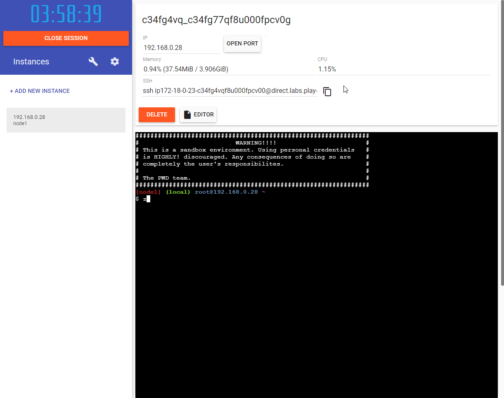
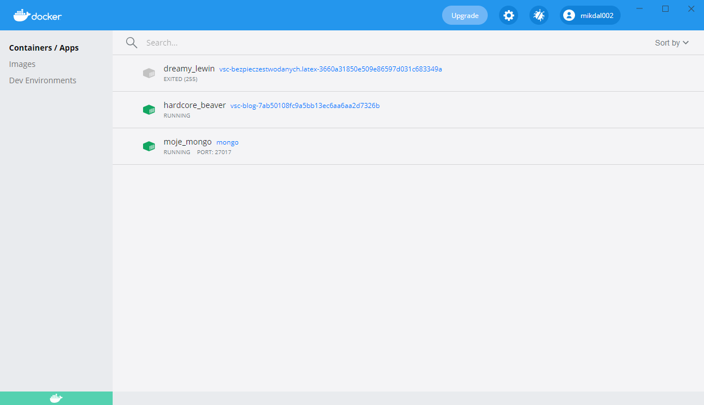

= Using Docker to stay clean. Part 01 - Console
Mikołaj Dalecki <mikolaj.dalecki@outlook.com>
:toc:
:source-highlighter: pygments

== What is Docker (for those who don't know)
Docker is open source freeware used to run in containers, and these can be compared to very lightweight virtual machines.
Their advantages over VMs are much greater lightness, speed, and startup time. The disadvantages are: less control over the virtualized environment and less security (malicious code has more chances to escape from the container). You can read more about this topic, for example, here: https://docs.docker.com/get-started/overview/[Docker overwiew].

== Where to get Docker from?
You can play with Docker both in the cloud and locally.
However, once you decide to use it for learning/working it is definitely better to have it on your computer.

=== In the cloud

Let me start by introducing you to the cloud version.
You can find it at https://labs.play-with-docker.com/[Play with Docker], where you need to log in. 
If you don't already have an account, it's free to create one, just like using Docker. 

NOTE: In my opinion, this version is still immature and within my testing it was not suitable for any work. I present it here for posterity, as I hope they develop this service.

.A view of the Play with Docker page with one container

On the left side we can create new windows with Docker, while at the top of the screen we see such data as: - internal IP address (for communication between containers), - a button to open a port (to get access to particular services), and SSH address, which allows us to upload files or connect to Visual Studio Code.

=== Locally

Docker can be installed locally, which I did myself.
You can download it from this page: https://docs.docker.com/docker-for-windows/install/[Docker install].
I won't cover the whole process of going through the wizard here - there's nothing extraordinary there that you can't change later.
At the end of the installation process and after rebooting, it's a good idea to check that Docker is running using the command:

[source,console]
----
> docker help
----

== Docker in the console

First, a bit of formality.
That is, how to run everything in the console - the most basic way to interact with Docker. 
Fortunately, there are only two commands.

=== Starting services
That is, how to start the software, which is actually a service running in the background.
We are talking, for example, about https://hub.docker.com/$$_$$/mongo/[MongoDb] or https://hub.docker.com/$$_$$/microsoft-mssql-server/[Microsoft SQL Server].

[source,console]
----
> docker run --name my_mongo -p 27017:27017 -d mongo 
----

.What do the elements mean?
run::
    Causes the container to be launched.
    If there is no container image on disk, it will be downloaded from the repository first.

--name my_mongo::
    Sets a friendly name _my_mongo_, which later makes it easier to find out about the containers present on our computer.

-p 27017:27017::
    Specifies which port to share - a bit like opening a port on a firewall. 
    For simplicity's sake, I recommend setting the same values on either side of the ':' at the beginning, which will make it easier to get started with Docker.

-d::
    Tells you that you are running in _detached_ mode, which fits the nature of services that run in the background.

mongo::
    Specifies which image we want to use. 
    In this case, we choose MongoDB. 
    We can browse all publicly available images here: https://hub.docker.com/search?q=&type=image. 

By running the above command, you can see information about downloading more layers.
At the end of this process you will see a long string <1>:
[source,console]
----
> docker run --name my_mongo -p 27017:27017 -d mongo 
e7c364cf16898d636151d4b1be15caa5b726069c7fde2fa2cf241c4748ebd723 <1>
----

It is the unique identifier of the container you just created. 
By typing `docker ps` in the console, you can view the containers that are running on your machine. 
However, I recommend using the *Docker Dashboard* for this, which will display this in a friendly form and allow you to perform some simple operations using a windowed application.

.View of the Docker Desktop application after running the mongo container and a few others :)

For example, if we wanted to play with https://hub.docker.com/_/ghost[ghost] (an interesting service for blogs) we would type
[source,console]
----
> docker run -d --name some-ghost -p 2368:2368 ghost
----

Now just type https://localhost:2368 in your browser and we should see our new website.

=== Launching interactive images

You can work this way, for example, when learning a new programming language:

[source,console]
----
> docker run --name some-nodejs -p 3000:3000 -v "$(PWD):/mylocaldata" -it node bash
----

These values are shown above, let us briefly recall them:

run::
    Runs the container, 
--name some-nodejs::
    Gives it the name some-nodejs
-p 3000:3000:::
    -opens port 3000 - useful for running the example code from the documentation (from the _Getting started_ section).

The new ones are:

-v "$(PWD):/mylocaldata"::
    Causes the directory in which, you run this command to become available to the container and allow easy file sharing between your computer and the Docker.
    The shared directory will be visible in the container under the path `/mylocaldata`.
-it node bash::
    Tells us to run the `node` image in interactive mode with the `bash` command (Node runs the `node` console program by default).

After running the above command, the console will take us to `bash` running on the platform where `node.js` is installed. 

At this point, we can create an `app.js` file and paste the code from the Node homepage into it. Unfortunately, in order to run it without a problem, two modifications need to be made

[source,javascript]
----
const http = require('http');

const hostname = '127.0.0.1'; <1>
const port = 3000;

const server = http.createServer((req, res) => {
  res.statusCode = 200;
  res.setHeader('Content-Type', 'text/plain');
  res.end('Hello World');
});

server.listen(port, /*hostname,*/ () => { <2>
  console.log(`Server running at http://${hostname}:${port}/`);
});
----

<1> I changed the `hostname` 
<2> and disabled its use.
This is necessary because the `127.0.0.1` address assumes connecting from the same machine.
However, we are running our program in a container that is visible as a separate machine, so we cannot limit ourselves to localhost. 
Remember that you can easily create the above file under Windows. 
Then we go to our container and execute the commands:

[source,console]
----
> cd /localhost
> node app.js
----

Now go to https://localhost:3000 in your browser and you can see our website. 
You can modify the file directly from Windows using your favorite editor.

What if we need to open another port? Unfortunately in this case the easiest way is to delete the container and create it from scratch. 
However, there is a simple solution to this problem - you can do it using Visual Studio Code, which will be presented in the next part.
