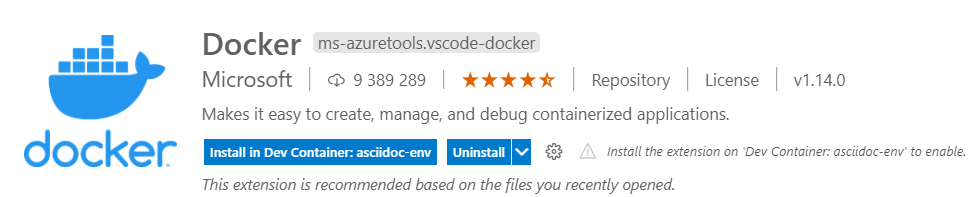
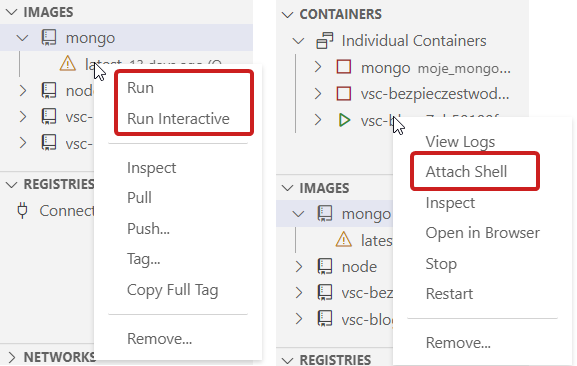
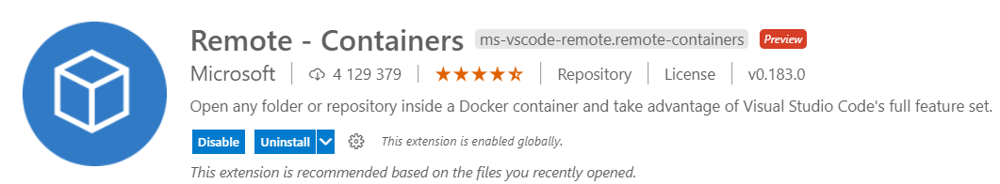
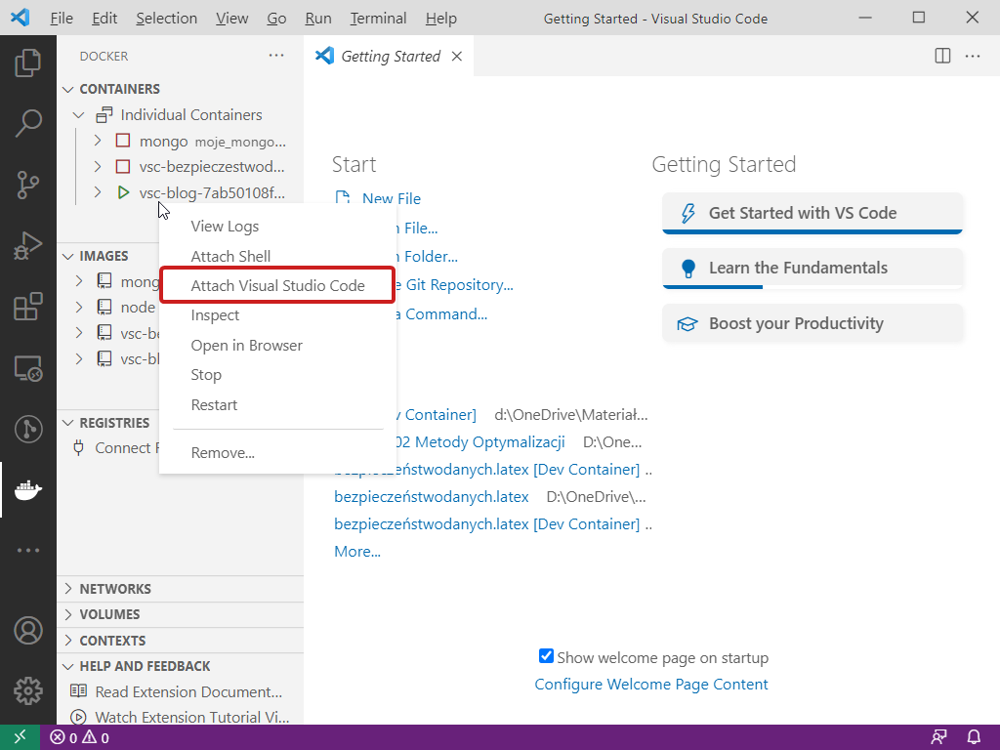
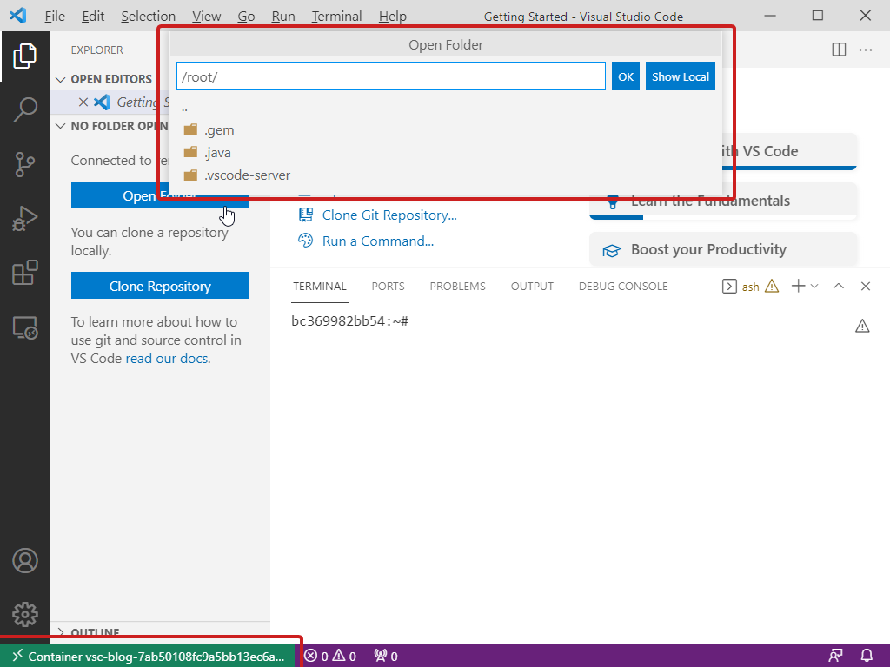
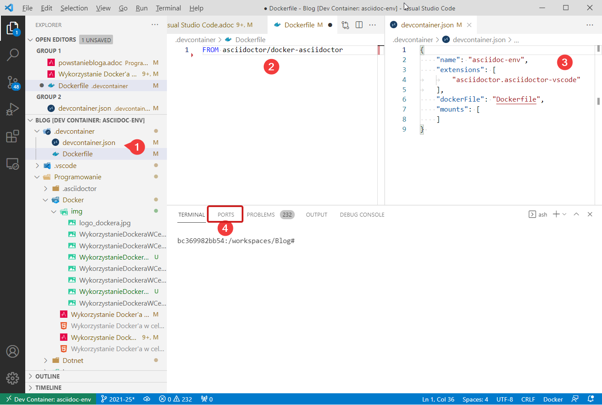
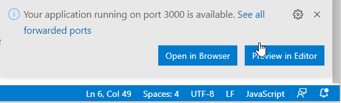

= Wykorzystanie Docker'a w celu zachowania czystości. Część 02 - Visual Studio Code
Mikołaj Dalecki <mikolaj.dalecki@outlook.com>
:toc:
:source-highlighter: pygments
:note-caption: Uwaga
:icons: font
:experimental:

== Po prostu Docker

.Widok pluginu

Rozszerzenie Docker autorstwa firmy Microsoft dostępne pod adresem https://marketplace.visualstudio.com/items?itemName=ms-azuretools.vscode-docker pozwala nam na łatwe zarządzanie obrazami i ich uruchamianiem.
Ma jeszcze wiele innych funkcji, które wykraczają poza zakres niniejszego artykułu.

Najważniejsze jego funkcje to:

.Widok menu kontekstowego dającego dostęp do użytecznych funkcji

Następujące funkcje są najciekawsze w przypadku _uruchamiania nowego kontenera z obrazu_:

Run::
    Jest to odpowiednik uruchamiania serwisu z poprzedniej części artykułu. 
    Uruchamia dany kontener i pozostawia go w tle.

Run interactive::
    Odpowiada uruchomieniu interaktywnego obrazu. 
    Po użyciu tej komendy całe wyjście i możliwość interakcji z obrazem jest dostępna z poziomu terminala Visual Studio Code.

Pull::
    Pozwala nam zaktualizować obraz, jeśli pojawiła się jego nowsza wersja pod danym tagiem.

Remove::
    Usuwa obraz, zwalniając przestrzeń dyskową.

W przypadku operacji na uruchomionym kontenerze najciekawsze funkcje to:

Attach Shell::
    Podłącza terminal Visual Studio Code pozwalając nam na działania w wybranym kontenerze. 

Open in Browser::
    Otwiera kontener w przeglądarce (jeśli ten udostępnił do tego port)

Stop::
    Zatrzymuje kontener.

Podsumowując – mamy do dyspozycji wszystkie podstawowe operacje co w konsoli tylko, że w dużo przyjemniejszym środowisku.

== Remote - Containers

.Widok wtyczki Remote-Containers

Jest to niewątpliwie najlepsza wtyczka do pracy z Dockerem, która dodatkowo integruje się ze wtyczką powyżej, otóż: 

.Rozszerzenie pluginu Docker przez Remote - Containers.

Attach Visual Studio Code::
    Funkcja ta powoduje, że nasze Visual Studio Code zostanie otwarte ponownie w kontekście kontenera!
    Dzięki temu zyskujemy możliwość otwierania folderów, które tam się znajdują. 
    Daje nam to świetną integrację, gdyż bez problemu możemy kopiować dane i pracować na plikach z poziomu Visual Studio Code. 

.Widok Visual Studio Code wewnątrz kontenera. 

Jest jeszcze lepsza część tego rozszerzenia, otóż:

=== .devcontainer

Visual Studio Code może działać w środowisko skonteneryzowanym (uruchamiać projekt w Dokerze) poprzez dodanie katalogu `.devcontainer` a w nim pliku `devcontainer.json` służącego do konfiguracji środowiska VSC oraz `Dockerfile`, który przechowuje informacje na temat naszego obrazu, w którym będziemy pracować.
VSC może uzupełnić strukturę plików za ciebie poprzez polecenie `((Remote-Containers)): Add Development Container Configuration Files`, także nie musisz nic zapisywać ani zapamiętywać.

Struktura katalogów i treść plików wygląda następująco:

.Struktura katalogów dla .devcontainer

1. Widok na strukturę katalogów,
2. Treść pliku Dockerfile dla środowiska, w którym pisze wpisy na tego bloga,
3. Treść devcontainer.json, który automatycznie konfiguruje to środowisko przy pierwszym starcie.
4. Terminal oraz możliwość *otwierania portów w trakcie działania w kontenerze*!

[sidebar]
****
Więcej na temat konfiguracji Visual Studio Code pod kontenery znajdziesz https://code.visualstudio.com/docs/remote/containers-tutorial[tutaj], a jeszcze więcej informacji na https://code.visualstudio.com/docs/remote/containers[oficjalnej stronie Microsoft].
****

=== Przykład z node.js 

[qanda]
Na początek utwórz katalog do pracy::
Może to być na przykład `D:/mojnodejsproject`.
Możesz to zrobić za pomocą polecenia:
+
[source,console]
----
> mkdir D:/mojnodejsproject
----

Następnie otwórz w nim Visual Studio Code::
Aby to zrobić, naciśnij prawym przyciskiem na puste miejsce w katalogu menu:PPM[Open With Code].
Możesz to również zrobić za pomocą polecenia:
+
[source,console]
----
> cd D:/mojnodejsproject
> code .
----

Utwórz przykładowy Devcontainer::
Wewnątrz Visual Studio Code naciśnij kbd:[F1] i wpisz `Remote-Container: Reopen in container` - polecenie to otworzy menu wyboru przykładowego kontenera, z którego wybierz `Node.js`, wersja dowolna (ja wybrałem 16).
Teraz trzeba chwilę poczekać na pobranie obrazu i jego uruchomienie.
W międzyczasie możesz zobaczyć, że w naszym katalogu `D:/mojnodejsproject` pojawił się katalog `
* .devcontainer` a w nim dwa pliki (o których była mowa wyżej): `devcontainer.json`, który mówi nam o konfiguracji kontenera, która zostanie przeprowadzona przez VSC.
* Dockerfile, który jest klasycznym plikiem Dockera, o którym więcej w oficjalnej dokumentacji: https://docs.docker.com/engine/reference/builder/.

W katalogu `D:/mojnodejsproject` utwórz plik `app.js`::
Możesz to również zrobić z poziomu Visual Studio Code. 
Wklej do niego kod z poprzedniej części, który umieszczam również poniżej:
+
.Kod z Getting Started z Node.js
[source,javascript]
----
const http = require('http');

const http = require('http');

const hostname = '127.0.0.1';
const port = 3000;

const server = http.createServer((req, res) => {
  res.statusCode = 200;
  res.setHeader('Content-Type', 'text/plain');
  res.end('Hello World');
});

server.listen(port, /*hostname,*/ () => {
  console.log(`Server running at http://${hostname}:${port}/`);
});
----
*Niezapomnnij zapisać treści pliku!*

Otwórz Terminal w Visual Studio Code::
Przejdź do menu:View[Terminal] na górnym pasku VSC bądź naciśnij kbd:[F1] i wpisz `Open new external terminal`.
Zobaczysz najpewniej coś podobnego:
+
[source,console]
----
node ➜ /workspaces/mojnodejsproject $ 
----
Otóż jesteśmy wewnątrz kontenera, w katalogu, który nazywa się identycznie do naszego!
Co więcej, jeśli wpiszemy polecenie `ls`, to zobaczymy, że są tam nasz plik `app.js`!
+
[source,console]
----
node ➜ /workspaces/mojnodejsproject $ ls
app.js
----

Uruchommy naszą aplikację: wpisz polecenie `node app.js` w terminalu::
Visual Studio automatycznie wykrywa, że potrzebujemy portu 3000 i sam przekieruje go do naszego komputera! Mówi nam o tym komunikat:
+

Co więcej, możemy kliknąć przycisk btn:[Open in browser], a w naszej ulubionej przeglądarce zobaczymy wyczekiwane `Hello world`!

Baw się dalej!::
W kontenerze możesz instalować osobny zestaw dodatków, także czemu by nie dodać obsługi JavaScriptu czy samego node? 