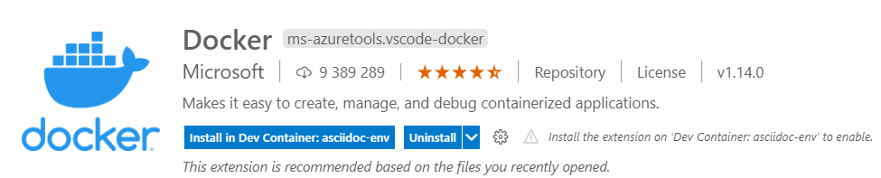

= Using Docker to stay clean. Part 02 - Visual Studio Code
Mikołaj Dalecki <mikolaj.dalecki@outlook.com>
:toc:
:source-highlighter: pygments
:icons: font
:experimental:

== Just Docker

.Plugin view

The Docker extension by Microsoft available at https://marketplace.visualstudio.com/items?itemName=ms-azuretools.vscode-docker allows us to easily manage and run images.
It has many more features that are beyond the scope of this article.

Its most important features are:

.A context menu view that gives access to useful functions
image::WykorzystanieDockeraWCeluZachowaniaCzystyosci_FunkcjePluginuDocker.png[]

The following functions are most interesting for _starting a new container from an image_:

Run::
    This is the equivalent of running the service from the previous part of the article. 
    It starts the given container and leaves it in the background.

Run interactive::
    Corresponds to running an interactive image. 
    After using this command, all output and the ability to interact with the image is available from the Visual Studio Code terminal.

Pull::
    Allows us to update the image if a newer version has appeared under the given tag.

Remove::
    Removes the image, freeing up disk space.

For operations on a running container, the most interesting features are:

Attach Shell::
    Connects the Visual Studio Code terminal allowing us to act in the selected container. 

Open in Browser::
    Opens the container in a browser (if the browser has provided a port for this)

Stop::
    Stops the container.

In summary - we have all the basic operations as in the console but in a much more pleasant environment.

== Remote - Containers

.View of Remote-Containers plugin
image::WykorzystanieDockeraWCeluZachowaniaCzystyosci_RemoteContainers.png[]

This is undoubtedly the best plugin to work with Docker that integrates with the plugin above, well: 

.Docker plugin extension by Remote - Containers.
image::WykorzystanieDockeraWCeluZachowaniaCzystyosci_FunkcjePluginuRemoteContainers.png[]

Attach Visual Studio Code::
    This function causes our Visual Studio Code to be reopened in the context of the container!
    This gives us the ability to open folders that are located there. 
    This gives us great integration as we can easily copy data and work on files from within Visual Studio Code. 

.View Visual Studio Code inside the container. 
image::WykorzystanieDockeraWCeluZachowaniaCzystyosci_QisokVSCWKontenerze.png[]

There is an even better part of this extension, that is::

=== .devcontainer

Visual Studio Code can run in a containerized environment (run the project in Docker) by adding a `.devcontainer` directory and in it a `devcontainer.json` file used to configure the VSC environment and a `Dockerfile` that stores information about our image in which we will be working.
VSC can complete the file structure for you through the command `((Remote-Containers)): Add Development Container Configuration Files`, so you don't have to save or remember anything.

The directory structure and file contents are as follows:

.directory structure for .devcontainer
image::WykorzystanieDockeraWCeluZachowaniaCzystyosci_WidokKonteneraDevContainer.png[]

1. a view of the directory structure,
2. The contents of the Dockerfile for the environment in which I write posts for this blog,
3. the contents of devcontainer.json, which automatically configures this environment on first startup.
4. a terminal and the ability to *open ports while running in a container*!

[sidebar]
****
You can find more about configuring Visual Studio Code under containers at https://code.visualstudio.com/docs/remote/containers-tutorial[here], and even more information at https://code.visualstudio.com/docs/remote/containers[the official Microsoft site].
****

=== node.js example

[qanda]
To begin, create a directory to work in::
This can be `D:/mynodejsproject`, for example.
You can do this using the command:
+
[source,console]
----
> mkdir D:/mynodejsproject
----

Then open Visual Studio Code: in it:
To do this, right-click on an empty space in the menu directory:PPM[Open With Code].
You can also do this with the command line:
+
[source,console]
----
> cd D:/mynodejsproject
> code .
----

Utwórz przykładowy Devcontainer::
Inside Visual Studio Code, press kbd:[F1] and type `Remote-Container: Reopen in container` - this command will open a menu for selecting a sample container, from which select `Node.js`, version any (I chose 16).
It will take a while for the image to be downloaded and run.
In the meantime, you can see that in our `D:/mynodejsproject` directory, a folder has appeared
* `.devcontainer` and in it two files (mentioned above): 
** `devcontainer.json`, which tells us the container configuration that will be performed by VSC.
** Dockerfile, which is a classic Docker file, about which more in the official documentation: https://docs.docker.com/engine/reference/builder/.

In the `D:/mynodejsproject` directory, create an `app.js` file::
You can also do this from within Visual Studio Code. 
Paste the code from the previous section into it, which I also include below:
+
.Code from Getting Started with Node.js
[source,javascript]
----
const http = require('http');

const http = require('http');

const hostname = '127.0.0.1';
const port = 3000;

const server = http.createServer((req, res) => {
  res.statusCode = 200;
  res.setHeader('Content-Type', 'text/plain');
  res.end('Hello World');
});

server.listen(port, /*hostname,*/ () => {
  console.log(`Server running at http://${hostname}:${port}/`);
});
----
*Don't forget to save the contents of the file!

Open Terminal in Visual Studio Code::
Go to menu:View[Terminal] on the top bar of VSC or press kbd:[F1] and type `Open new external terminal`.
You will probably see something similar:
+
[source,console]
----
node ➜ /workspaces/mynodejsproject $ 
----
Well, we are inside a container, in a directory that is named identically to ours!
What's more, if we type the `ls` command, we can see that our `app.js` file is there!
+
[source,console]
----
node ➜ /workspaces/mynodejsproject $ ls
app.js
----

Let's run our application: type the command `node app.js` in terminal::
Visual Studio automatically detects that we need port 3000 and redirects it to our computer itself! This is told to us by the message:
+
image::WykorzystanieDockeraWCeluZachowaniaCzystyosci_PrzekierowaniePortowPrzezVSC.png[]
Moreover, we can click the btn:[Open in browser] button, and we will see the awaited `Hello world` in our favorite browser!

Keep playing!::
You can install a separate set of add-ons in the container, also why not add support for JavaScript or node itself? 