:toc: 
:experimental: true

== Wstęp

Ostatnimi czas stanąłem znów przed zadaniem utworzenia instalatora dla prostego programu okienkowego na Windows.
Poprzedni wykonałem za pomocą technologi WiX, jednak jego ograniczenia takie jak: wymaganie budowania przez msbuild, brak sensownego kreatora,
czy mnóstwo problemów przy automatycznym wykrywaniu plików, które powinny znaleźć się wewnątrz paczki, zachęciły mnie do poszukiwania rozwiązania, które jest zdecydowanie łatwiejsze w obsłudze. 

Tak natrafiłem na Advanced Installer, który nie ma tych niedogodności. Jedno, co muszę wymienić, to, że w wersji darmowej nie ma możliwości robienia "pakietów". 
Nie możesz tutaj dorzucić paczek zawierających wymagane przez twoją Aplikacje SDK, czy pakiety redystrybucyjne. 
Jeśli jest to twoim wymaganiem, to niestety nie tutaj.

Warto zwrócić uwagę, że licencja jasno wskazuje, że darmowa wersja Advanced Installer może być używana komercyjnie: 

[quote,Advanced Installer End User Licence,https://www.advancedinstaller.com/eula.html]
2.1 Freeware Features License. Caphyon grants you an unlimited license to use the Freeware Features of the Software. The install packages created using only the Freeware Features can be freely redistributed and used both in commercial and non-commercial purpose.

== Przygotowanie lokalnego środowiska

Przygotowanie lokalnego środowiska zacznijmy od pobrania instalatora z https://www.advancedinstaller.com/download.html[strony producenta]. 
Zainstaluj go, a następnie uruchom.

.Instalacja Advanced Installer
[.table-gallery,cols="1,1,1"]
|===
a| 
.Pobieranie
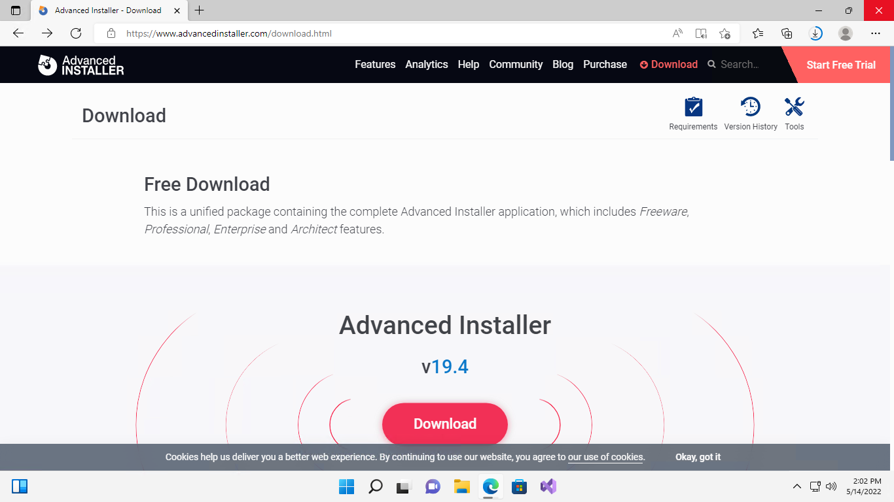 
a| 
.Instalacja
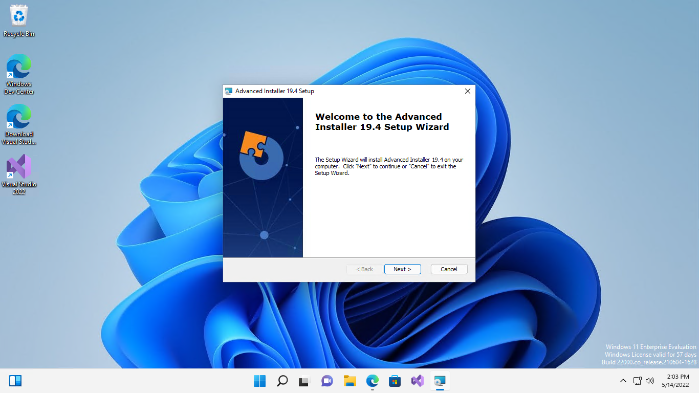
a| 
.Gotowy program
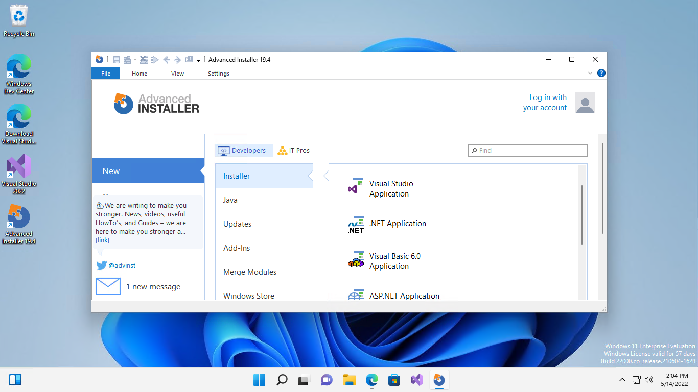
|===

Następnie pobierz i zainstaluj wtyczkę do Visual Studio. 
Znajdziesz ją https://marketplace.visualstudio.com/items?itemName=caphyon.AdvancedInstallerforVisualStudio2022[tutaj]. 
Pamiętaj, aby ściągnąć wersję odpowiednią dla twojego środowiska.

.Instalacja dodatku do Visual Studio 2022
[.table-gallery,cols="1,1"]
|===
a| 
.Pobieranie
image::vsaddon_download.png[] 
a| 
.Instalacja
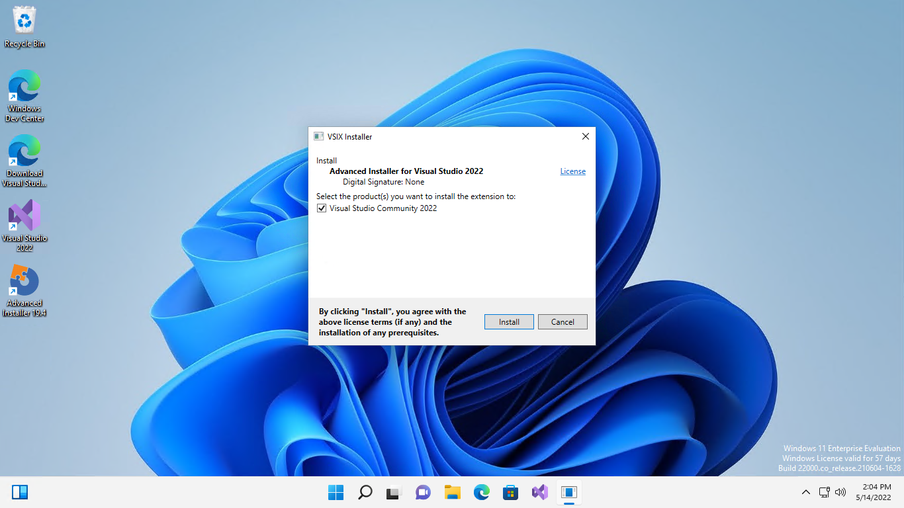
|===

== Przygotowanie projektu: 

Mając odpowiednio przygotowane środowisko, możemy przejść do konkretów:

=== Przykładowy projekt WPF,

Dla celów demonstracyjnych utwórzmy nowy projekt WPF (1) w Visualu o nazwie AdvancedInstallerDemo.Wpf (2).
Dla pewności sprawdź, czy program poprawnie się uruchamia, aby nie było później niejasności.

.Tworzenie nowego projektu
[.table-gallery,cols="1,1,1"]
|===
a| 
.Wybierz projekt WPF,
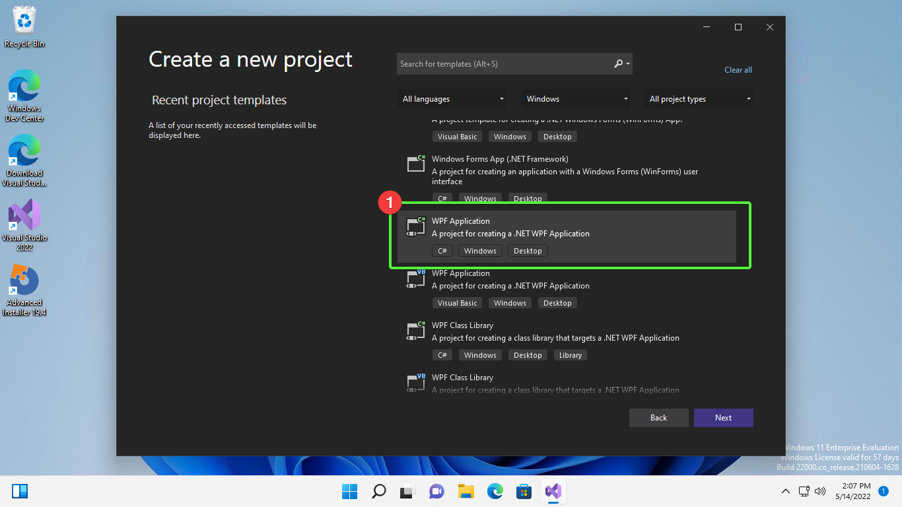
 
a| 
.Nadaj mu nazwę,
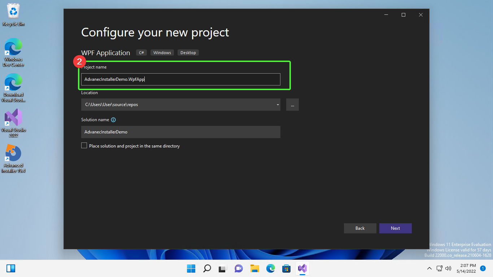

a| 
.Sprawdź, czy działa!
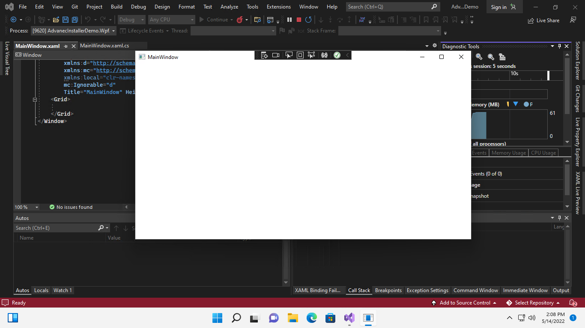

|===

=== Dodanie projektu instalatora

Teraz najważniejsze, dodajemy instalator!

. W tym celu utwórz nowy projekt `Advanced Installer Project` za pomocą Visual studio o nazwie AdvancedInstallerDemo.Installer i kliknij dwukrotnie nowo utworzony projekt, otworzy się okno z wtyczką,
Następnie przejdź do "Files and Folders" (1), i kliknij przycisk "Add Project Output" (2).
. Otworzy się nowe okno, w którym zaznacz "Publish Profile" przy projekcie WPF.
Jeśli nie tworzyłeś wcześniej profilu publikacji, to w tym momencie zostaniesz o to poproszony. 
Do działania jest potrzebny profil publikacji do Folderu, także wybierz pozycję "Folder" i przejdź kreator z domyślnymi wartościami (zwróć uwagę, aby nie wybrać ClickOnce!).
. Teraz możesz wrócić do projektu instalatora, przejść do "Files and Folder", kliknąć "Add Project Output" i upewnić się, że odpowiedni profil publikacji został wybrany.
. Przebuduj projekt instalatora (PPM na projekt i wybierz pozycję Rebuild).
. Przejdź do katalogu projektu instalatora, następnie do folderu `AdvancedInstallerDemo.Installer-SetupFiles`.
Wewnątrz znajdziesz plik `AdvancedInstallerDemo.Installer.msi`! 
Twój instalator jest już gotowy do pracy.

.Dodawanie instalatora
[.table-gallery,cols="1,1,1"]
|===
a| 
.Dodaj projekt instalatora
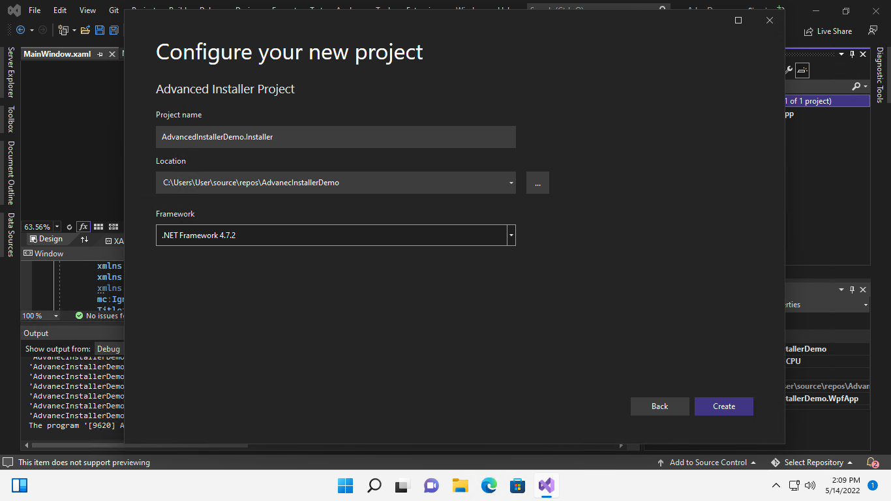
 
a| 
.Dodaj pliki projektu
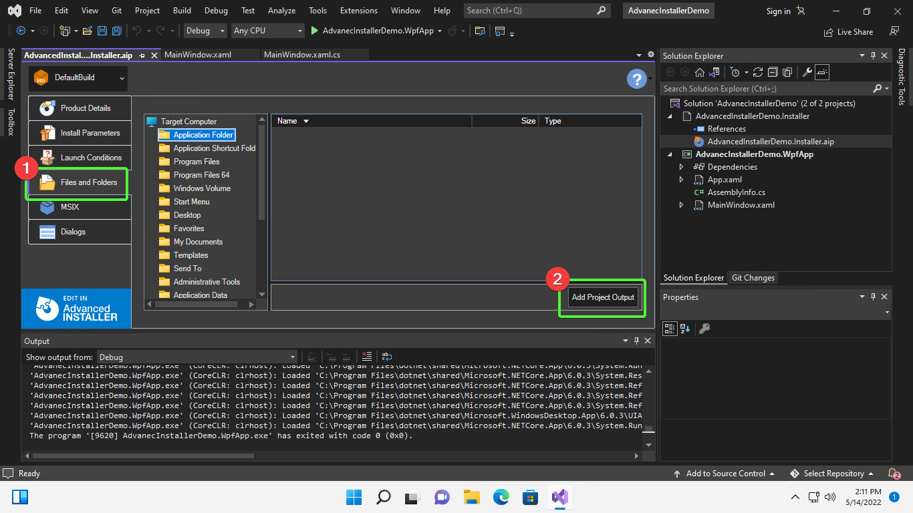

a| 
.Dodaj wyjście projektu WPF
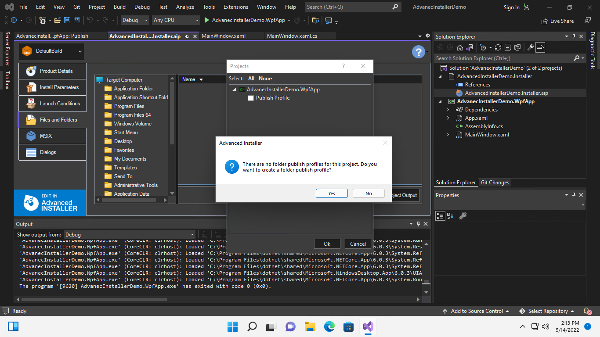

a| 
.Utwórz profil publikacji (1)
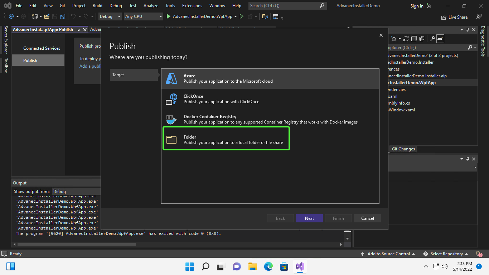

a| 
.Utwórz profil publikacji (2)
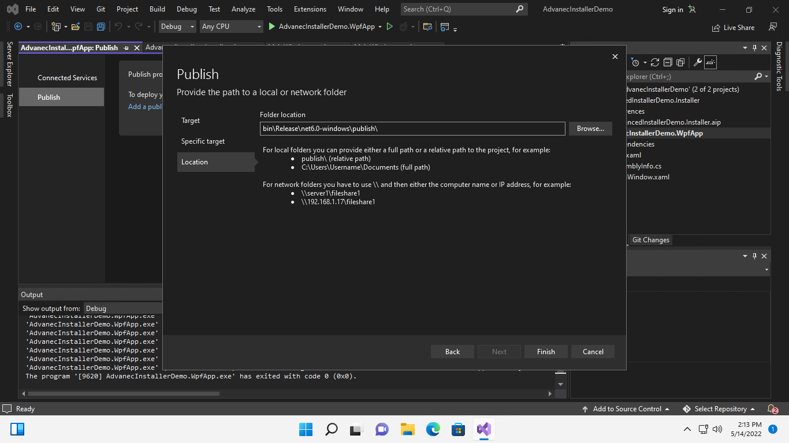

a| 
.Upewnij się, że wybrany został profil 
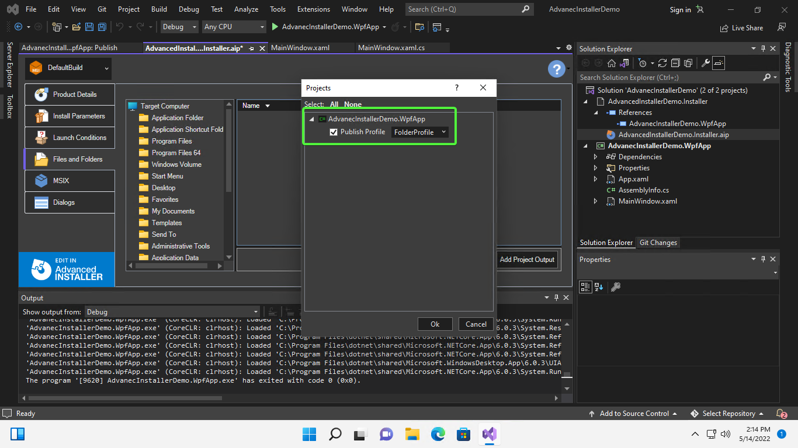

|===

=== Podstawowa konfiguracja

Niestety, to nie wszystko.
Aby móc korzystać z wielu udogodnień, musimy wykonać jeszcze kilka kroków.

Jeśli zainstalowałeś swoją paczkę, to zapewne zauważyłeś, że twoja aplikacja instaluje się w dziwnym katalogu, jakim jest `C:\Program Files(x86)\Your Company\Your Application`.
Aby to zmienić, najlepiej uzupełnić kilka podstawowych informacji na temat twojej aplikacji.

- Wróć do Visual Studio i projektu `AdvancedInstallerDemo.Installer`, wybierz plik z rozszerzeniem *.aip. 
- W zakładce "Product Details" uzupełnij pola "Product Name" nazwą twojej aplikacji, na przykład "Advanced Installer Demo".
W polu "Company Name" wpisz nazwę organizacji, do której należy aplikacji, na przykład "Zaprogramuj to raz".

Zachęcam do wypełnienia pozostałych pól w tej zakładce, jednak nie będę ich tutaj omawiał. 
Pamiętaj, że po wybraniu konkretnego pola, u dołu okna pojawia się krótki opis, do czego ono służy. 
Jeśli i ta wiedza nie będzie wystarczająca, masz do dyspozycji jeszcze przycisk pomocy — znak zapytania w niebieskim okręgu w górnym prawym rogu okna. 

TIP: Pamiętaj, że jeszcze więcej ciekawych funkcji jest dostępnych pod przyciskiem "Edit in Advanced Installer" w lewej dolnej krawędzi okna.

=== Dodawanie skrótu na pulpicie

Aby dodać skrót na pulpicie, musimy otworzyć nasz projekt instalatora w dedykowanej aplikacji Advanced Installer.
Aby to zrobić, kliknij niebieski przycisk "Edit in Advanced Installer" w Visual Studio, albo dwukrotnie na projekt instalatora w Eksploratorze Plików.

. Przejdź do zakładki "Shortcuts", następnie kliknij Prawym Przyciskiem Myszki i wybierz "Installed File" (1).
. Następnie przejdź do katalogu, gdzie jest zainstalowana aplikacja, wybierz główny plik wykonawczy (2) i kliknij ok.
. Następnie w oknie właściwości, przy polu "Shortcut folder" kliknij przycisk z trzema kropkami (3) i wybierz katalog "Desktop" (4) i kliknij Ok (5). 

Teraz, przy następnej instalacji skrót pojawi sie na pulpicie! 

.Ustawienie skrótu do aplikacji na pulpicie
[.table-gallery,cols="1,1"]
|===
a| 

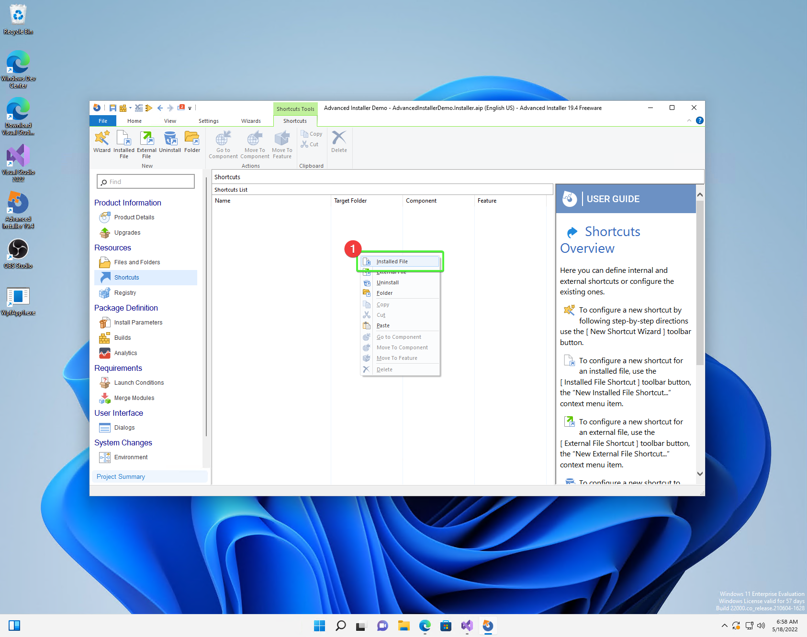
a| 

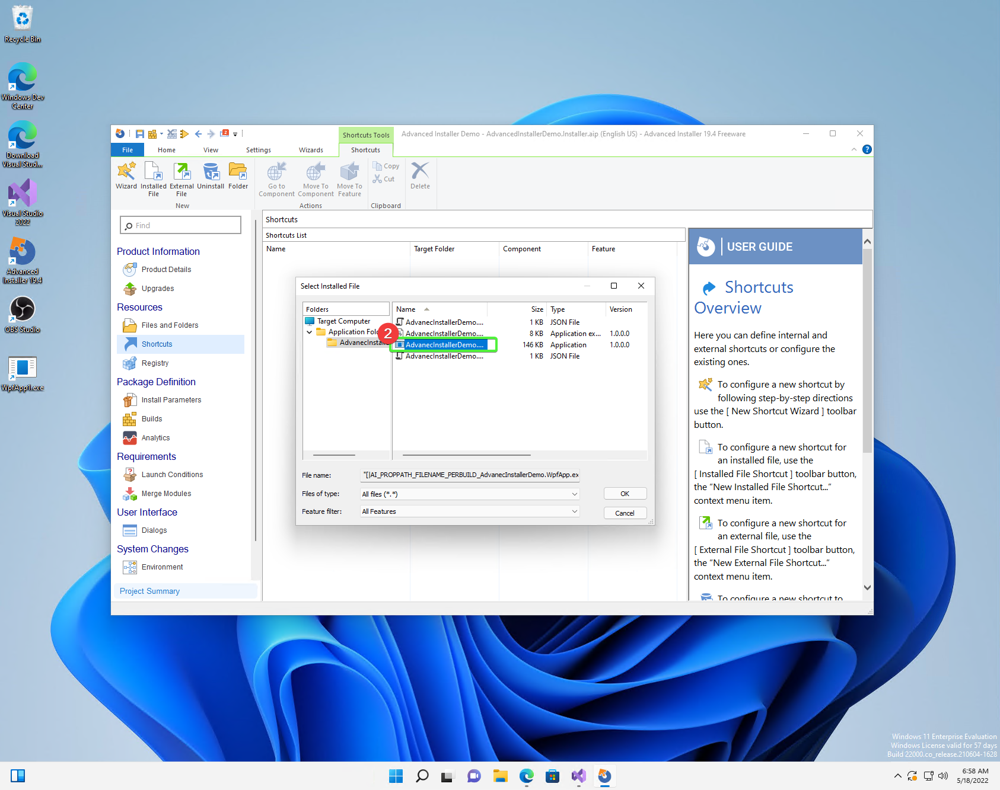
a| 

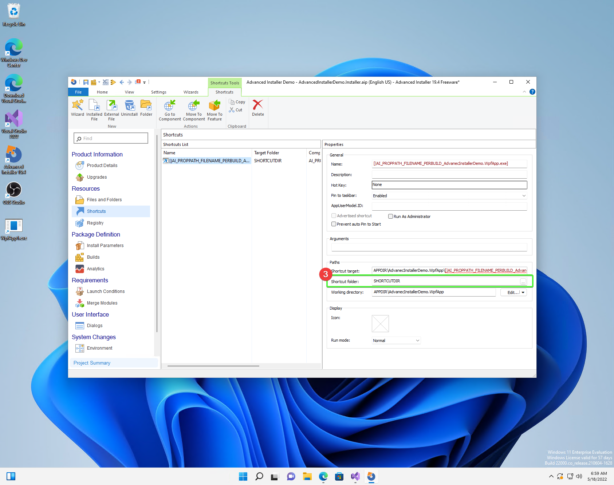
a| 

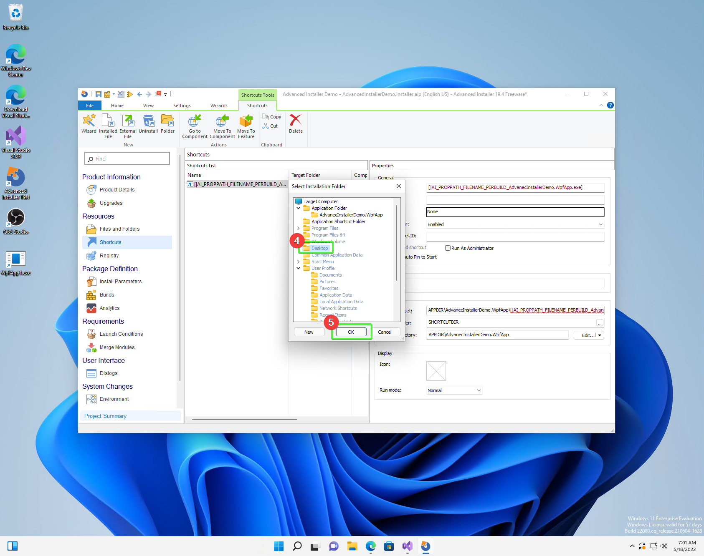

|===

=== Zapewnienie łatwej aktualizacji pakietu (zmiana wersji)

Jednym z wymagań stawianych wobec instalatora jest aktualizacja aplikacji. 
Kluczowym elementem jest *zwiększanie numeru wersji*.
Bez tego próba instalacji zakończy się błędem. 
Aby instalator mógł aktualizować aplikację, konieczna jest zmiana wersji. 
Dlaczego przeczytasz https://www.advancedinstaller.com/user-guide/set-version.html#set-version[tutaj] i https://www.advancedinstaller.com/user-guide/changing-version.html[tutaj].

Numer wersji możemy zmienić na dwa sposoby: 

. W Visual studio
+
W zakładce "Product Details" w polu "Product Version" możesz zmienić wersję.

. Z konsoli
+
Wykonując dwa następne polecenia, zmienisz tymczasowo plik projektu instalatora i zbudujesz go z tymi ustawieniami.
Pamiętaj, aby poniższe polecenia wykonać w katalogu, gdzie znajduje się projekt instalatora!
+
[source,powershell]
----
& "C:\Program Files (x86)\Caphyon\Advanced Installer 19.4\bin\x86\AdvancedInstaller.com" /Edit .\AdvancedInstallerDemo.Installer.aip /SetVersion 1.3.0
& "C:\Program Files (x86)\Caphyon\Advanced Installer 19.4\bin\x86\AdvancedInstaller.com" /Rebuild .\AdvancedInstallerDemo.Installer.aip
----

IMPORTANT: Ścieżka instalacji nie zostanie zmieniona, w przypadku, gdy zaktualizowaliśmy pola "Company Name" oraz "Product Name". 
Ścieżka instalacji zostanie zmieniona dopiero po ponownej instalacji. 

=== Cicha instalacja

==== Uwaga

[WARNING]
Podczas cichej instalacji zauważony został pewien błąd. 
Otóż, jeśli instalacja sie nie powiedzie, to nie otrzymasz żadnego błędu! 
Aby temu zapobiec, należy uruchomić instalację ze skryptu powershell:

.Pobieranie kodu błędu z instalatora. Kod należy umieścić w jednym pliku *.ps1
[source,powershell]
----
& '.\AdvancedInstallerDemo.Installer.msi' /qn
if( ($LASTEXITCODE -ne 0) -and -not ( $LASTEXITCODE -eq $null) ) {
	throw "Exit code is $LASTEXITCODE"
}
----

Dużą zaletą poprawnie przygotowanych instalatorów MSI jest możliwość ich instalacji z konsoli, bez interakcji z człowiekiem. 
Taką funkcjonalność nazywamy trybem cichym, co pozwala na wykorzystanie go w automatyzacji, czy grupach GPO.
Aby dowiedzieć się więcej, zajrzyj do https://www.advancedinstaller.com/user-guide/qa-silent-msi-install.html[dokumentacji].
Cichą instalację, wykonuje się poniższym poleceniem.

.Pamiętaj, aby uruchamiać instalację jako administrator, jeśli aplikacja ma trafić do katalogu Program Files.
[source,powershell]
 '.\AdvancedInstallerDemo.Installer 1.3.0.msi' /quiet

NOTE: Pamiętaj, że instalacja w katalogu Program Files wymaga uprawnień administratora.
Jeśli twoja aplikacja nie instaluje się poprawnie w trybie cichym, upewnij się, że uruchamiasz polecenie z odpowiednimi uprawnieniami!

== Dodatek: TeamCity

Ta sekcja jest dodatkiem, ponieważ jest ona przeznaczona dla osób, które mają minimalne obeznanie z TeamCity.
Pokazuję tutaj jak dodać krok, który zbuduje nam instalator, bez opisu całej procedury tworzenia projektu.

=== Pobieranie i instalacja pluginu na TeamCity.
Instalacja dodatku pozwala nam na proste tworzenie kroku budującego instalator oraz dodanie narzędzia, które będzie automatycznie instalowane na każdym agencie budującym. 
Jest to bardzo wygodne, ponieważ nie musimy pilnować, czy nasz budujący znajduje się wszędzie tam, gdzie będzie potrzebny. 

. Pobierz dodatek z GitHub'a https://github.com/Caphyon/teamcity-advinst-build-runner, wydania dostępne są w sekcji Releases. 
Najnowsze wydanie jest w wersji 1.3 dostępne bezpośrednio pod https://github.com/Caphyon/teamcity-advinst-build-runner/releases/download/v1.3/advinst-teamcity-plugin-1.3.zip[tym adresem]
. Na TeamCity udaj się do zakładki Administrations (1) > Plugins (2) i kliknij "Upload plugin zip" (3), wybierz pobrany plik .zip (4) i załaduj go klikając ponownie przycisk "Upload plugin zip" (5).
. Następnie włącz plugin klikając "Enable uploaded plugins" i znów "Enable".
. Teraz przjdź do zakładki Tools (6) (również wewnątrz Administration), następnie wybierz "Install Tool..." (7), wybierz "Advanced Installer" (7) i kliknij "Add" (8).
. W tym momencie, jeśli na serwerze budującym nie został zainstlowany Advanced Installer, masz możliwość to źrobić. Wybierz najnowszą wersję i kliknij "Add". 
. Po chwili oczekiwania narzędzie jest gotowe do działania. 

.Instalacja dodatku do TeamCity
[.table-gallery,cols="1,1"]
|===
a| 
.Instalowanie wtyczki
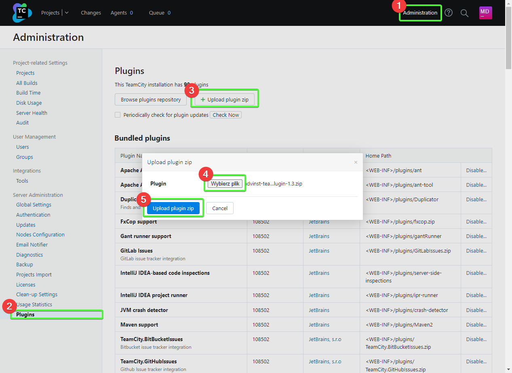
a| 
.Instalowanie narzędzia
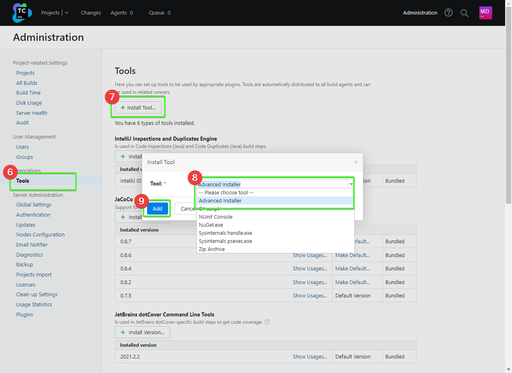
|===

=== Przykładowe wypełnienie kroku budowania.

.Przykładowy krok budowania instalatora na TeamCity
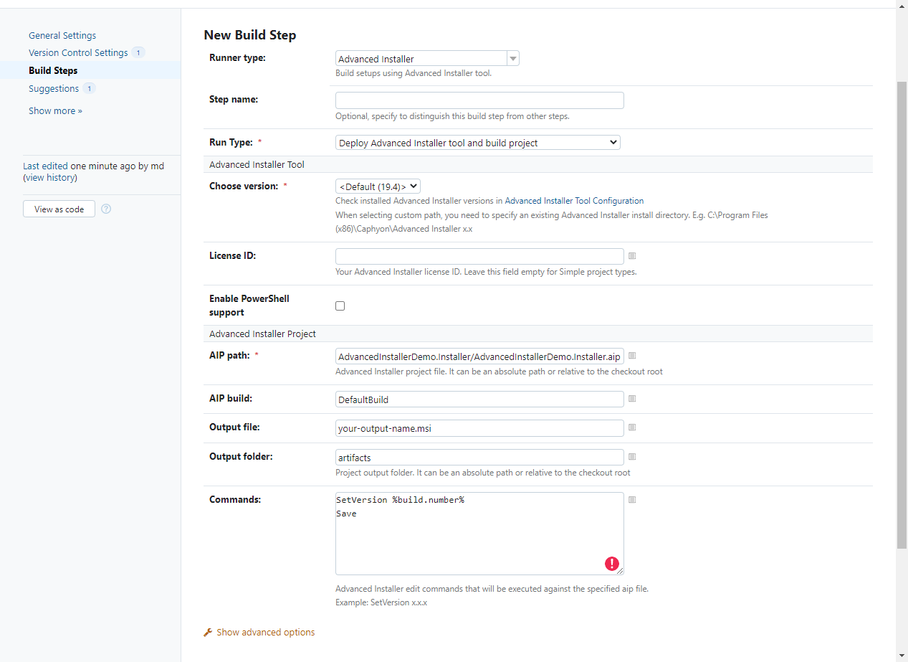

. Przejdź do projektu, do którego chcesz dodać budowanie instalatora, 
. Kliknij "Add build step",
. Wybierz "Runner type" jako `Advanced Installer`.
. Następnie podaj ścieżkę do pliku projektu instalatora. 
Dla projektu utworzonego wcześniej byłoby to: `AdvancedInstallerDemo.Installer/AdvancedInstallerDemo.Installer.aip`.
. Następnie musisz okreslić wartość "AIP Build". Domyślnie jest to `DefaultBuild`. 
Tę wartość znajdziesz w narzędziu Advanced Installer (nie pomyl z pluginem do Visual Studio) w zakładce "Builds". 
. Teraz możesz określić nazwę pliku wynikowego. 
Ja lubię dodawać do instalatora numer wersji, na przykład: `AIDemoInstaller-%build.number%.msi`. 
Pamiętaj, aby wcześniej określić poprawny numer wersji footnote:[Z opisu w oknie pluginu Visual Studio jest napisane, że numer wersji powinien wyglądać tak: "x.y.z", gdzie x, y i z są liczbami całkowitymi. Największa możliwa wartość to 255.255.65535.65535. Inne przykładowe, poprawne formaty, to: "3", "2.0", "2.11", "5.10.5". Opis ten pochodzi z pluginu do Visual Studio w wersji 19.4.] w zakładce "General Settings". Jeśli nie widzisz pola "Build number format", to kliknij "Show advanced options" ponizej formularza. 
. Możesz dodatkowo określić katalog wyjściowy (Output Folder)
. I najważniejsze, powinieneś okerślić transformacje wykonywane na pliku projektu przed wykonaniem budowania.
Najwazniejsza jest zmiana nazwy, dlatego w pole "Commands" polecam wpisać Ci:

[source]
----
SetVersion %build.number%
Save
----

Wstęp i bardziej szczegółowy opis pliku poleceń znajdziesz https://www.advancedinstaller.com/user-guide/command-line.html#file[tutaj].

Zdjęcie tytułowe by https://unsplash.com/photos/X_JsI_9Hl7o?utm_source=unsplash&utm_medium=referral&utm_content=creditShareLink[Zan].
