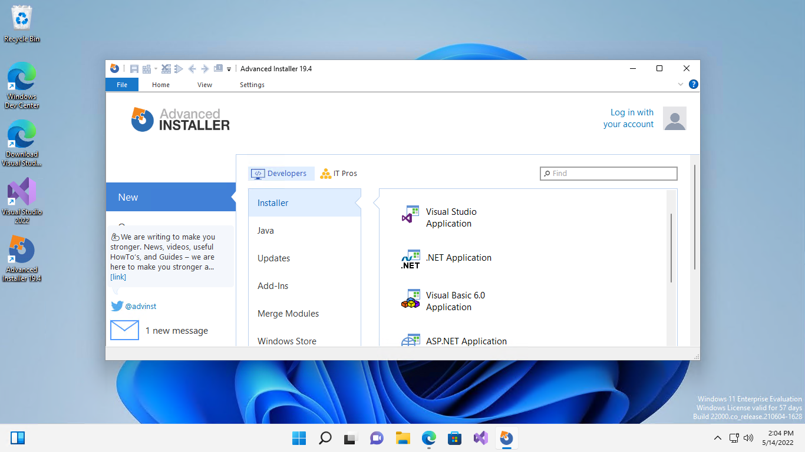
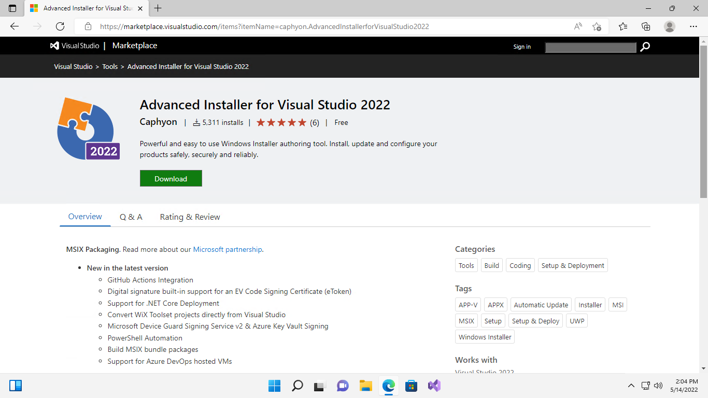
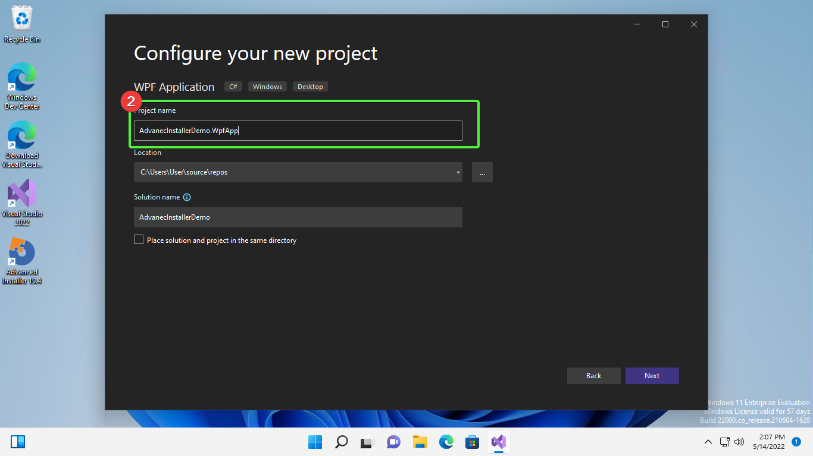
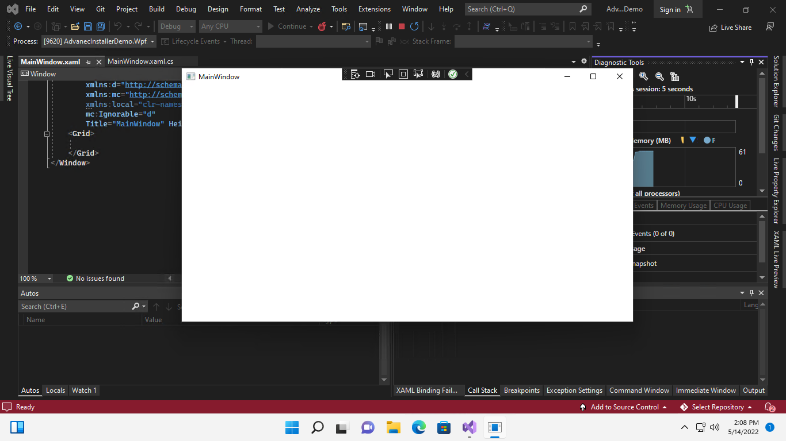
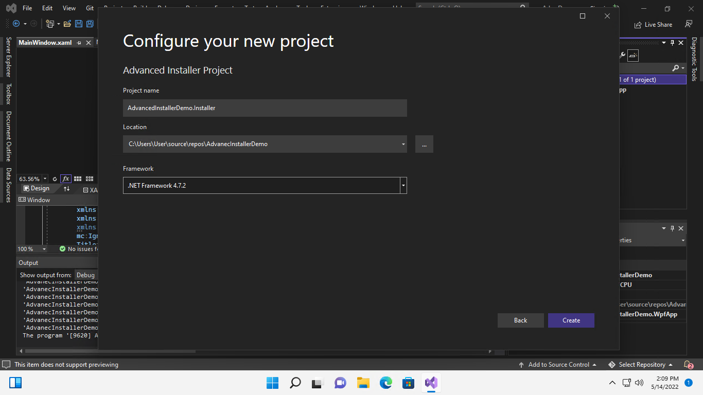
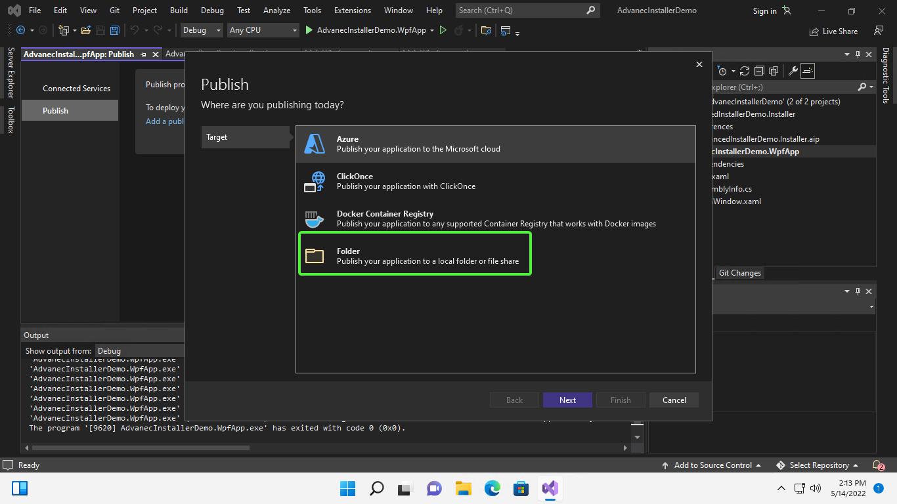
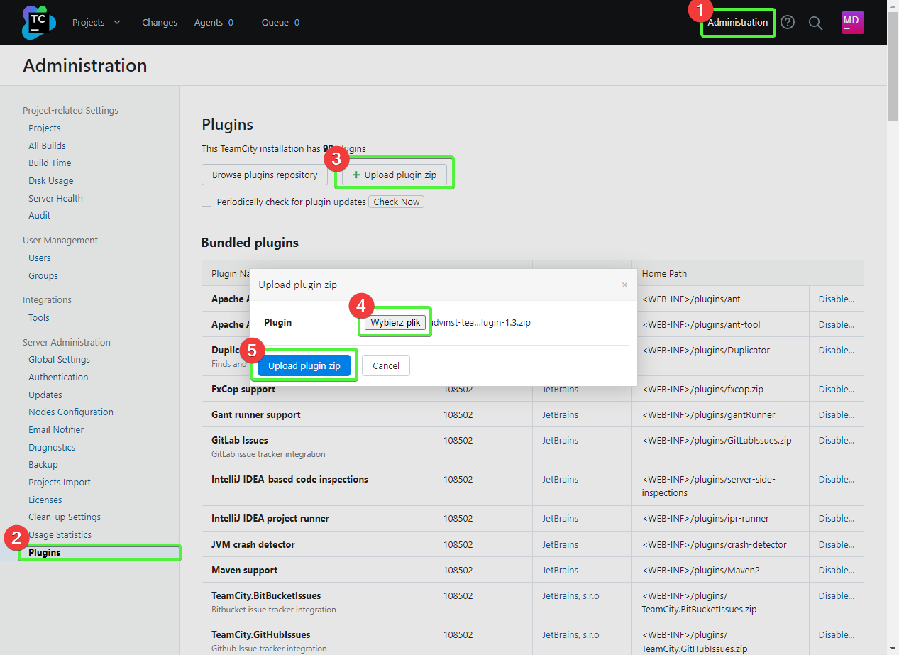
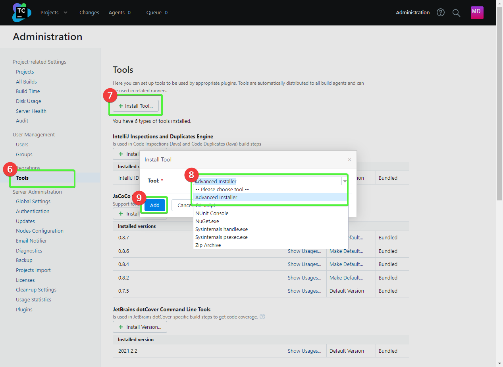
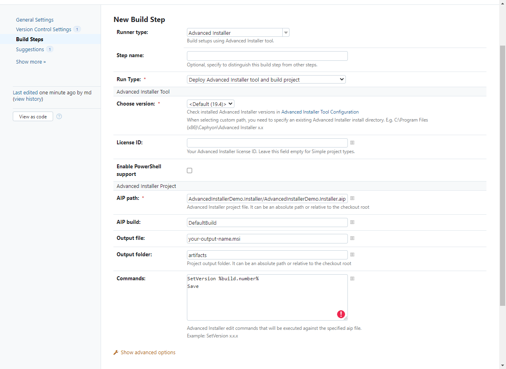

:toc: 
:experimental: true

== Introduction

Recently I faced again the task of creating an installer for a simple desktop Windows program.
The previous one I made using WiX technology, but its limitations such as: requiring msbuild to build, lack of a reasonable wizard,
and lots of problems with automatic detection of files that should be inside the package encouraged me to look for a solution that is much easier to use. 

That's how I came across Advanced Installer, which doesn't have these inconveniences. One thing I have to mention is that in the free version there is no possibility to make "packages". 
You can't add external packages containing the SDK or redistribution packages required by your Application. 
If this is your requirement, then unfortunately you won't find it here.

Note that the license clearly indicates that the free version of Advanced Installer can be used commercially: 

[quote,Advanced Installer End User Licence,https://www.advancedinstaller.com/eula.html]
2.1 Freeware Features License. Caphyon grants you an unlimited license to use the Freeware Features of the Software. The install packages created using only the Freeware Features can be freely redistributed and used both in commercial and non-commercial purpose.

== Przygotowanie lokalnego środowiska

Let's start preparing the local environment by downloading the installer from https://www.advancedinstaller.com/download.html[manufacturer's website]. 
Install it and then run it.

.Instalacja Advanced Installer
[.table-gallery,cols="1,1,1"]
|===
a| 
.Downloading
image::download-installer.png[] 
a| 
.Installation
image::install-installer-1.png[]
a| 
.Ready program

|===

Then download and install the Visual Studio plug-in. 
You can find it https://marketplace.visualstudio.com/items?itemName=caphyon.AdvancedInstallerforVisualStudio2022[here]. 
Remember to download the version appropriate for your environment.

.Installing the Visual Studio 2022 add-on
[.table-gallery,cols="1,1"]
|===
a| 
.Downloading
 
a| 
.Installation
image::vsaddon_install.png[]
|===

== Prepare project: 

With the environment properly prepared, we can move on to specifics:

=== Przykładowy projekt WPF,

For demonstration purposes, let's create a new WPF project (1) in Visual called AdvancedInstallerDemo.Wpf (2).
Just to be sure, check that the program starts correctly so that there will be no confusion later.

.Creating a new project
[.table-gallery,cols="1,1,1"]
|===
a| 
.Select the WPF project,
image::VS_NewProject-1.png[]
 
a| 
.Give it a name,

a| 
.See if it works!

|===

=== Adding an installer project

Now the most important thing, we add the installer!

. To do this, create a new `Advanced Installer Project` using Visual studio named AdvancedInstallerDemo.Installer and double-click the file with the extension *.aip in the newly created project, the plug-in window will open,
Then go to "Files and Folders" (1), and click "Add Project Output" (2).
. A new window will open where you select "Publish Profile" next to the WPF project.
If you have not created a publish profile before, you will be asked to do so at this point. 
You will need a Publish Profile to Folder to work, also select the "Folder" item and go through the wizard with the default values (be careful not to select ClickOnce!).
. Now you can go back to the installer project, go to "Files and Folder", click "Add Project Output" and make sure that the correct publication profile is selected.
. Rebuild the installer project (RMB on the project and select Rebuild).
. Go to the installer project directory, then to the `AdvancedInstallerDemo.Installer-SetupFiles` folder.
Inside you will find the `AdvancedInstallerDemo.Installer.msi` file! 
Your installer is now ready to go.

.Adding an installer
[.table-gallery,cols="1,1,1"]
|===
a| 
.Add installer project

 
a| 
.Add project files
image::addprojectoutput.png[]

a| 
.Add WPF project output
image::addprojectoutputcreator.png[]

a| 
.Create publication profile (1)

a| 
.Create publication profile (2)
image::addpublishprofile-2.png[]

a| 
.Make sure that the profile is selected 
image::makesureprojectoutput.png[]

|===

=== Basic configuration

Unfortunately, that's not all.
There are a few more steps we need to take in order to take advantage of the many benefits.

If you have installed your package, you have probably noticed that your application installs in a weird directory, which is `C:\Program Files(x86)\Your Company\Your Application.
To change this, it is best to fill in some basic information about your application.

- Go back to Visual Studio and project `AdvancedInstallerDemo.Installer`, select the file with extension *.aip. 
- In the "Product Details" tab, fill in the "Product Name" fields with the name of your application, for example "Advanced Installer Demo".
In the "Company Name" field, enter the name of the organization to which the application belongs, for example, "Program it once."

I encourage you to fill in the other fields on this tab, but I won't discuss them here. 
Remember that after selecting a particular field, a short description of what it is used for appears at the bottom of the window. 
If this is not enough, there is a help button - a question mark in a blue circle in the upper right corner of the window. 

TIP: Remember that even more interesting features are available under the "Edit in Advanced Installer" button at the bottom left of the window.

=== Adding a shortcut to the desktop

You can add a desktop shortcut in the dedicated Advanced Installer application.
To do this, click the blue "Edit in Advanced Installer" button in Visual Studio, or double-click on the installer project in File Explorer.

. Go to the "Shortcuts" tab, then right-click and select "Installed File" (1).
. Then go to the directory where the application is installed, select the main executable file (2) and click ok.
. Then in the properties window, next to the "Shortcut folder" field, click the button with three dots (3) and select the "Desktop" folder (4) and click Ok (5). 

Now, the next time you install it, the shortcut will appear on your desktop! 

.Setting a shortcut to an application on the desktop
[.table-gallery,cols="1,1"]
|===
a| 

image::AddingShortcut_1.png[]
a| 

image::AddingShortcut_2.png[]
a| 

image::AddingShortcut_3.png[]
a| 

image::AddingShortcut_4.png[]

|===

=== Provide easy package upgrade (version change)

One of the requirements for the installer is to update the application. 
The key element is *increasing the version number*.
Without this, the installation attempt will end in an error. 
In order for the installer to update the application, a version change is required. 
Why read https://www.advancedinstaller.com/user-guide/set-version.html#set-version[here] and https://www.advancedinstaller.com/user-guide/changing-version.html[here].

We can change the version number in two ways: 

. In Visual studio
+
In the "Product Details" tab in the "Product Version" field you can change the version.

. From the console
+
By running the next two commands, you will temporarily change the installer project file and build it with these settings.
Remember to run the following commands in the directory where the installer project is located!
+
[source,powershell]
----
& "C:\Program Files (x86)\Caphyon\Advanced Installer 19.4\bin\x86\AdvancedInstaller.com" /Edit .\AdvancedInstallerDemo.Installer.aip /SetVersion 1.3.0
& "C:\Program Files (x86)\Caphyon\Advanced Installer 19.4\bin\x86\AdvancedInstaller.com" /Rebuild .\AdvancedInstallerDemo.Installer.aip
----

IMPORTANT: The installation path will not be changed if we have updated the "Company Name" and "Product Name" fields. 
The installation path will only be changed after reinstallation. 

=== Quiet installation

==== Attention

[WARNING]
A bug was noticed during the silent installation. 
Well, if the installation fails, you will not get any error! 
To prevent this, run the installation from a powershell script:

.Retrieve the error code from the installer. The code should be placed in one *.ps1 file
[source,powershell]
----
& '.\AdvancedInstallerDemo.Installer.msi' /qn
if( ($LASTEXITCODE -ne 0) -and -not ( $LASTEXITCODE -eq $null) ) {
	throw "Exit code is $LASTEXITCODE"
}
----

A big advantage of properly prepared MSI installers is the ability to install them from the console, without human interaction. 
Such functionality is called quiet mode, which allows you to use it in automation, or GPO groups.
To find out more, take a look at https://www.advancedinstaller.com/user-guide/qa-silent-msi-install.html[documentation].
Silent installation, is performed with the following command.

.Remember to run the installation as administrator if you want the application to go to the Program Files directory.
[source,powershell]
 '.\AdvancedInstallerDemo.Installer 1.3.0.msi' /quiet

NOTE: Remember that installation in the Program Files directory requires administrator privileges.
If your application does not install correctly in silent mode, make sure you run the command with the correct permissions!

== Appendix: TeamCity

This section is an addition because it is intended for people who have minimal experience with TeamCity.
I show here how to add a step that will build the installer for us, without describing the entire project creation procedure.

=== Downloading and installing the plugin on TeamCity.
Installing the add-on allows us to easily create a build step for the installer and add a tool that will be automatically installed on each build agent. 
This is very convenient because we don't have to keep an eye on whether our builder is everywhere it will be needed. 

. Download the add-on from GitHub https://github.com/Caphyon/teamcity-advinst-build-runner, releases are available in the Releases section. 
The latest release is version 1.3, available directly from https://github.com/Caphyon/teamcity-advinst-build-runner/releases/download/v1.3/advinst-teamcity-plugin-1.3.zip[this link].
. On TeamCity go to Administrations (1) > Plugins (2) and click "Upload plugin zip" (3), select the downloaded .zip file (4) and upload it by clicking the "Upload plugin zip" button again (5).
. Then enable the plugin by clicking "Enable uploaded plugins" and "Enable" again.
. Now go to Tools tab (6) (also inside Administration), then select "Install Tool..." (7), select "Advanced Installer" (7) and click "Add" (8).
. At this point, if you have not installed Advanced Installer on the build server, you have the option to do so. Select the latest version and click "Add". 
. After waiting a moment, the tool is ready for operation. 

.Instalacja dodatku do TeamCity
[.table-gallery,cols="1,1"]
|===
a| 
.Installing the plug-in

a| 
.Installing the tool

|===

=== Example completion of a build step.

.Example of a step to build an installer on TeamCity

. Navigate to the project to which you want to add the installer build, 
. Click "Add build step",
. Select "Runner type" as `Advanced Installer`.
. Then provide the path to the installer project file. 
For the project created earlier this would be: `AdvancedInstallerDemo.Installer/AdvancedInstallerDemo.Installer.aip`.
. Next, you must specify the value of `AIP Build'. By default it is `DefaultBuild`. 
You can find this value in the Advanced Installer tool ( don't confuse it with the Visual Studio plugin) under the "Builds" tab. 
. Now you can specify the name of the resulting file. 
I like to add the version number to the installer, for example: `AIDemoInstaller-%build.number%.msi`. 
Remember to specify the correct version number footnote:[From the description in the Visual Studio plugin window, it says that the version number should look like this: "x.y.z", where x, y, and z are integers. The largest possible value is 255.255.65535.65535. Other examples of valid formats are: "3", "2.0", "2.11", "5.10.5". This description is from the Visual Studio plugin version 19.4] in the "General Settings" tab beforehand. If you do not see the "Build number format" field, then click "Show advanced options" below the form. 
. You can also specify the Output Folder
. And most importantly, you should specify the transformations performed on the project file before performing the build.
The most important thing to do is to change the name, so in the "Commands" field I recommend you to type:

[source]
----
SetVersion %build.number%
Save
----

For an introduction and more detailed description of the command file, see https://www.advancedinstaller.com/user-guide/command-line.html#file[here].

Title photo by https://unsplash.com/photos/X_JsI_9Hl7o?utm_source=unsplash&utm_medium=referral&utm_content=creditShareLink[Zan].
