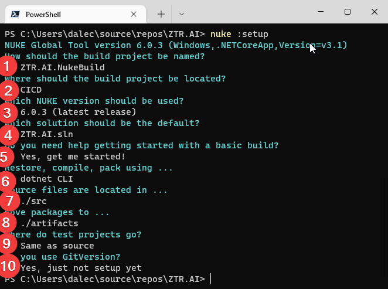
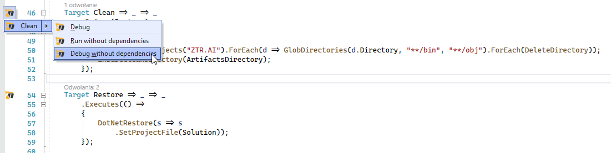
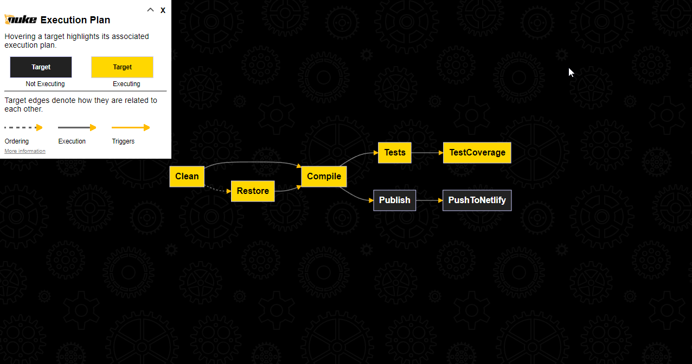

:toc: 
:experimental: true

You can find the final code with the elements described here, and some more, on my GitHub: https://github.com/MikDal002/ZTR.AI/tree/master/CICD[Ztr.AI].

== Introduction
Imagine being able to describe the entire CI/CD of your application using C#.
Without having to learn the TeamCity desktop environment, or GitHub's YAML. 

Nuke is one of the ways to describe building our application in C# language. 
If we want our project to be manageable all the time, we need to have a way to describe all the requirements for it. 
And so, we can describe:

1. (Cleanup) what the directories should look like before we start building the project,
2. (Preparation) what dependencies our application needs to compile,
3. (Building) in what order to build each component,
4. (Testing) how to run unit tests and what are our requirements to cover our code with them,
5. (Publishing) how to package our application and send it to the production environment. 

This is not a complete list of what we can do during the continuous integration and delivery process. 
It certainly shows the basic topics we face when releasing the next version of our software. 
And as it happens in life, if we don't write something down, we are bound to forget it.
And why write something down on a scrap of paper when you can do it with code that will execute itself? 

We can describe all the steps described above in different languages.
We often do this in such specialized forms as build projects on TeamCity, or GitHub Actions. 
Nuke convinced me by the fact that I don't have to learn all these configurations separately - I can describe everything necessary using the well-known C# language and use it where I need.
In the case of GitHub Actions I can also easily use once written code in many flows, which definitely simplifies work and testing.

== Initial configuration with the help of a wizard

Initial configuration of our project should start with installing Nuke tool, which greatly simplifies developer's work.
What is important, it is not necessary on the build server.

[source,powershell]
----
dotnet tool install Nuke.GlobalTool --global
----

Next, we run the configurator in the root directory of our solution:

[source, powershell]
----
nuke :setup
----

.View of the Nuke configurator

1. Select the name of the build project, 
2. The directory where it will be saved,
3. The version of Nuke,
4. The default solution that will be built,
5. Choose if you want the basic build commands to be already placed in the new project. 
6. Select the environment that will build your solution.
7. Select where your projects are placed (this is the directory where additional cleanup will be performed). 
8. Choose where you want the artifacts, i.e. the resulting build files, such as nuget packages, to go. 
9. Choose where your projects that test the solution are.
10.Choose whether you use GitVersion. I chose to say yes, however a description of this tool will be in another article.

The result of such choices, will be a C# class that will look more or less like the one below.
Alongside this we will get some build.sh, build.cmd and build.ps1 files, which allow us to build our application even in an environment that does not have .Net installed. 
There will also be a `.nuke` directory that stores some settings.

.View of Build.cs class
[source,csharp]
----
// [CheckBuildProjectConfigurations] <1>
[ShutdownDotNetAfterServerBuild]
class Build : NukeBuild
{
    public static int Main () => Execute<Build>(x => x.Compile);

    [Parameter("Configuration to build - Default is 'Debug' (local) or 'Release' (server)")]
    readonly Configuration Configuration = IsLocalBuild ? Configuration.Debug : Configuration.Release;

    [Solution] readonly Solution Solution;
    [GitRepository] readonly GitRepository GitRepository;
    [GitVersion] readonly GitVersion GitVersion;

    AbsolutePath SourceDirectory => RootDirectory / "src";
    AbsolutePath ArtifactsDirectory => RootDirectory / "artifacts";

    Target Clean => _ => _
        .Before(Restore)
        .Executes(() =>
        {
            SourceDirectory.GlobDirectories("**/bin", "**/obj").ForEach(DeleteDirectory);
            EnsureCleanDirectory(ArtifactsDirectory);
        });

    Target Restore => _ => _
        .Executes(() =>
        {
            DotNetRestore(s => s
                .SetProjectFile(Solution));
        });

    Target Compile => _ => _
        .DependsOn(Restore)
        .Executes(() =>
        {
            DotNetBuild(s => s
                .SetProjectFile(Solution)
                .SetConfiguration(Configuration)
                .SetAssemblyVersion(GitVersion.AssemblySemVer)
                .SetFileVersion(GitVersion.AssemblySemFileVer)
                .SetInformationalVersion(GitVersion.InformationalVersion)
                .EnableNoRestore());
        });

}
----

<1> Note that I commented out the `CheckBuildProjectConfigurations` attribute because it was removed in Nuke version 7.0.0, while it remained in the new project template.

.Joining paths
****
Already at this point, it is worth drawing our attention to a very interesting use of the `/` operator for linking paths: `AbsolutePath SourceDirectory => RootDirectory / "src";`.
In the course of working with Nuke, I noticed that this is a very handy approach and I strongly encourage you to use it.
****

=== How to build a project with Nuke

We can run the Nuke build project in at least three ways:

NOTE: Regardless of the method chosen, it is often necessary to rebuild the project in order for the build code changes to be applied. 
Building alone, without cleanup, rarely produces results.

==== From the console

* __dotnet run__ -
You can build with the `dotnet run` command invoked from the directory where our build project is located (in my case, the CICD directory).

* __Narzędziem nuke__ -
If you have previously installed the global nuke tool, you can use that as well. 
Invoke the `nuke` command in the console.
It will invoke the default build target, which is compilation. 
This approach is more flexible because it will work regardless of the directory you call it in. 
It can find the root directory of the solution itself and look for the appropriate files there.

Whatever your approach, remember that you can specify your own runtime parameters at startup. 
You can try by adding the `--Configuration Release` flag, which will cause the application to be built in release mode. 
For more on defining custom parameters, see the section on CI/CD later in this article.

If you want to call a different target, just give it a name: `nuke restore` (`dotnet run restore`).

==== Visual Studio 2022 Plugin

Visual Studio plugin allows us to call build actions directly from IDE. 
What is more it allows debugging.
You can download plugin https://marketplace.visualstudio.com/items?itemName=nuke.visualstudio[here]. 

After installation you will see additional icon next to each build target:

.Visual Studio 2022 with Nuke support installed

== Unit tests

With the environment already set up, we can add unit tests. 

[source,csharp]
----
Target Tests => _ => _
        .DependsOn(Compile) // <1>
        .TriggeredBy(Compile) // <2>
        .Executes(() =>
        {
            EnsureCleanDirectory(TestResultDirectory); // <3>
            DotNetTest(s => s
                .SetProcessEnvironmentVariable("DOTNET_CLI_UI_LANGUAGE", "en-US") // <7>
                .SetConfiguration(Configuration) // <4>
                .EnableNoBuild() // <5>
                .SetProjectFile(Solution)); // <6>
        });
----

The above code is completely sufficient to run the unit tests found throughout our solution.

<1> First we specify that the tests must be executed after compilation.
<2> Next, that they are called after compilation is complete.  
You can read more about these two methods in the boxes below. 
<3> Here we make sure that the unit tests result folder is empty. 
Sometimes interesting things can be found there, especially when something doesn't work. 
<4> This is where we set the configuration, which is how we want to build our application, whether in `debug` or `release` mode. 
As you look at the code generated by the configurator the `Configuration` parameter that provides us with this information.
You can always override it by using the `--Configuration [Debug|Release]` parameter. 
<5> We set a flag indicating that the test engine should not re-build our projects. We did this in the `Compile` step, so it should save us some time.
<6> We specify the project, or in this case the entire solution we want to test. 
<7> Specifying .Net t work in English is necessary because of a bug in .Net that can occur with a particular version and languages (it occurs in one version and not in another). More information on Microsoft's Github https://github.com/dotnet/sdk/issues/29543[dotnet test does no longer accept a project path after updating to NET 7.0.101].

With these few lines added to our `Build.cs` class we can call the `nuke Compile` command. 
We should finally get a result like this: 

[source,console]
----
═══════════════════════════════════════
Target             Status      Duration
───────────────────────────────────────
Clean              Succeeded     < 1sec
Restore            Succeeded     < 1sec
Compile            Succeeded       0:02
Tests              Succeeded       0:02
───────────────────────────────────────
Total                              0:15
═══════════════════════════════════════
​
Build succeeded on 29.05.2022 18:38:46. ＼（＾ᴗ＾）／

----

.DependsOn() i TriggeredBy()
****
`DependsOn` allows us to specify what steps must be performed before the selected action can be executed.
Whereas `TriggeredBy` causes the step to be triggered by the one given as an argument. 
In the above code, at <1> and <2> we have an example that tests must be executed after compilation and are also called by it. 
This way, no matter if we execute the `nuke compile` or `nuke tests` command, unit tests will always be executed.

These commands allow us to shape the call chain without having to change other call elements.
****

== Additional information

=== Help

You can call up building help at any time. 
This can be done in many different ways:

* `nuke help` in any solution directory if you have the Nuke tool installed.
* `dotnet run -- --help` in the build project directory. 
* `.\build.ps1 --help` in the directory where the build script is located. 

An example of the result is shown below.
Note that all the previously defined build targets and parameters are visible, along with a description. 
This gives us very nice discoverability of our build process. 

[source,console]
----
███╗   ██╗██╗   ██╗██╗  ██╗███████╗
████╗  ██║██║   ██║██║ ██╔╝██╔════╝
██╔██╗ ██║██║   ██║█████╔╝ █████╗  
██║╚██╗██║██║   ██║██╔═██╗ ██╔══╝  
██║ ╚████║╚██████╔╝██║  ██╗███████╗
╚═╝  ╚═══╝ ╚═════╝ ╚═╝  ╚═╝╚══════╝
​
NUKE Execution Engine version 6.0.3 (Windows,.NETCoreApp,Version=v6.0)
​
Targets (with their direct dependencies):

  Clean
  Restore
  Compile (default)    -> Clean, Restore
  Tests                -> Compile
  Publish              -> Compile
  PushToNetlify        -> Publish
  TestCoverage         -> Tests

Parameters:

  --configuration            Configuration to build - Default is 'Debug' (local) or
                             'Release' (server).
  --netlify-site-access-token   <no description>
  --netlify-site-id          <no description>

  --continue                 Indicates to continue a previously failed build attempt.
  --help                     Shows the help text for this build assembly.
  --host                     Host for execution. Default is 'automatic'.
  --no-logo                  Disables displaying the NUKE logo.
  --plan                     Shows the execution plan (HTML).
  --profile                  Defines the profiles to load.
  --root                     Root directory during build execution.
  --skip                     List of targets to be skipped. Empty list skips all
                             dependencies.
  --target                   List of targets to be invoked. Default is 'Compile'.
  --verbosity                Logging verbosity during build execution. Default is
                             'Normal'.
----

=== What is the order? 

Once the number of build targets is large, and the dependencies between them are many, it is worth remembering about the tool that will clearly show us what is going to happen. 
To do this, use the `plan` flag, which is used as follows: `nuke --plan`, or, if we want to see the plan for a non-standard call then we can provide touch parameters, such as the name of the build target: `nuke PushToNetlify --plan`.
Note that like the help command, this one can also be called in similar ways.

.Result of `nuke --plan` command

== Summary 

In the next part I'm going to show you how to enforce proper code coverage with unit tests and how to prepare your application for publication. 
I'll also describe how to prepare a CI/CD for Github Actions including parameters for retrieving repository secrets.

You can find the final code with the elements described here, and some more, on my GitHub: https://github.com/MikDal002/ZTR.AI/tree/master/CICD[Ztr.AI].

[.small]
Photo by https://unsplash.com/es/@burgessbadass?utm_source=unsplash&utm_medium=referral&utm_content=creditCopyText[Burgess Milner] on https://unsplash.com/s/photos/nuke?utm_source=unsplash&utm_medium=referral&utm_content=creditCopyText[Unsplash].
