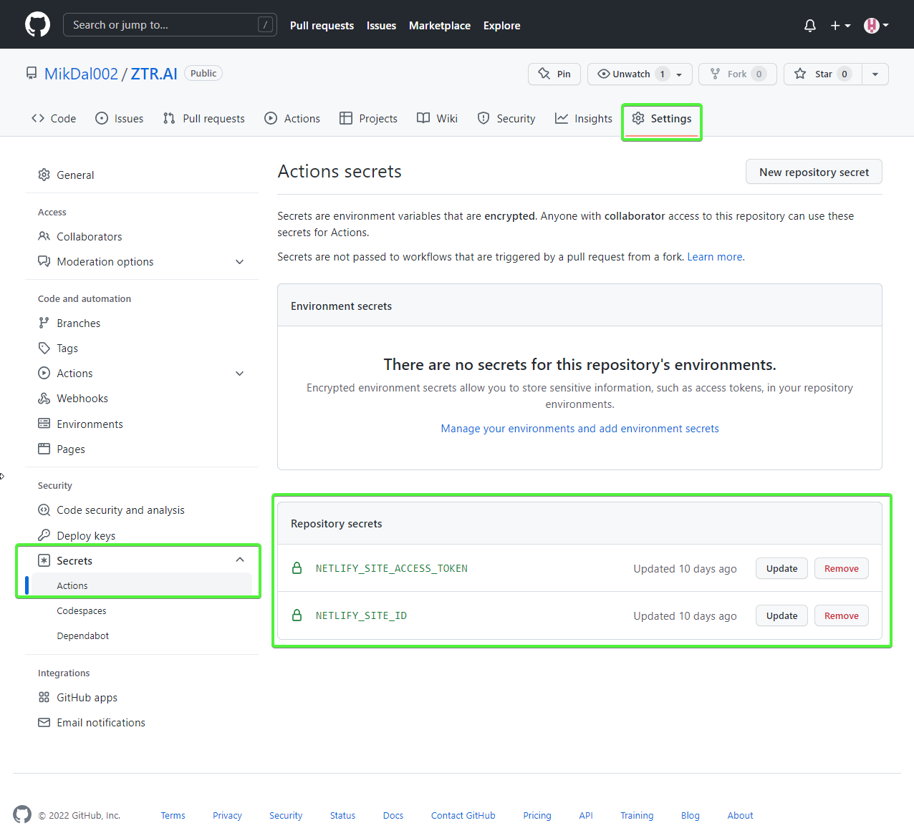

:toc: 
:experimental: true

== Wstęp

Ten artykuł jest drum z serii artykułów o Nuke. Poprzedni znajdziesz w liście u dołu artykułu.

Końcowy kod z opisanymi tutaj elementami, i kilkoma więcej, znajdziesz na moim GitHubie: https://github.com/MikDal002/ZTR.AI/tree/master/CICD[Ztr.AI].

== Pokrycie testami jednostkowymi

Uruchomienie badania pokrycia testami jednostkowymi i zwracanie błędu, gdy to pokrycie jest za małe, zajęło mi na prawdę sporo czasu.
Niestety to rozwiązanie wciąż nie jest idealne, ponieważ działa tylko na maszynie z Windows, a do tego potrzebuje trochę kodu.

Badanie pokrycia kodu testami jednostkowymi jest wykonywane za pomocą `Coverlet`, które jest używane przez środowisko `dotnet test`.
Nie użyłem DotCover, ponieważ nie jestem pewien, czy mogę tego narzędzie używać w każdym projekcie.
Aby móc z niego skorzystać, musisz zainstalować odpowiednią paczkę:

[source,powershell]
----
nuke :add-package coverlet.console --version 3.1.2
# lub, jeśli nie zainstalowałeś narzędzia nuke
dotnet tool install --global coverlet.console --version 3.1.2
----

Największym problemem, okazało się wymuszenie odpowiedniego pokrycia testami.
Tylko jedna, z wielu testowanych przeze mnie konfiguracji, działa, to jest, zwraca błąd, gdy pokrycie testami jest niższe niż wskazane, oto ona: 

[source,csharp]
----
Target TestCoverage => _ => _
    .DependsOn(Tests)
    .TriggeredBy(Tests)
    .OnlyWhenStatic(() => IsWindowsWhenReleaseOrAnyOsWhenOther()) // <1>
    .Executes(() =>
    {
        var coverageTestSettings = TestSettings
            .SetConfiguration(Configuration.Debug)
            .SetProjectFile(Solution); 
        DotNetTest(coverageTestSettings); // <2>

        var previousCoverageFileResult = string.Empty;
        CoverletTasks.Coverlet(s => s
            .SetFormat(CoverletOutputFormat.cobertura, CoverletOutputFormat.json) // <3> 
            .CombineWith(TestsProjects, (settings, project) =>
                PrepareCoverageSettingsForCoveringProject(project, settings, coverageTestSettings,ref previousCoverageFileResult) // <4>
            )
        );

        // <7>
        ReportGeneratorTasks.ReportGenerator(s => s
            .SetTargetDirectory(TestResultDirectory / "report")
            .SetFramework("net6.0")
            .SetReports(TestResultDirectory.GlobFiles("**/*.cobertura.xml").Select(d => d.ToString())));
    });

CoverletSettings PrepareCoverageSettingsForCoveringProject(Project project, CoverletSettings settings,
    DotNetTestSettings coverageTestSettings, ref string previousCoverageFileResult)
{
    var assemblyPath = FindAssemblyForProject(project);
    var coverageResultDirectory = TestResultDirectory / project.Name;

    settings = settings
        .SetAssembly(assemblyPath)
        // Ukośnik na końcu jest niezbędny, aby coverlet wiedziało, że ścieżkę ma traktować jako katalog.
        .SetOutput(coverageResultDirectory + "/")
        .SetTargetSettings(coverageTestSettings
            // Zbudowanie testów osobno jest kluczowym elementem do poprawnego działania Coverlet.
            .EnableNoBuild()
            .SetProjectFile(project));

    settings = MergeCoverageResultsWithPreviousRun(previousCoverageFileResult, settings); <5>
    previousCoverageFileResult = SetThresholdForLastRun(project, coverageResultDirectory, ref settings); <6>

    return settings;
}

string SetThresholdForLastRun(Project project, AbsolutePath testResultFile, ref CoverletSettings settings)
{
    if (TestsProjects.Select(d => d.ProjectId).Last() == project.ProjectId)
        settings = settings.SetThreshold(UnitTestCoverage_Minimum);
    string previousCoverageResult = testResultFile / "coverage.json";
    return previousCoverageResult;
}

static CoverletSettings MergeCoverageResultsWithPreviousRun(string previousCoverageResult,
    CoverletSettings settings)
{
    if (!string.IsNullOrWhiteSpace(previousCoverageResult))
        settings = settings.SetMergeWith(previousCoverageResult);
    return settings;
}

AbsolutePath FindAssemblyForProject(Project project)
{
    var projectName = $"**/{Configuration.Debug}/**/" + project.Name + ".dll";
    var first = SourceDirectory.GlobFiles(projectName).First();
    return first;
}
----

No i wylądowała nieczytelna ściana kodu. 
Wybacz, że jest ona tak duża, ale myślę, że dzięki temu będziesz w stanie łatwiej ją skopiować. 
Omówmy najważniejsze fragmenty kodu: 

<1> Na początku pomińmy uruchamianie tegoż kroku na wszystkich platformach po za Windows. 
Kod metody sprawdzającej platformę znajduje się poniżej. 
<2> Dla pewności uruchomy testy ponownie w konfiguracji Debug. 
Badanie pokrycia dla kodu zbudowanego w Release nie zawsze daje dobre wyniki. 
<3> Pokrycie kodu będziemy badać dla każdego projektu z testami osobno. 
Dlatego potrzebujemy dwóch formatów wyjściowych: cobertura dla wygenerowania raportu oraz json, który, jako natywny format, pozwala na łączenie wyników. 
Samo łączenie następuje w punkcie 5.
<4> Z racji, że badamy pokrycie dla każdego projektu osobno, musimy przygotować odpowiednie parametry.
<5> Musimy pamiętać, że mamy coś do połaczenia dopiero po pierwszym uruchomieniu programu.
<6> Na koniec, po wykonaniu ostatniego badania, możemy ustawić wymagany poziom pokrycia kodu testami jednostkowymi. 
Jeśli zrobimy to wcześniej, to poziom ten będzie sprawdzany dla każdego uruchomienia, co w niektórych przypadkach może skończyć się błędem.
<7> W tym miejscu mamy już zbadane pokrycie kodu testami jednostkowymi, i możemy wygenerować raport.

.OnlyWhenStatic() 
****
Funkcja ta powoduje, że warunki podane w niej zostaną sprawdzone w momencie rozpoczęcia kompilacji, czyli na długo przed uruchomieniem pierwszego kroku budowania. 
Pozwala nam to łatwo odsiać te kroki, które i tak nie mają sensu przy danej konfiguracji.
****

.CombineWith()
****
`CombineWith` pozwala nam na proste tworzenie wielu konfiguracji budowania budowania. 

Ważne jest, aby zauważyc, że wszystkie metody zmieniające konfigurację dokonują kopii obiektu i dopiero wtedy wprowadzają modyfikację. 
Aby uprosić nam pracę nad wieloma możliwościami otrzymujemy metodę `CombineWith`, która kopiuje nam obiekt konfiguracyjny i pozwala na wprowadzenie zmian. 
Następnie niemalże wszystkie metody wykonujące krok budowania są w stanie przyjąć, jako parametr wejściowy, wiele konfiguracji, co powoduje, że zostaną one uruchomione wielokrotnie.
****

=== Sprawdzanie systemu operacyjnego

Podczas próby sprawdzenia, na jakim środowisku jest uruchamiany kod porpzez GitHub Actions, miałem dużo mylnych informacji.
Nawet dane z klasy `EnvironmentInfo` zwracały mi informację, że środowiskiem uruchomieniowym jest windows, podczas gdy była to dystrybucja Ubuntu.
Jedynym sensownym sposobem mi znanym, na ten moment, jest wywołanie polecenia `uname`.

.Kod poprawnie sprawdzający, czy mamy do czynienia z systemem operacyjnym Windows, czy też może nie.
[source,csharp]
----
bool IsWindowsWhenReleaseOrAnyOsWhenOther()
{
    var isWindows = IsWindows();
    if (isWindows && Configuration == Configuration.Release) return true;
    return Configuration.Release != Configuration;
}

static bool IsWindows()
{
    try
    {
        Process p = new Process
        {
            StartInfo =
            {
                UseShellExecute = false,
                RedirectStandardOutput = true,
                FileName = "uname",
                Arguments = "-s"
            }
        };
        p.Start();
        string uname = p.StandardOutput.ReadToEnd().Trim();
        Serilog.Log.Information($"You run this built on {uname} machine.");
        // MSYS_NT - this name return uname on Github Action's machine.
        return uname.Contains("MSYS_NT", StringComparison.InvariantCultureIgnoreCase);
    }
    catch (Exception)
    {
        return true;
    }
}
----

.Logowanie procesu budowania
****
Warto zwrócić uwage na linijkę zaczynającą się od `Serilog.Log.Information`. 
Serilog jest domyslnym silnikiem służącym do logowania procesu budowania i jest to też zalecany sposób, na zwracanie naszych informacji na wyjście.
****

=== Raport z testów jednostkowych

Jeszcze kilka słów o raporcie. 
Raport ułatwi nam śledzenie, które moduły naszej aplikacji są testowane w największym stopniu, a które w najniższym.
Istnieją także platformy, które potafią zrobić z nich większy użytek i ładnie je wyświetlić, jednak na razie nie miałem potrzeby aby bawić się tym dalej. 
Jeśli znasz jakieś ciekawe zastosowanie dla raportu to daj znać w komentarzach!

Zwróć uwagę, na to jak wyszukiwane są pliki cubertury do wygenerowania raportu: `TestResultDirectory.GlobFiles("**/*.cobertura.xml")`. 
Jak widzisz, Nuke daje nam fajne narzędzie do operowania na plikach i katalogach.

== Publikowanie z wysyłką do Netlify jako przykład CI/CD.

Cały proces CI/CD nie może obejść się bez publikacji rozwiązania na serwer roboczy. 
W ramach przykładu, pokaże jak dochodzi do publikacji aplikacji Web Assembly (WASM) wykonanej w technologii Blazor na serwer Netlify.

Przy publikacji projektu korzystam z biblioteki https://github.com/daveaglick/NetlifySharp[NetlifySharp], także do poprawnego działania poniższego skrawka kodu musisz ją doinstalować:

[source,powershell]
Install-Package NetlifySharp -Version 1.1.1

Kod wygląda następująco: 

[source,csharp]
----
[Parameter] readonly string NetlifySiteId;

[Parameter][Secret] readonly string NetlifySiteAccessToken; // <1> 

Target Publish => _ => _
    .DependsOn(Compile)
    .Executes(() =>
    {
        var projectToPublish = Solution.GetProject("ZTR.AI.Example"); // <2> 
        DotNetPublish(s => s
            .SetProject(projectToPublish)
            .SetConfiguration(Configuration)
            .SetOutput(ArtifactsDirectory)); // <3> 
    });

Target PushToNetlify => _ => _
    .DependsOn(Publish)
    .Requires(() => NetlifySiteId, () => NetlifySiteAccessToken) // <4> 
    .Executes(async () =>
    {
        var netlifyClient = new NetlifyClient(NetlifySiteAccessToken); 
        var rootDirectory = ArtifactsDirectory / "wwwroot";
        await netlifyClient.UpdateSiteAsync(rootDirectory, NetlifySiteId); // <5>
    });
----

<1> Najpierw zdefiniujmy niezbędne parametry do działania naszej publijacji. 
W tym przypadu potrzebujemy identyfikatora strony Netlify oraz kodu dostępu do API (który możemy wygenerować w ustawieniach portalu).
Więcej o parametrach w ramce poniżej.
<2> Z racji, że wiele projektów może nadawać się do publikacji, choćby w postaci pakietów Nuget, to w tym przypadku interesuje mnie ten jeden. 
Poprzez proste podanie nazwy takiego projektu, można go łatwo wybrać. 
<3> W tym miejscu określamy do jakigo katalogu ma zostac opublikowana nasza strona, tak aby było ją łatwo wysłać.
<4> Przed wypchnięciem do Netlify upewnijmy się, że znane są nam parametry połączeniowe. 
Bez tego możemy otrzymać zestaw dziwnych błędów. 
<5> I tak przygotowaną stronę możemy wysłać dwoma linijkami prosto na serwer! 

Pominąłem w tym przykładzie kwestię publikowania paczek nuget, gdyż te są łatwo dostępne w Internecie, na przykład https://cfrenzel.com/publishing-nuget-nuke-appveyor/[tutaj]. 
Moje podejście do sprawy pokażę w przyszłej części tej serii artykułów.

.ParameterAttribute i SecretAttribute
****
Parametry maja bardzo dużo, różnych właściwości. 
Gdy oznaczymy jakieś pole atrybutem `Parameter`, to Nuke samodzielnie potraktuje to jako parametr wejściowy, który może zostać podany zarówno w linii poleceń jak i pobrany samoczynnie ze zmiennych środowiskowych.
Nuke potrafi nawet przechowywać parametry w celu wielokrotnego użycia. 
Więcej przykładów użyć znajdziesz między innymi na https://twitter.com/nukebuildnet/status/1365023015688413187[Twitterze].

Atrybut `Secret` powoduje, że Nuke nie będzie przechowywał tej wartości czystym tekstem.
W niektórych przypadkach potrafi nawet chronić taki sekret hasłem użytkownika, ale nie miałem okazji testować tej funkcjonalności.
****

.Requires()
****
`Requires` pozwala określić nam, wymagania niezbędne do uruchomienia danej akcji. 
Jeśli, któryś z warunków nie będzie spełniony, zostanie wyświetlony błąd a cała procedura przerwana.

W przykładzie powyżej, w punkcje 4 podajemy, że do wykonania danego kroku niezbędę są wartości `NetlifySideId` oraz `NetlifySiteAccessToken`. 
Wartości string nie mogą być `null` ani pustym ciągiem znaków.
****

== Github Actions

Wszelką konfigurację GitHub Actions robimy za pomocą atrybutu.
Z racji, że możemy mieć wiele wystąpień atrybutu `GitHubActions`, może określić różne docelowe kroki budowania w zależności od naszych potrzeb.
Poniżej pokazuję przykładową konfigurację budowania dla każdej propozycji nowego kodu (prośba dodania z ang. _pull request_ ) oraz gdy wejdą nowe zmiany do gałęzi głównej, kiedy to ma zostać wykonane wdrożenie strony.

[source,csharp]
----
[GitHubActions(
    "ForPR", // <1> 
    GitHubActionsImage.WindowsLatest, // <2> 
    GitHubActionsImage.UbuntuLatest,
    OnPullRequestBranches = new[] { DevelopBranch, MasterBranch }, // <3> 
    PublishArtifacts = false,
    InvokedTargets = new[] { nameof(Tests) }, // <4>
    CacheKeyFiles = new[] { "global.json", "source/**/*.csproj" },
    EnableGitHubToken = true)]
[GitHubActions(
    "Deploy", // <1> 
    GitHubActionsImage.WindowsLatest, // <2> 
    OnPushBranches = new[] { MasterBranch }, // <3>
    PublishArtifacts = false,
    InvokedTargets = new[] { nameof(Tests), nameof(PushToNetlify) }, // <4>
    CacheKeyFiles = new[] { "global.json", "source/**/*.csproj" },
    EnableGitHubToken = true, 
    ImportSecrets = new [] {nameof(NetlifySiteId), nameof(NetlifySiteAccessToken) } // <5>
    )]
partial class Build : NukeBuild
{
    const string MasterBranch = "master";
    const string DevelopBranch = "develop";

    [Parameter] readonly string NetlifySiteId;

    [Parameter][Secret] readonly string NetlifySiteAccessToken; // <5>
}
----

<1> Dla każdej akcji msuimy podać naszą nazwę, która będzie wyświetlana na GitHubie.
<2> Musimy również podać na jakim środowisku mają być wykonywane nasze procedury.
<3> Możemy określić zasady, według których będa uruchamiane poszczególne konfigurację (więcej szczegółów znajdziesz w https://docs.github.com/en/actions/using-workflows/workflow-syntax-for-github-actions#onpushbranchestagsbranches-ignoretags-ignore[dokumentacji]).
I tak `OnPullRequestBranches` powoduje wywołanie danej konfiguracji, gdy pojawi się nowe żądanie (PR), które będzie adresowane do poszczególnych gałęzi.
Natomiast `OnPushBranches` powoduje wywołanie danego przepływu każdorazowo, gdy zostaną wypchnięte na daną gałąź nowe zmiany.
<4> Najciekawszym elementem jest `InvokedTargets`, który określa nam wyraźnie, który krok naszego budowania ma być uruchomiony w danych przypadku. 
To właśnie tutaj zyskujemy najwięcej na wielorazowym wykorzystaniu kodu: nie ważne w ile przepływów wymyślimy, to ciągle wywołujemy dokładnie ten sam kod!
<5> Fragment `ImportSecrets` jest istotny, gdy chcemy pobrać pewne zmienne z środowiska GitHub Actions.
Zwróć uwagę (zrzut ekranu poniżej), że nazwa parametru, na przykład `NetlifySiteId`, zostanie zamieniona na `NETLIFY_SITE_ID`.
Pola parametrów `NetlifySIteId` oraz `NetlifySiteAccessToken` zostały tutaj dodane dla przejżystości przykładu. 

Wynikiem pracy takich atrybutów będą następujace pliki YAML:

.Konfiguracja publikowania strny
[source,yaml]
----
name: Deploy
on:
  push:
    branches:
      - master
jobs:
  windows-latest:
    name: windows-latest
    runs-on: windows-latest
    steps:
      - uses: actions/checkout@v1
      - name: Cache .nuke/temp, ~/.nuget/packages
        uses: actions/cache@v2
        with:
          path: |
            .nuke/temp
            ~/.nuget/packages
          key: ${{ runner.os }}-${{ hashFiles('global.json', 'source/**/*.csproj') }}
      - name: Run './build.cmd Tests PushToNetlify'
        run: ./build.cmd Tests PushToNetlify
        env:
          NetlifySiteId: ${{ secrets.NETLIFY_SITE_ID }}
          NetlifySiteAccessToken: ${{ secrets.NETLIFY_SITE_ACCESS_TOKEN }}
          GITHUB_TOKEN: ${{ secrets.GITHUB_TOKEN }}

----

.Konifguracja sprawdzająca prośbę dodania kodu
[source,yaml]
----
name: ForPR
on:
  pull_request:
    branches:
      - develop
      - master
jobs:
  windows-latest:
    name: windows-latest
    runs-on: windows-latest
    steps:
      - uses: actions/checkout@v1
      - name: Cache .nuke/temp, ~/.nuget/packages
        uses: actions/cache@v2
        with:
          path: |
            .nuke/temp
            ~/.nuget/packages
          key: ${{ runner.os }}-${{ hashFiles('global.json', 'source/**/*.csproj') }}
      - name: Run './build.cmd Tests'
        run: ./build.cmd Tests
        env:
          GITHUB_TOKEN: ${{ secrets.GITHUB_TOKEN }}
  ubuntu-latest:
    name: ubuntu-latest
    runs-on: ubuntu-latest
    steps:
      - uses: actions/checkout@v1
      - name: Cache .nuke/temp, ~/.nuget/packages
        uses: actions/cache@v2
        with:
          path: |
            .nuke/temp
            ~/.nuget/packages
          key: ${{ runner.os }}-${{ hashFiles('global.json', 'source/**/*.csproj') }}
      - name: Run './build.cmd Tests'
        run: ./build.cmd Tests
        env:
          GITHUB_TOKEN: ${{ secrets.GITHUB_TOKEN }}

----

.Widok strony konfiguracji sekretów dla GitHub Actions

== Podsumowanie

Muszę przyznać, że podejście, które reprezentuje Nuke bardzo mi się podoba: mogę opisać cały proces budowania raz w języku, który znam i łatwo testować całość lokalnie.
Niestety nie ma róży bez kolców. 
Na ten moment, dokumentacja i przykłady użycia są znikome. 
Dużo, z tego co jest zaprezentowane w tej serii artykułów (i co zaprezentowane jeszcze będzie) zostało wyrwane z kodów różnych repozytoriów. 
Na ten moment, nauka płynąca z używania Nuke płynie taka: Nuke to framework do wołania innych narzędzi. 
Ma to dwie konsekwencje: duża ilość możliwości oraz duża ilość szukania odpowiedzi. 
Jednak ma to też dobre strony: nie jesteśmy obarczeni blokadą stawianą przez bibliotekę (tak zwany vendor-lock), gdyż łatwo możemy przejść do innych dostępnych narzędzi, bądź wywoływać konkretne polecenia bezposrednio.

Końcowy kod z opisanymi tutaj elementami, i kilkoma więcej, znajdziesz na moim GitHubie: https://github.com/MikDal002/ZTR.AI/tree/master/CICD[Ztr.AI].

[.small]
Photo by https://unsplash.com/es/@burgessbadass?utm_source=unsplash&utm_medium=referral&utm_content=creditCopyText[Burgess Milner] on https://unsplash.com/s/photos/nuke?utm_source=unsplash&utm_medium=referral&utm_content=creditCopyText[Unsplash].
