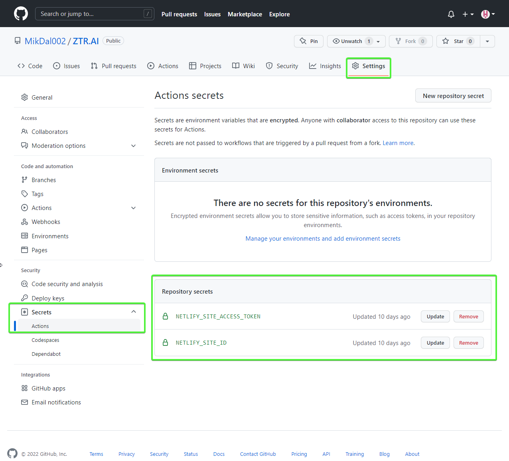

:toc: 
:experimental: true

== Introduction

This article is the second in a series of articles about Nuke. You can find the previous one in the list at the bottom of the article.

You can find the final code with the elements described here, and some more, on my GitHub: https://github.com/MikDal002/ZTR.AI/tree/master/CICD[Ztr.AI].

== Unit test coverage

It took me a really long time to run the unit test coverage check and return an error when this coverage is too small.
Unfortunately, this solution is still not perfect, because it only works on a Windows machine, and it needs some code.

Examining code coverage with unit tests is done with `Coverlet`, which is used by the `dotnet test` environment.
I didn't use DotCover because I'm not sure I can use this tool in every project, and I need something as universal as possible.
To use it, you need to install the appropriate package:

[source,powershell]
----
nuke :add-package coverlet.console --version 3.1.2
# or, if you have not installed the nuke tool
dotnet tool install --global coverlet.console --version 3.1.2
----

The biggest problem, it turned out, was forcing appropriate test coverage.
Only one, of the many configurations I tested, works, that is, it returns an error when test coverage is lower than indicated, here it is: 

[source,csharp]
----
Target TestCoverage => _ => _
    .DependsOn(Tests)
    .TriggeredBy(Tests)
    .OnlyWhenStatic(() => IsWindowsWhenReleaseOrAnyOsWhenOther()) // <1>
    .Executes(() =>
    {
        var coverageTestSettings = TestSettings
            .SetConfiguration(Configuration.Debug)
            .SetProjectFile(Solution); 
        DotNetTest(coverageTestSettings); // <2>

        var previousCoverageFileResult = string.Empty;
        CoverletTasks.Coverlet(s => s
            .SetFormat(CoverletOutputFormat.cobertura, CoverletOutputFormat.json) // <3> 
            .CombineWith(TestsProjects, (settings, project) =>
                PrepareCoverageSettingsForCoveringProject(project, settings, coverageTestSettings,ref previousCoverageFileResult) // <4>
            )
        );

        // <7>
        ReportGeneratorTasks.ReportGenerator(s => s
            .SetTargetDirectory(TestResultDirectory / "report")
            .SetFramework("net6.0")
            .SetReports(TestResultDirectory.GlobFiles("**/*.cobertura.xml").Select(d => d.ToString())));
    });

CoverletSettings PrepareCoverageSettingsForCoveringProject(Project project, CoverletSettings settings,
    DotNetTestSettings coverageTestSettings, ref string previousCoverageFileResult)
{
    var assemblyPath = FindAssemblyForProject(project);
    var coverageResultDirectory = TestResultDirectory / project.Name;

    settings = settings
        .SetAssembly(assemblyPath)
        // The slash at the end is necessary so that coverlet knows to treat the path as a directory.
        .SetOutput(coverageResultDirectory + "/")
        .SetTargetSettings(coverageTestSettings
            // Building the tests separately is a key element for Coverlet to work properly.
            .EnableNoBuild()
            .SetProjectFile(project));

    settings = MergeCoverageResultsWithPreviousRun(previousCoverageFileResult, settings); <5>
    previousCoverageFileResult = SetThresholdForLastRun(project, coverageResultDirectory, ref settings); <6>

    return settings;
}

string SetThresholdForLastRun(Project project, AbsolutePath testResultFile, ref CoverletSettings settings)
{
    if (TestsProjects.Select(d => d.ProjectId).Last() == project.ProjectId)
        settings = settings.SetThreshold(UnitTestCoverage_Minimum);
    string previousCoverageResult = testResultFile / "coverage.json";
    return previousCoverageResult;
}

static CoverletSettings MergeCoverageResultsWithPreviousRun(string previousCoverageResult,
    CoverletSettings settings)
{
    if (!string.IsNullOrWhiteSpace(previousCoverageResult))
        settings = settings.SetMergeWith(previousCoverageResult);
    return settings;
}

AbsolutePath FindAssemblyForProject(Project project)
{
    var projectName = $"**/{Configuration.Debug}/**/" + project.Name + ".dll";
    var first = SourceDirectory.GlobFiles(projectName).First();
    return first;
}
----

Well, and landed an unreadable wall of code. 
Forgive it for being so large, but I think this will make it easier for you to copy. 
Let's discuss the most important parts of the code: 

<1> At first, let's skip running this step on all platforms except Windows. 
The code for the method that checks the platform is below. 
<2> To be sure, we run the tests again in the Debug configuration. 
Testing coverage for code built in Release does not always give good results. 
<3> We will examine code coverage for each project with tests separately. 
Therefore, we need two output formats: `cobertura` for generating the report and `json`, which, as a native format, allows us to merge the results. 
The merging itself occurs in step 5.
<4> Since we are examining coverage for each project separately, we need to prepare the appropriate parameters.
<5> We need to remember that we only have something to merge when we first run the program.
<6> Finally, after doing the last test, we can set the required level of code coverage with unit tests. 
If we do this beforehand, this level will be checked for each run, which in some cases may end up with an error.
<7> At this point, we have already examined the code coverage with unit tests, and we can generate a report.

.OnlyWhenStatic() 
****
This function causes the conditions given in it to be checked at the start of compilation, that is, long before the first build step is run. 
This allows us to easily sift out those steps that don't make sense with a given configuration anyway.
****

.CombineWith()
****
`CombineWith` allows us to easily create multiple configurations for building an application. 

It's important to note that all configuration changing methods make a copy of the object and only then make the modification. 
To make it simpler for us to work on multiple combinations, we can use the `CombineWith` method, which copies the configuration object and allows us to make changes. 
After that, almost all methods that perform the build step are able to accept, as an input parameter, multiple configurations, which causes them to be run multiple times.
****

=== Checking the operating system

When trying to check what environment the code is running on via GitHub Actions, I had a lot of confusing information.
Even the data from the `EnvironmentInfo` class was returning that the runtime environment was Windows, while it was the Ubuntu distribution.
The only sensible way I know of, at this point, is to call the `uname` command.

.Code that correctly checks whether or not we are running a Windows operating system.
[source,csharp]
----
bool IsWindowsWhenReleaseOrAnyOsWhenOther()
{
    var isWindows = IsWindows();
    if (isWindows && Configuration == Configuration.Release) return true;
    return Configuration.Release != Configuration;
}

static bool IsWindows()
{
    try
    {
        Process p = new Process
        {
            StartInfo =
            {
                UseShellExecute = false,
                RedirectStandardOutput = true,
                FileName = "uname",
                Arguments = "-s"
            }
        };
        p.Start();
        string uname = p.StandardOutput.ReadToEnd().Trim();
        Serilog.Log.Information($"You run this built on {uname} machine.");
        // MSYS_NT - this name return uname on Github Action's machine.
        return uname.Contains("MSYS_NT", StringComparison.InvariantCultureIgnoreCase);
    }
    catch (Exception)
    {
        return true;
    }
}
----

.Logging during the building process
****
It is worth to pay attention to the line starting with `Serilog.Log.Information`. 
Serilog is the default engine for logging the build process, and it is also the recommended way, to return information to the output.
****

=== Unit test report

A few more words about the report. 
The report will help us keep track of which modules of our application are tested the most and which are tested the lowest.
There are also platforms that can make more use of them and display them nicely, but for now I had no need to play with it further. 
If you know of any interesting uses for the report, let me know in the comments!

Note how the `cubertura` files are searched for to generate the report: `TestResultDirectory.GlobFiles("**/*.cobertura.xml")`. 
As you can see, Nuke gives us a cool tool to operate on files and directories.

== Publishing with uploading to Netlify as an example of CI/CD.

The entire CI/CD process cannot do without publishing the solution to the working server. 
As an example, I will show how to publish a Web Assembly (WASM) application made with Blazor technology to a Netlify server.

When publishing the project I use the library https://github.com/daveaglick/NetlifySharp[NetlifySharp], also for the following code snippet to work correctly you need to install it:

[source,powershell]
Install-Package NetlifySharp -Version 1.1.1

The code looks as follows: 

[source,csharp]
----
[Parameter] readonly string NetlifySiteId;

[Parameter][Secret] readonly string NetlifySiteAccessToken; // <1> 

Target Publish => _ => _
    .DependsOn(Compile)
    .Executes(() =>
    {
        var projectToPublish = Solution.GetProject("ZTR.AI.Example"); // <2> 
        DotNetPublish(s => s
            .SetProject(projectToPublish)
            .SetConfiguration(Configuration)
            .SetOutput(ArtifactsDirectory)); // <3> 
    });

Target PushToNetlify => _ => _
    .DependsOn(Publish)
    .Requires(() => NetlifySiteId, () => NetlifySiteAccessToken) // <4> 
    .Executes(async () =>
    {
        var netlifyClient = new NetlifyClient(NetlifySiteAccessToken); 
        var rootDirectory = ArtifactsDirectory / "wwwroot";
        await netlifyClient.UpdateSiteAsync(rootDirectory, NetlifySiteId); // <5>
    });
----

<1> First, let's define the necessary parameters for our publication to work. 
In this case, we need the Netlify site ID and the API access code (which we can generate in the portal settings).
More about the parameters in the box below.
<2> Since many projects may be suitable for publication, if only in the form of nuget packages, in this case I am interested in this one. 
By simply specifying the name of such a project, it can be easily selected. 
<3> Here we specify to which directory we want to publish our site, so that it is easy to send it.
<4> Before pushing out to Netlify, let's make sure we know the connection parameters. 
Without this, we may get a set of strange errors. 
<5> And so prepared page we can send with two lines straight to the server! 

I skipped the issue of publishing nuget packages in this example, as these are readily available on the Internet, for example, https://cfrenzel.com/publishing-nuget-nuke-appveyor/[here]. 
I will show my approach in a future part of this article series.

.ParameterAttribute i SecretAttribute
****
Parametry mają bardzo dużo, różnych właściwości. 
Gdy oznaczymy jakieś pole atrybutem `Parameter`, to Nuke samodzielnie potraktuje to jako parametr wejściowy, który może zostać podany zarówno w linii poleceń, jak i pobrany samoczynnie ze zmiennych środowiskowych.
Nuke potrafi nawet przechowywać parametry w celu wielokrotnego użycia. 
Więcej przykładów użyć znajdziesz między innymi na https://twitter.com/nukebuildnet/status/1365023015688413187[Twitterze].

Atrybut `Secret` powoduje, że Nuke nie będzie przechowywał tej wartości czystym tekstem.
W niektórych przypadkach potrafi nawet chronić taki sekret hasłem użytkownika, ale nie miałem okazji testować tej funkcjonalności.
****

.Requires()
****
`Requires` pozwala określić nam, wymagania niezbędne do uruchomienia danej akcji. 
Jeśli, któryś z warunków nie będzie spełniony, zostanie wyświetlony błąd a cała procedura przerwana.

W przykładzie powyżej, w punkcje 4 podajemy, że do wykonania danego kroku niezbędne są wartości `NetlifySideId` oraz `NetlifySiteAccessToken`. 
Wartości string nie mogą być `null` ani pustym ciągiem znaków.
****

== Github Actions

Wszelką konfigurację GitHub Actions robimy za pomocą atrybutu.
Z racji, że możemy mieć wiele wystąpień atrybutu `GitHubActions`, może określić różne docelowe kroki budowania w zależności od naszych potrzeb.
Poniżej pokazuję przykładową konfigurację budowania dla każdej propozycji nowego kodu (prośba dodania z ang. _pull request_ ) oraz gdy wejdą nowe zmiany do gałęzi głównej, kiedy to ma zostać wykonane wdrożenie strony.

[source,csharp]
----
[GitHubActions(
    "ForPR", // <1> 
    GitHubActionsImage.WindowsLatest, // <2> 
    GitHubActionsImage.UbuntuLatest,
    OnPullRequestBranches = new[] { DevelopBranch, MasterBranch }, // <3> 
    PublishArtifacts = false,
    InvokedTargets = new[] { nameof(Tests) }, // <4>
    CacheKeyFiles = new[] { "global.json", "source/**/*.csproj" },
    EnableGitHubToken = true)]
[GitHubActions(
    "Deploy", // <1> 
    GitHubActionsImage.WindowsLatest, // <2> 
    OnPushBranches = new[] { MasterBranch }, // <3>
    PublishArtifacts = false,
    InvokedTargets = new[] { nameof(Tests), nameof(PushToNetlify) }, // <4>
    CacheKeyFiles = new[] { "global.json", "source/**/*.csproj" },
    EnableGitHubToken = true, 
    ImportSecrets = new [] {nameof(NetlifySiteId), nameof(NetlifySiteAccessToken) } // <5>
    )]
partial class Build : NukeBuild
{
    const string MasterBranch = "master";
    const string DevelopBranch = "develop";

    [Parameter] readonly string NetlifySiteId;

    [Parameter][Secret] readonly string NetlifySiteAccessToken; // <5>
}
----

<1> Dla każdej akcji musimy podać naszą nazwę, która będzie wyświetlana na GitHubie.
<2> Musimy również podać, na jakim środowisku mają być wykonywane nasze procedury.
<3> Możemy określić zasady, według których będą uruchamiane poszczególne konfiguracje (więcej szczegółów znajdziesz w https://docs.github.com/en/actions/using-workflows/workflow-syntax-for-github-actions#onpushbranchestagsbranches-ignoretags-ignore[dokumentacji]).
I tak `OnPullRequestBranches` powoduje wywołanie danej konfiguracji, gdy pojawi się nowe żądanie (PR), które będzie adresowane do poszczególnych gałęzi.
Natomiast `OnPushBranches` powoduje wywołanie danego przepływu każdorazowo, gdy zostaną wypchnięte na daną gałąź nowe zmiany.
<4> Najciekawszym elementem jest `InvokedTargets`, który określa nam wyraźnie, który krok naszego budowania ma być uruchomiony w danym przypadku. 
To właśnie tutaj zyskujemy najwięcej na wielorazowym wykorzystaniu kodu: nieważne ile przepływów wymyślimy, to ciągle wywołujemy dokładnie ten sam kod!
<5> Fragment `ImportSecrets` jest istotny, gdy chcemy pobrać pewne zmienne ze środowiska GitHub Actions.
Zwróć uwagę (zrzut ekranu poniżej), że nazwa parametru, na przykład `NetlifySiteId`, zostanie zamieniona na `NETLIFY_SITE_ID`.
Pola parametrów `NetlifySIteId` oraz `NetlifySiteAccessToken` zostały tutaj dodane dla przejrzystości przykładu. 

Wynikiem pracy takich atrybutów będą następujące pliki YAML:

.Konfiguracja publikowania strny
[source,yaml]
----
name: Deploy
on:
  push:
    branches:
      - master
jobs:
  windows-latest:
    name: windows-latest
    runs-on: windows-latest
    steps:
      - uses: actions/checkout@v1
      - name: Cache .nuke/temp, ~/.nuget/packages
        uses: actions/cache@v2
        with:
          path: |
            .nuke/temp
            ~/.nuget/packages
          key: ${{ runner.os }}-${{ hashFiles('global.json', 'source/**/*.csproj') }}
      - name: Run './build.cmd Tests PushToNetlify'
        run: ./build.cmd Tests PushToNetlify
        env:
          NetlifySiteId: ${{ secrets.NETLIFY_SITE_ID }}
          NetlifySiteAccessToken: ${{ secrets.NETLIFY_SITE_ACCESS_TOKEN }}
          GITHUB_TOKEN: ${{ secrets.GITHUB_TOKEN }}

----

.Konifguracja sprawdzająca prośbę dodania kodu
[source,yaml]
----
name: ForPR
on:
  pull_request:
    branches:
      - develop
      - master
jobs:
  windows-latest:
    name: windows-latest
    runs-on: windows-latest
    steps:
      - uses: actions/checkout@v1
      - name: Cache .nuke/temp, ~/.nuget/packages
        uses: actions/cache@v2
        with:
          path: |
            .nuke/temp
            ~/.nuget/packages
          key: ${{ runner.os }}-${{ hashFiles('global.json', 'source/**/*.csproj') }}
      - name: Run './build.cmd Tests'
        run: ./build.cmd Tests
        env:
          GITHUB_TOKEN: ${{ secrets.GITHUB_TOKEN }}
  ubuntu-latest:
    name: ubuntu-latest
    runs-on: ubuntu-latest
    steps:
      - uses: actions/checkout@v1
      - name: Cache .nuke/temp, ~/.nuget/packages
        uses: actions/cache@v2
        with:
          path: |
            .nuke/temp
            ~/.nuget/packages
          key: ${{ runner.os }}-${{ hashFiles('global.json', 'source/**/*.csproj') }}
      - name: Run './build.cmd Tests'
        run: ./build.cmd Tests
        env:
          GITHUB_TOKEN: ${{ secrets.GITHUB_TOKEN }}

----

.Widok strony konfiguracji sekretów dla GitHub Actions

== Podsumowanie

Muszę przyznać, że podejście, które reprezentuje Nuke bardzo mi się podoba: mogę opisać cały proces budowania raz w języku, który znam i łatwo testować całość lokalnie.
Niestety nie ma róży bez kolców. 
Na ten moment, dokumentacja i przykłady użycia są znikome. 
Dużo, z tego co jest zaprezentowane w tej serii artykułów (i co zaprezentowane jeszcze będzie) zostało wyrwane z kodów różnych repozytoriów. 
Na ten moment, nauka płynąca z używania Nuke płynie taka: Nuke to framework do wołania innych narzędzi. 
Ma to dwie konsekwencje: duża ilość możliwości oraz duża ilość szukania odpowiedzi. 
Jednak ma to też dobre strony: nie jesteśmy obarczeni blokadą stawianą przez bibliotekę (tak zwany vendor-lock), gdyż łatwo możemy przejść do innych dostępnych narzędzi, bądź wywoływać konkretne polecenia bezpośrednio.

Końcowy kod z opisanymi tutaj elementami, i kilkoma więcej, znajdziesz na moim GitHubie: https://github.com/MikDal002/ZTR.AI/tree/master/CICD[Ztr.AI].

[.small]
Photo by https://unsplash.com/es/@burgessbadass?utm_source=unsplash&utm_medium=referral&utm_content=creditCopyText[Burgess Milner] on https://unsplash.com/s/photos/nuke?utm_source=unsplash&utm_medium=referral&utm_content=creditCopyText[Unsplash].
