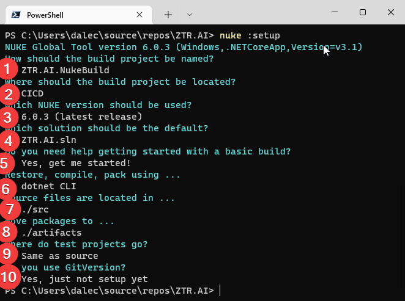
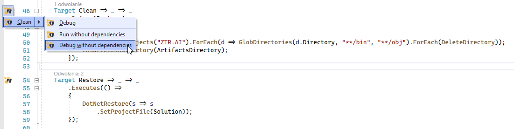

:toc: 
:experimental: true

Końcowy kod z opisanymi tutaj elementami, i kilkoma więcej, znajdziesz na moim GitHubie: https://github.com/MikDal002/ZTR.AI/tree/master/CICD[Ztr.AI].

== Wstęp
Wyobraź sobie, że całe CI/CD swojej aplikacji możesz opisać za pomocą C#.
Bez potrzeby nauki środowiska graficznego TeamCity, czy YAML'i GitHuba. 

Nuke jest jednym ze sposobów opisu budowania naszej aplikacji w języku C#. 
Jeżeli chcemy, aby nasz projekt był cały czas łatwo zarządzalny, musimy mieć sposób na opis wszystkich wymagań stawianych przed nim. 
I tak oto, możemy opisać:

1. (Czyszczenie) jak powinny wyglądać katalogi przed rozpoczęciem budowania projektu,
2. (Przygotowanie) jakich zależności potrzebuje nasza aplikacja do kompilacji,
3. (Budowanie) w jakiej kolejności budować poszczególne elementy,
4. (Testowanie) jak uruchamiać testy jednostkowe i jakie są nasze wymagania co do pokrycia nimi naszego kodu,
5. (Publikacja) jak spakować naszą aplikację i wysłać ją na środowisko produkcyjne. 

Nie jest to kompletna lista, tego, co możemy zrobić w trakcie procesu ciągłej integracji i dostarczania. 
Na pewno pokazuje ona podstawowe zagadnienia, przed którymi jesteśmy stawiani podczas wydawania kolejnej wersji naszego oprogramowania. 
I jak to w życiu bywa, jeśli czegoś nie zapiszemy, to pewno o tym zapomnimy.
A po co zapisywać coś na skrawku papieru, gdy można to zrobić za pomocą kodu, który wykona się sam? 

Wszystkie wyżej opisane kroki możemy opisywać w różnych językach.
Robimy to często w tak wyspecjalizowanych formach, jak projekty budujące na TeamCity, czy GitHub Actions. 
Nuke przekonał mnie tym, że nie muszę uczyć się tych wszystkich konfiguracji osobno – mogę opisać wszystko, co niezbędne za pomocą dobrze mi znanego języka C# i wykorzystywać tam, gdzie potrzebuję.
W przypadku GitHub Actions mogę bez problemu również wykorzystać raz napisany kod w wielu różnych przepływach, co stanowczo upraszcza pracę i testowanie.

== Wstępna konfiguracja z pomocą kreatora

Wstępną konfigurację naszego projektu warto zacząć od instalacji narzędzia Nuke, które stanowczo ułatwia pracę dewelopera.
Co ważne, nie jest ono niezbędne na serwerze budującym.

[source,powershell]
----
dotnet tool install Nuke.GlobalTool --global
----

.Widok konfiguratora Nuke

1. Wybierz nazwę projektu budującego, 
2. Katalog, w którym będzie on zapisany,
3. Wersję Nuke,
4. Domyślne rozwiązanie, które będzie budowane,
5. Wybierz, czy chcesz, aby podstawowe polecenia budujące zostały już umieszczone w nowym projekcie. 
6. Wybierz środowisku, które będzie budować twoje rozwiązanie.
7. Wybierz miejsce, gdzie są umieszczone twoje projekty (w tym katalogu będzie przeprowadzane czyszczenie dodatkowe),
8. Wybierz, gdzie mają trafiać artefakty, czyli pliki wynikowe budowania, jak paczki nuget. 
9. Wybierz, gdzie są twoje projekty, które testują rozwiązanie.
10 Wybierz, czy używasz GitVersion. Ja wybrałem, że tak, jednak opis tego narzędzia znajdzie się w innym artykule.

Rezultatem takich wyborów, będzie klasa C#, która będzie wyglądać mniej więcej tak, jak poniżej.
Obok tego dostaniemy kilka plików build.sh i build.cmd i build.ps1, które pozwalają nam na budowę naszej aplikacji nawet w środowisku, które nie ma zainstalowanego środowiska .Net. 
Pojawi się również katalog `.nuke`, który przechowuje kilka ustawień.

.Widok klasy Build.cs
[source,csharp]
----
[CheckBuildProjectConfigurations]
[ShutdownDotNetAfterServerBuild]
class Build : NukeBuild
{
    public static int Main () => Execute<Build>(x => x.Compile);

    [Parameter("Configuration to build - Default is 'Debug' (local) or 'Release' (server)")]
    readonly Configuration Configuration = IsLocalBuild ? Configuration.Debug : Configuration.Release;

    [Solution] readonly Solution Solution;
    [GitRepository] readonly GitRepository GitRepository;
    [GitVersion] readonly GitVersion GitVersion;

    AbsolutePath SourceDirectory => RootDirectory / "src";
    AbsolutePath ArtifactsDirectory => RootDirectory / "artifacts";

    Target Clean => _ => _
        .Before(Restore)
        .Executes(() =>
        {
            SourceDirectory.GlobDirectories("**/bin", "**/obj").ForEach(DeleteDirectory);
            EnsureCleanDirectory(ArtifactsDirectory);
        });

    Target Restore => _ => _
        .Executes(() =>
        {
            DotNetRestore(s => s
                .SetProjectFile(Solution));
        });

    Target Compile => _ => _
        .DependsOn(Restore)
        .Executes(() =>
        {
            DotNetBuild(s => s
                .SetProjectFile(Solution)
                .SetConfiguration(Configuration)
                .SetAssemblyVersion(GitVersion.AssemblySemVer)
                .SetFileVersion(GitVersion.AssemblySemFileVer)
                .SetInformationalVersion(GitVersion.InformationalVersion)
                .EnableNoRestore());
        });

}
----

=== Jak budować projekt z pomocą Nuke

Projekt budujący Nuke możemy uruchomić przynajmniej na trzy sposoby:

NOTE: Niezależnie od wybranej metody, często, aby zmiany w kodzie budującym zostały zastosowane, niezbędne jest przebudowanie projektu. 
Samo budowanie, bez czyszczenia, rzadko daje efekty.

==== Z konsoli

* __dotnet run__ -
Budować możesz poleceniem `dotnet run` wywołanym w katalogu, gdzie znajduje się nasz projekt budujący (u mnie jest to katalog CICD).

* __Narzędziem nuke__ -
Jeśli zainstalowałeś wcześniej globalne narzędzie nuke, to możesz użyć również go. 
Wywołaj w konsoli polecenie `nuke`.
Spowoduje ono wywołanie domyślnego celu budowania, czyli kompilację. 
Podejście to jest bardziej elastyczne, ponieważ zadziała niezależnie od katalogu, w którym je wywołasz. 
Potrafi ono samo znaleźć katalog główny rozwiązania i tam poszukać odpowiednich dojść.

Niezależnie od podejścia, pamiętaj, że przy uruchomieniu możesz podawać własne parametry uruchomieniowe. 
Możesz spróbować poprzez dodanie flagi `--Configuration Release`, co spowoduje zbudowanie aplikacji w trybie release. 
Więcej o definiowaniu własnych parametrów znajdziesz w dalszej części artykułu, w sekcji na temat CI/CD.

Jeśli chcesz wywołać inny cel, wystarczy, że podasz jego nazwę: `nuke restore` (`dotnet run restore`).

==== Plugin do Visual Studio 2022

Plugin do Visual Studio pozwala nam na wywoływanie akcji budowania prosto z IDE. 
Do tego dochodzi możliwość debugowania.
Plugin ściągniesz https://marketplace.visualstudio.com/items?itemName=nuke.visualstudio[tutaj]. 

Po instalacji zobaczysz dodatkową ikonkę obok każdego celu budowania:

.Visual Studio 2022 z zainstalowanym wsparciem dla Nuke

// Wyjaśnienie poszczególnych elementów raczej wolałbym dać w ramkach w tekście

.Requires()
****
`Requires` pozwala określić nam, wymagania niezbędne do uruchomienia danej akcji. 
Jeśli, któryś z warunków nie będzie spełniony, zostanie wyświetlony błąd a cała procedura przerwana.
****

.Atrybut [Parameter]
****
Atrybut `Parameter` pozwala nam jasno określić parametry konfiguracyjne naszego procesu budującego. 
Daje on nam możliwość ustawienia opisu, wartości domyślnej.
Co ważne, wartości oznaczone atrybutem `Parameter` mogą być pozyskane zarówno z wiersza poleceń, przy uruchomieniu programu budującego, jak i ze zmiennych środowiskowyhc.
****

.Secret()
****
Oznaczenie parametru jako `Secret` spowoduje, że jego wartość nie zostanie wyświetlona w trakcie precesu budującego.
****

.CombineWith()
****
`CombineWith` pozwala nam na proste tworzenie kombinacji budowania. 
Kopiuje on konfigurację i pozwala na zmianę poszczególnych parametrów na podstawie dostarczonej kolekcji.
****

== Testy jednostkowe

Mając już przygotowane środowisko, możemy dodać testy jednostkowe. 

[source,csharp]
----
Target Tests => _ => _
        .DependsOn(Compile) // <1>
        .TriggeredBy(Compile) // <2>
        .Executes(() =>
        {
            EnsureCleanDirectory(TestResultDirectory); // <3>
            DotNetTest(new DotNetTestSettings() 
                .SetConfiguration(Configuration) // <4>
                .EnableNoBuild() // <5>
                .SetProjectFile(Solution)); // <6>
        });
----

Powyższy kod w zupełności wystarczy, aby uruchomić testy jednostkowe znajdujące się w całym naszym rozwiązaniu.

<1> Najpierw określamy, że testy muszą zostać wykonane po kompilacji.
<2> Następnie, że są one wywoływane po zakończeniu kompilacji.  
Więcej na temat tych dwóch metod przeczytasz w ramce poniżej. 
<3> W tym miejscu upewniamy się, że folder wynikowy testów jednostkowych jest pusty. 
Czasem potrafią znaleźć się tam ciekawe rzeczy, zwłaszcza gdy coś nie działa. 
<4> W tym miejscu ustawiamy konfigurację, czyli to, w jaki sposób chcemy budować naszą aplikację, czy w trybie `debug`, czy `release`. 
Jak spojrzysz na kod wygenerowany przez konfigurator parametr `Configuration`, który dostarcza nam takową informację.
Zawsze możesz go nadpisać, używając parametru `--Configuration [Debug|Release]`. 
<5> Ustawiamy flagę, informujacą o tym, że mechanizm testowy ma nie budować ponownie naszych projektów. Zrobiliśmy to w kroku `Compile``, więc powinno nam to zaoszczędzić trochę czasu.
<6> Określamy projekt, a w tym przypadku całe rozwiązanie, które chcemy przetestować. 

Mając dodane te kilka linijek do naszej klasy `Build.cs` możemy wywołać polecenie `nuke Compile`. 
Powinniśmy osatecznie uzyskać wynik na kształt: 

[source,console]
----
═══════════════════════════════════════
Target             Status      Duration
───────────────────────────────────────
Clean              Succeeded     < 1sec
Restore            Succeeded     < 1sec
Compile            Succeeded       0:02
Tests              Succeeded       0:02
───────────────────────────────────────
Total                              0:15
═══════════════════════════════════════
​
Build succeeded on 29.05.2022 18:38:46. ＼（＾ᴗ＾）／

----

.DependsOn() i TriggeredBy()
****
`DependsOn` pozwala nam na określenie, jakie kroki muszą zostać wykonane przed wykonaniem wybranej akcji.
Natomiast `TriggeredBy` powoduje, że krok ten zostanie wywołany przez ten, podany jako argument. 
W powyższym kodzie, w punkcie <1> i <2> mamy przykład, że testy muszą być wykonane po kompilacji i są też przez nią wywoływane. 
Dzięki temu nie ważne, czy wykonamy polecenie `nuke compile` czy `nuke tests`, zawsze zostaną wykonane testy jednostkowe.

Polecenia te pozwalają nam kształtować łańcuch wywołań bez konieczności zmiany innych elementów wywołujących.
****

== Pokrycie testami jednostkowymi

Uruchomienie badania pokrycia testami jednostkowymi i zwracanie błędu, gdy to pokrycie jest za małe, zajęło mi na prawdę sporo czasu.
Niestety to rozwiązanie wciąż nie jest idealne, ponieważ działa tylko na maszynie z Windows, a do tego potrzebuje trochę kodu.

Badanie pokrycia kodu testami jednostkowymi jest wykonywane za pomocą `Coverlet`, które jest używane przez środowisko `dotnet test`.
Nie użyłem DotCover, ponieważ nie jestem pewien, czy mogę tego narzędzie używać w każdym projekcie.
Aby móc z niego skorzystać, musisz zainstalować odpowiednią paczkę:

[source,powershell]
----
nuke :add-package coverlet.console --version 3.1.2
# lub, jeśli nie zainstalowałeś narzędzia nuke
dotnet tool install --global coverlet.console --version 3.1.2
----

Największym problemem, okazało się wymuszenie odpowiedniego pokrycia testami.
Tylko jedna, z wielu testowanych przeze mnie konfiguracji, działa, to jest, zwraca błąd, gdy pokrycie testami jest niższe niż wskazane, oto ona: 

[source,csharp]
----
Target TestCoverage => _ => _
    .DependsOn(Tests)
    .TriggeredBy(Tests)
    .OnlyWhenStatic(() => IsWindowsWhenReleaseOrAnyOsWhenOther()) // <1>
    .Executes(() =>
    {
        var coverageTestSettings = TestSettings
            .SetConfiguration(Configuration.Debug)
            .SetProjectFile(Solution); 
        DotNetTest(coverageTestSettings); // <2>

        var previousCoverageFileResult = string.Empty;
        CoverletTasks.Coverlet(s => s
            .SetFormat(CoverletOutputFormat.cobertura, CoverletOutputFormat.json) // <3> 
            .CombineWith(TestsProjects, (settings, project) =>
                PrepareCoverageSettingsForCoveringProject(project, settings, coverageTestSettings,ref previousCoverageFileResult) // <4>
            )
        );

        // <7>
        ReportGeneratorTasks.ReportGenerator(s => s
            .SetTargetDirectory(TestResultDirectory / "report")
            .SetFramework("net6.0")
            .SetReports(TestResultDirectory.GlobFiles("**/*.cobertura.xml").Select(d => d.ToString())));
    });

CoverletSettings PrepareCoverageSettingsForCoveringProject(Project project, CoverletSettings settings,
    DotNetTestSettings coverageTestSettings, ref string previousCoverageFileResult)
{
    var assemblyPath = FindAssemblyForProject(project);
    var coverageResultDirectory = TestResultDirectory / project.Name;

    settings = settings
        .SetAssembly(assemblyPath)
        // Ukośnik na końcu jest niezbędny, aby coverlet wiedziało, że ścieżkę ma traktować jako katalog.
        .SetOutput(coverageResultDirectory + "/")
        .SetTargetSettings(coverageTestSettings
            // Zbudowanie testów osobno jest kluczowym elementem do poprawnego działania Coverlet.
            .EnableNoBuild()
            .SetProjectFile(project));

    settings = MergeCoverageResultsWithPreviousRun(previousCoverageFileResult, settings); <5>
    previousCoverageFileResult = SetThresholdForLastRun(project, coverageResultDirectory, ref settings); <6>

    return settings;
}

string SetThresholdForLastRun(Project project, AbsolutePath testResultFile, ref CoverletSettings settings)
{
    if (TestsProjects.Select(d => d.ProjectId).Last() == project.ProjectId)
        settings = settings.SetThreshold(UnitTestCoverage_Minimum);
    string previousCoverageResult = testResultFile / "coverage.json";
    return previousCoverageResult;
}

static CoverletSettings MergeCoverageResultsWithPreviousRun(string previousCoverageResult,
    CoverletSettings settings)
{
    if (!string.IsNullOrWhiteSpace(previousCoverageResult))
        settings = settings.SetMergeWith(previousCoverageResult);
    return settings;
}

AbsolutePath FindAssemblyForProject(Project project)
{
    var projectName = $"**/{Configuration.Debug}/**/" + project.Name + ".dll";
    var first = SourceDirectory.GlobFiles(projectName).First();
    return first;
}
----

No i wylądowała nieczytelna ściana kodu. 
Wybacz, że jest ona tak duża, ale myślę, że dzięki temu będziesz w stanie łatwiej ją skopiować. 
Omówmy najważniejsze fragmenty kodu: 

<1> Na początku pomińmy uruchamianie tegoż kroku na wszystkich platformach po za Windows. 
Kod metody sprawdzającej platformę znajduje się poniżej. 
<2> Dla pewności uruchomy testy ponownie w konfiguracji Debug. 
Badanie pokrycia dla kodu zbudowanego w Release nie zawsze daje dobre wyniki. 
<3> Pokrycie kodu będziemy badać dla każdego projektu z testami osobno. 
Dlatego potrzebujemy dwóch formatów wyjściowych: cobertura dla wygenerowania raportu oraz json, który, jako natywny format, pozwala na łączenie wyników. 
Samo łączenie następuje w punkcie 5.
<4> Z racji, że badamy pokrycie dla każdego projektu osobno, musimy przygotować odpowiednie parametry.
<5> Musimy pamiętać, że mamy coś do połaczenia dopiero po pierwszym uruchomieniu programu.
<6> Na koniec, po wykonaniu ostatniego badania, możemy ustawić wymagany poziom pokrycia kodu testami jednostkowymi. 
Jeśli zrobimy to wcześniej, to poziom ten będzie sprawdzany dla każdego uruchomienia, co w niektórych przypadkach może skończyć się błędem.
<7> W tym miejscu mamy już zbadane pokrycie kodu testami jednostkowymi, i możemy wygenerować raport.

.OnlyWhenStatic() 
****
Funkcja ta powoduje, że warunki podane w niej zostaną sprawdzone w momencie rozpoczęcia kompilacji, czyli na długo przed uruchomieniem pierwszego kroku budowania. 
Pozwala nam to łatwo odsiać te kroki, które i tak nie mają sensu przy danej konfiguracji.
****

=== Sprawdzanie systemu operacyjnego

Podczas próby sprawdzenia, na jakim środowisku jest uruchamiany kod porpzez GitHub Actions, miałem dużo mylnych informacji.
Nawet dane z klasy `EnvironmentInfo` zwracały mi informację, że środowiskiem uruchomieniowym jest windows, podczas gdy była to dystrybucja Ubuntu.
Jedynym sensownym sposobem mi znanym, na ten moment, jest wywołanie polecenia `uname`.

.Kod poprawnie sprawdzający, czy mamy do czynienia z systemem operacyjnym Windows, czy też może nie.
[source,csharp]
----
bool IsWindowsWhenReleaseOrAnyOsWhenOther()
{
    var isWindows = IsWindows();
    if (isWindows && Configuration == Configuration.Release) return true;
    return Configuration.Release != Configuration;
}

static bool IsWindows()
{
    try
    {
        Process p = new Process
        {
            StartInfo =
            {
                UseShellExecute = false,
                RedirectStandardOutput = true,
                FileName = "uname",
                Arguments = "-s"
            }
        };
        p.Start();
        string uname = p.StandardOutput.ReadToEnd().Trim();
        Serilog.Log.Information($"You run this built on {uname} machine.");
        // MSYS_NT - this name return uname on Github Action's machine.
        return uname.Contains("MSYS_NT", StringComparison.InvariantCultureIgnoreCase);
    }
    catch (Exception)
    {
        return true;
    }
}
----

=== Raport z testów jednostkowych

Jeszcze kilka słów o raporcie. 
Raport ułatwi nam śledzenie, które moduły naszej aplikacji są testowane w największym stopniu, a które w najniższym.
Istnieją także platformy, które potafią zrobić z nich większy użytek i ładnie je wyświetlić, jednak na razie nie miałem potrzeby aby bawić się tym dalej. 
Jeśli znasz jakieś ciekawe zastosowanie dla raportu to daj znać w komentarzach!

Zwróć uwagę, na to jak wyszukiwane są pliki cubertury do wygenerowania raportu: `TestResultDirectory.GlobFiles("**/*.cobertura.xml")`. 
Jak widzisz, Nuke daje nam fajne narzędzie do operowania na plikach i katalogach.

== Publikowanie z wysyłką do Netlify jako przykład CI/CD.

Cały proces CI/CD nie może obejść się bez publikacji rozwiązania na serwer roboczy. 
W ramach przykładu, pokaże jak dochodzi do publikacji aplikacji Web Assembly (WASM) wykonanej w technologii Blazor na serwer Netlify.

Przy publikacji projektu korzystam z biblioteki https://github.com/daveaglick/NetlifySharp[NetlifySharp], także do poprawnego działania poniższego skrawka kodu musisz ją doinstalować:

[source,powershell]
Install-Package NetlifySharp -Version 1.1.1

Kod wygląda następująco: 

[source,csharp]
----
[Parameter] readonly string NetlifySiteId;

[Parameter][Secret] readonly string NetlifySiteAccessToken; // <1> 

Target Publish => _ => _
    .DependsOn(Compile)
    .Executes(() =>
    {
        var projectToPublish = Solution.GetProject("ZTR.AI.Example"); // <2> 
        DotNetPublish(s => s
            .SetProject(projectToPublish)
            .SetConfiguration(Configuration)
            .SetOutput(ArtifactsDirectory)); // <3> 
    });

Target PushToNetlify => _ => _
    .DependsOn(Publish)
    .Requires(() => NetlifySiteId, () => NetlifySiteAccessToken) // <4> 
    .Executes(async () =>
    {
        var netlifyClient = new NetlifyClient(NetlifySiteAccessToken); 
        var rootDirectory = ArtifactsDirectory / "wwwroot";
        await netlifyClient.UpdateSiteAsync(rootDirectory, NetlifySiteId); // <5>
    });
----

<1> Najpierw zdefiniujmy niezbędne parametry do działania naszej publijacji. 
W tym przypadu potrzebujemy identyfikatora strony Netlify oraz kodu dostępu do API (który możemy wygenerować w ustawieniach portalu).
Więcej o parametrach w ramce poniżej.
<2> Z racji, że wiele projektów może nadawać się do publikacji, choćby w postaci pakietów Nuget, to w tym przypadku interesuje mnie ten jeden. 
Poprzez proste podanie nazwy takiego projektu, można go łatwo wybrać. 
<3> W tym miejscu określamy do jakigo katalogu ma zostac opublikowana nasza strona, tak aby było ją łatwo wysłać.
<4> Przed wypchnięciem do Netlify upewnijmy się, że znane są nam parametry połączeniowe. 
Bez tego możemy otrzymać zestaw dziwnych błędów. 
<5> I tak przygotowaną stronę możemy wysłać dwoma linijkami prosto na serwer! 

.ParameterAttribute i SecretAttribute
****
Parametry maja bardzo dużo, różnych właściwości. 
Gdy oznaczymy jakieś pole atrybutem `Parameter`, to Nuke samodzielnie potraktuje to jako parametr wejściowy, który może zostać podany zarówno w linii poleceń jak i pobrany samoczynnie ze zmiennych środowiskowych.
Nuke potrafi nawet przechowywać parametry w celu wielokrotnego użycia. 
Więcej przykładów użyć znajdziesz między innymi na https://twitter.com/nukebuildnet/status/1365023015688413187[Twitterze].

Atrybut `Secret` powoduje, że Nuke nie będzie przechowywał tej wartości czystym tekstem.
W niektórych przypadkach potrafi nawet chronić taki sekret hasłem użytkownika, ale nie miałem okazji testować tej funkcjonalności.
****

Pominąłem tutaj przykład publikowania paczek nuget, gdyż te są łatwo dostępne w Internecie, na przykład https://cfrenzel.com/publishing-nuget-nuke-appveyor/[tutaj]. 
Moje podejście do sprawy pokażę w przyszłej części tej serii artykułów.

== Github Actions

Wszelką konfigurację github action robimy za pomocą atrybutu.

=== Dla pull requestów

NOTE: Nie zapomnij dodać definicji parametrów pobieranych z sekretów do pliku YAML. 

=== Dla CI/CD.

Proces budowania dla CI/CD chcemy, aby był uruchamiany tylko po poprawnym połączeniu z gałęzią master. 

== Opis dodatkowy
`build.ps1 --help`
`build.ps1 --plan`

=== Budowanie równoległe niektórych kroków
=== Logowanie Serilog.Warning()
=== Łączenie ścieżek do pliku za pomocą operatora /

== Podsumowanie

=== Minusy
Słaba dokumentacja. 
Szukanie zawsze trzeba wykonywać w dwóch kierunkach: 1) jak to powinno być zrobione natywnie za pomocą danego narzędzia, 2) jak to zrobic w Nuke. 
Mogłoby być zdecydowanie więcej przykładów.

Końcowy kod z opisanymi tutaj elementami, i kilkoma więcej, znajdziesz na moim GitHubie: https://github.com/MikDal002/ZTR.AI/tree/master/CICD[Ztr.AI].

Photo by https://unsplash.com/es/@burgessbadass?utm_source=unsplash&utm_medium=referral&utm_content=creditCopyText[Burgess Milner] on https://unsplash.com/s/photos/nuke?utm_source=unsplash&utm_medium=referral&utm_content=creditCopyText[Unsplash].
