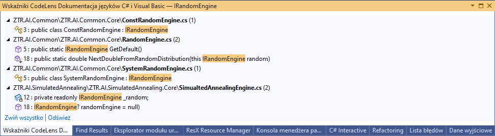

:toc: 
:experimental: true

== Wstęp

Nie ma człowieka i zespołu, który nie popełniałby błędów. 
Prawdziwym błędem jednak jest niewyciąganie wniosków. 
Niniejszy artykuł ma za zadanie zarchiwizować moje spojrzenie, na to, co według mnie było nie tak. 

Poniższe notatki dotyczą oprogramowania (mówię o całości), które w całości składało się w sumie z kilkunastu projektów. 
Pracowało nad nim łącznie około 8 programistów w szczytowym momencie. 
Poniżej będę mówił o tym, jaka organizacja sprawiała mi trudności i dlaczego. 

== Wiele solucji w wielu repozytoriach

Wiele solucji, które znajdowały się w osobnych repozytoriach, powodowało, że miałem potrzeba było poświęcić zdecydowanie więcej czasu na znalezienie wszystkich zależności, które powinienem zmienić, wykonując zadanie. 
Dodatkową trudność sprawiał fakt, że podczas pracy nad rozproszonym monolitem trzeba dbać, o to, aby wiele fragmentów naszej aplikacji korzystało z tej samej wersji kodu źródłowego. 
Poprzez rozproszony monolit (więcej na ten temat https://bulldogjob.pl/readme/czy-monolity-to-architektura-przyszlosci[tutaj]) rozumiem zestaw aplikacji, które są uruchamiane na wielu różnych maszynach, a żeby poprawnie działać, wszystkie, lub większość, musi zostać podegrana w tym samym czasie. 

Także wyobraź sobie, że szukając, co wywołuje daną metodę, nie możesz wykorzystać środowiska programistycznego i funkcji "Znajdź wszystkie odwołania", tylko musisz tekstowo szukać w kilku repozytoriach, a wszystkie zmiany w definicji synchronizować, czy to ręcznie, czy przez często zmieniającego się nugeta. 
Kosztowało mnie to mnóstwo energii, aby wszystko działało tak, jak należy, a i tak nie zawsze się udawało. 

.Wygodne szukanie wszystkich referencji

=== Problem współdzielenia kodu

Takie podejście powoduje jeszcze jeden poważny problem: dużą duplikację kodu. 
Kiedy nasze oprogramowanie jest rozbite na osobne repozytoria, to przychodzą mi do głowy dwa rozwiązania, aby sensownie współdzielić kod: subrepozytorium lub nuget. 

Podejście z subrepozytorium pozwala na szybsze stosowanie zmian. 
Spotkałem się z dość dużym oporem przed wykorzystaniem tego rozwiązania, który nie zawsze był dla mnie zrozumiały.
Jeśli też jesteś przeciwny temu podejściu, proszę napisz w komentarzu, dlaczego. 
Sam stosuję to podejście w projektach prywatnych i sprawdza się naprawdę dobrze.

Podejście z nugetem stanowczo wydłuża cały proces. 
Zmiany wprowadzone do projektu muszą zostać wysłane na serwer budujący, upublicznione w firmowym źródle, stamtąd rozdystrybuowane do poszczególnych projektów. 
A co najgorsze, często, zanim cały ten proces się zacznie, musimy przejść proces przeglądu kodu (code review) i zebrać przynajmniej dwie akceptacje, co po prostu trwa. 
Dodatkowo zmiana kodu współdzielonego rzadko kończy się na jednej iteracji, co jeszcze bardziej wydłuża cały proces. 

Taka żmudność powoduje, że programiści odpuszczają współdzielenie kodu i wolą go po prostu skopiować z jednego projektu do drugiego. 
Niestety ten efekt powoduje degradacje naszego projektu, przez to, że chcąc poprawić jakiś błąd, lub coś usprawnić, musimy wyszukać powtarzające się fragmenty.
Tutaj zaczyna się pętla na szyi zaciskać: kopiujemy kod, którego musimy szukać, szukanie sobie utrudniamy przez rozbijanie projektu na wiele repozytorium, przez co jeszcze więcej kopiujemy. 
I tak w koło. 

Kwestia ta nie kończy się na duplikacji kodu produkcyjnego. 
Mnożenie nugetów wiąże się często też z mnożeniem konfiguracji na serwerze budującym, co ma swoje konsekwencje w postaci przestarzałych procesów budujących, wiecznie kończących się licencjach, przestojach ciągłej integracji oraz degradacji całego procesu. 

=== Testy jednostkowe

Jak wydłużyć jeszcze bardziej proces współdzielenia kodu przez nugety? 
Pomińmy testy jednostkowe, przecież nie ma nic lepszego niż ręczne testy! 
Jeśli chcesz współdzielić kod za pomocą nugeta niezbędne będą testy jednostkowe, pokrywające jego funkcjonalność.
Może się przydać też projekt demonstracyjny. 
Jeśli spróbujemy tutaj "oszczędzić" nasz czas, to szybko stracimy go na więcej okrążeń w postaci: zmiana kodu współdzielonego, code review, budowanie, testy w końcowym projekcie. 

Nie można też przecenić roli testów jednostkowych jak pewnego zaworu bezpieczeństwa. 
Ich brak, powoduje, że zużywam stanowczo więcej energii na kontrolę swojego działania, a drobne poprawki wprowadzam dużo rzadziej. 
Jednak, w tym temacie zostało już sporo powiedziane, więc na tym zakończę.

=== Propozycja rozwiązania 

Rozwiązanie tych problemów, według mnie, na początku jest proste: dopóki nie masz kilkudziesięciu projektów, to często rozmiar repozytorium nie ma większego znaczenia i nie warto poświęcać czasu pracowników na to, aby wyszukiwali powiązań w różnych miejscach. 
Warto więc trzymać kod w jednym repozytorium i solucji, najdłużej jak to możliwe. 

Kiedy jednak wystąpią pewne problemy, trzeba działać.
Kroki, które bym podjął to:

. Jeśli dotyka cię *syndrom następnego poranka* <<APZ>> (czyli programiści poświęcają mnóstwo czasu na rozwiązywanie konfliktów przy łączeniu zmian) to często podział na repozytorium tylko ukryje ten problem bardziej i na pewien czas – w tym momencie potrzeba przemyślenia podziału projektu na poszczególne komponenty (wskazówki na ten temat znajdziesz w tej samej publikacji <<APZ>> w części IV).
. Przeorganizuj projekty, tak aby wszystkie klasy, które zmieniają się razem były w jednym miejscu. 
Projekty, które zmieniają się razem, na przykład: api, testy i logika, również trzymaj blisko siebie – będzie to dobry zalążek na przyszłość.
. Jeśli czas budowania wszystkich projektów jest przytłaczający, to można wydzielić wolnozmienne klasy narzędziowe do osobnej solucji, ale wciąż nie do osobnego repozytorium. 
Tak, aby było łatwo je znaleźć.

Przy dzieleniu rozwiązania na komponenty, pamiętaj, aby trzymać razem te klasy, które zmieniają się razem i postarać się, aby do Nugetów trafiły te rzeczy, które zmieniają się rzadko. 
Do takich nugetów i projektów, które są używane w wielu miejscach, powinny trafiać klasy możliwe abstrakcyjne, tak aby drobne zmiany w zachowaniu nie wymagały przebudowywania wszystkiego. 

Niestety jednak jest taki moment, w którym przychodzi potrzeba podzielenia projektu na osobne repozytoria.
Często jest to też dobry moment, aby rozbić jeden zespół na wiele mniejszych. 
Kiedy jesteś już zmuszony do tego kroku, postaraj się, aby osobne repozytorium i programy w nim zawarte, mogły być traktowane tak, jakby było to rozwiązanie dostarczane przez całkowicie zewnętrzny zespół, niemalże jak oprogramowanie firmy trzeciej. 
Taki podejście zapewni Ci sporą elastyczność oraz zminimalizuje problemy wynikające ze ścisłego powiązania.

== Podsumowanie

Postawienie na łatwość w odkrywaniu zależności wewnątrz projektu jest kluczem, zarówno do wdrażania nowych członków zespołu, jak i samej przyjemności płynącej z pracy. 
Nie ma nic gorszego, niż dostać zadanie i nie wiedzieć gdzie zacząć – i wcale nie chodzi o mnogość możliwości, tylko o dosłowne podejście, czyli moment, w którym zastanawiasz się, gdzie w ogóle jest repozytorium, nad którym masz pracować. 

Czytając powyższe akapity, można by użyć słowa "odkrywalność" (od angielskiego pojęcia _discoverability_). 
Rozumiane jako wysiłek niezbędny do tego, aby znaleźć wiedzę konieczną do wykonania zadania.
Poprzez dzielenie naszego projektu na mniejsze kawałki, pamiętajmy, że przyjdzie czas, w którym każda ze stworzonych zależności będzie musiała być prześledzona. 

[bibliography]
== Odwołania

* [[[APZ]]] - Agile Programowanie Zwinne. Zasady, wzorce i praktyki zwinnego wytwarzania w C#. Robert C. Martin, Micah Martin.

[.small]
Photo from Unslash by 
https://unsplash.com/photos/kTHJb6pYsrY?utm_source=unsplash&utm_medium=referral&utm_content=creditShareLink[C D-X].