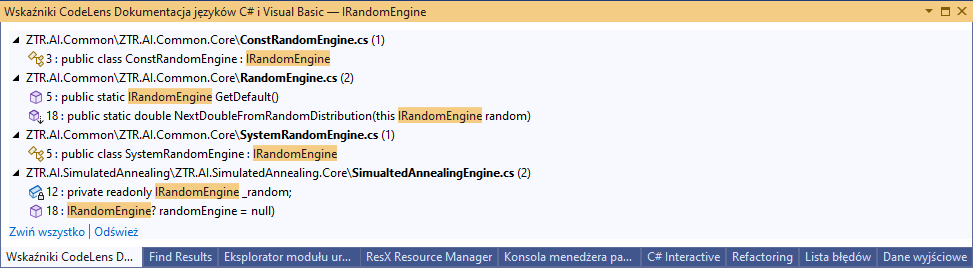

:toc: 
:experimental: true

== Introduction

There is no person or team that does not make mistakes. 
The real mistake, however, is not learning from them. 
This article is intended to archive my perspective on what I think went wrong. 

The following notes are about the software, which in total consisted of about a dozen projects. 
There were a total of about 8 programmers working on it at its peak. 
Below I'll talk about what organization caused me difficulty and why. 

== Multiple solutions in multiple repositories

Many solutions, which were located in separate repositories, caused that I had to spend much more time to find all the dependencies that I should change while doing the task. 
An additional difficulty was the fact that when working on a distributed monolith you have to make sure that many parts of your application are using the same version of the source code. 
By distributed monolith (more on this topic https://atechnologistspov.com/i-just-heard-that-monoliths-are-the-future-of-software-development-2190bf7f3c40[here]) I mean a set of applications that are run on many different machines, and in order to work properly, all, or most of them, need to be running at the same time. 

So, imagine that when looking for what calls a certain method, you can't use the development environment and the "Find all references" function, but you have to text search in several repositories, and synchronize all changes in the definition, either manually or through the frequently changing nuget. 
It cost me a lot of energy to get everything working as it should, and it still didn't always work. 

.Convenient search for all references

=== The problem of code sharing

This approach causes another major problem: a lot of code duplication. 
When our software is broken into separate repositories, I can think of two solutions to share code reasonably: sub-repositories or nuget. 

The sub-repository approach allows changes to be applied more quickly. 
I have encountered quite a bit of resistance to using this solution, which I have not always understood.
If you are also against this approach, please write in the comments why. 
I myself use this approach in private projects and it works really well.

The nuget approach makes the process much longer. 
Changes made to the project must be uploaded to the build server, made public in the corporate source, and then distributed to individual projects. 
And what's worst, often before the whole process starts we have to go through the code review process and get at least two approvals, which simply takes time. 
Additionally, changing shared code rarely ends in a single iteration, making the whole process even longer. 

This tediousness causes developers to give up on sharing code and prefer to simply copy it from one project to another. 
Unfortunately, this effect causes degradation of our project, by the fact that in order to fix a bug or improve something, we have to search for repeated fragments.
This is where the loop around our neck starts to tighten: we copy the code that we have to search for, we make the search harder by splitting the project into many repositories, which makes us copy even more. 
And so on and so forth. 

The issue does not end with duplication of production code. 
The multiplication of nugets is often also associated with a proliferation of configurations on the build server, which has consequences in terms of outdated build processes, perpetually running out of licenses, continuous integration downtime, and degradation of the overall process. 

=== Unit tests

How to make the code sharing process even longer for nugets? 
Let's skip the unit tests, after all there is nothing better than manual testing! 
If you want to share code via nuget you will need unit tests that cover its functionality.
A demo project may also be useful. 
If we try to "save" our time here, we will quickly lose it to more rounds of: changing shared code, code review, build, testing in the final project. 

The role of unit tests as a safety valve cannot be overestimated either. 
Lack of them causes that I use much more energy to control my work, and I make small corrections much less often. 
However, a lot has already been said on this topic, so I will end here.

=== Solution proposal

The solution to these problems, in my opinion, is simple at first: as long as you don't have dozens of projects, the size of the repository often doesn't matter much, and it's not worth spending staff time having them search for links in different places. 
So it's worth keeping the code in a single repository and solver for as long as possible. 

However, when certain problems occur, action is needed.
The steps I would take are:

. If you are affected by *next morning syndrome* <<APZ>> (i.e. developers spend a lot of time resolving conflicts when merging changes) then often splitting into a repository will only hide the problem more and for a while - at which point you need to rethink splitting the project into individual components (see the same <<APZ>> publication in Part IV for tips on this).
. Reorganize your projects so all classes that change together are in one place. 
Keep projects that change together, for example: api, tests, and logic, close together too - this will be a good seed for the future.
. If the build time for all projects is overwhelming, then you can spin off the slowly changing tool classes into a separate soloution, but still not into a separate repository. 
That way it's easy to find them.

When dividing the solution into components, be sure to keep together those classes that change together and try to get those things that change infrequently into Nugets. 
Possible abstract classes should go into such nugets and projects that are used in many places, so that minor changes in behavior won't require rebuilding everything. 

Unfortunately, however, there is a point at which the need to split a project into separate repositories comes.
It is also often a good time to break one team into many smaller ones. 
When you are forced to take this step, try to make the separate repository and the programs in it, can be treated as if it was a solution provided by a completely external team, almost like a third party software. 
This approach will give you a fair amount of flexibility and minimize the problems that come with tight coupling.

== Summary

Focusing on the ease of discovering dependencies within a project is key, both for the introduction of new team members and the enjoyment of the work itself. 
There's nothing worse than getting a task and not knowing where to start - and it's not about the multitude of possibilities at all, it's about the literal approach, which is the moment when you wonder where the repository you're supposed to be working on even is. 

Reading the above paragraphs, one might use the word "discoverability".
Understood as the effort required to find the knowledge necessary to complete a task.
By dividing our project into smaller pieces, let's keep in mind that there will come a time when each of the dependencies created will need to be traced. 

[bibliography]
== Odwołania

* [[[APZ]]] - Agile Principles, Patterns, and Practices in C#. Robert C. Martin, Micah Martin.

[.small]
Photo from Unslash by 
https://unsplash.com/photos/kTHJb6pYsrY?utm_source=unsplash&utm_medium=referral&utm_content=creditShareLink[C D-X].