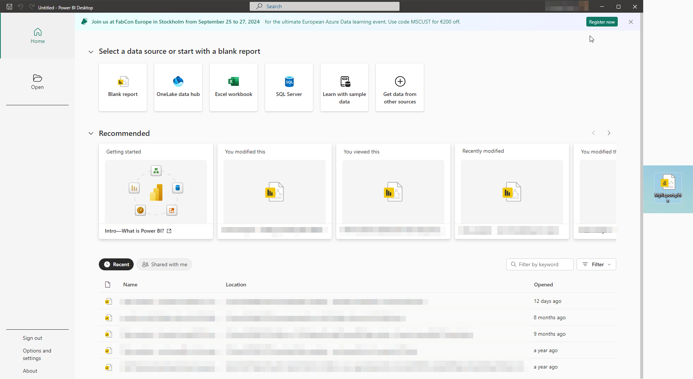
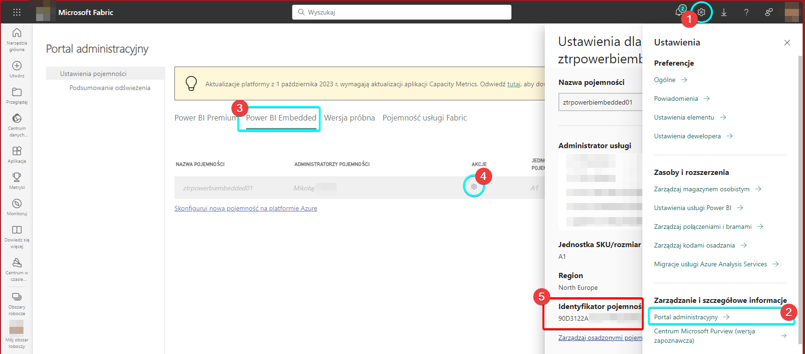
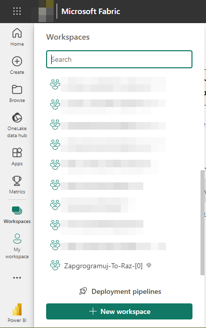

:toc: 
:experimental: true

[.small]

Zdjęcie ilustrujące artykuł pochodzi z https://unsplash.com/photos/turned-on-black-and-grey-laptop-computer-mcSDtbWXUZU?utm_content=creditCopyText&utm_medium=referral&utm_source=unsplash[Unsplash] i zostało wykonane przez https://unsplash.com/@goumbik?utm_content=creditCopyText&utm_medium=referral&utm_source=unsplash[Lukas Blazek]. 

W niniejszym artykule postaram się poprowadzić Cię przez podstawowe wdrożenie usługi Power BI. 

NOTE: Ten artykuł jest wciąż rozwijany, więc zajrzyj tu za jakiś czas. 
Najlepiej wcześniej zostaw komentarz, co jeszcze chciałbyś tu zobaczyć!

== Plik raportu

Wszystko zaczyna się tutaj, czyli od pliku raportu.
Do kreowania raportów istnieje aplikacja „Power BI Desktop”. 
Jej instalacja jest prosta:

[source,pwsh]
.Pobieranie aplikacji Power BI Desktop za pomoca winget
----
winget install -e --id Microsoft.PowerBI

----

Po instalacji otwórz aplikację i kliknij na przycisk „Pusty raport” (_Blank report_).
Następnie zapisz go na dysku.
W moim przypadku będzie to nazwa `MyReport.pbix`. 
Rozszerzenie `.pbix` to standardowe rozszerzenie pliku raportu dla Power BI.

Na początek taki pusty raport nam w zupełności wystarczy. 
Później dodamy do niego wyświetlenie danych, które również udostępnimy. 
Jednak nie będę tutaj pokazywał praktycznie nic na temat kreacji raportów.
Artykuł ten odnosi się do technicznej strony rozwiązania, jakim jest Power BI.

[[section:przygotowanie-srodowiska-w-azure]]
== Przygotowanie środowiska w Azure

Przed przystąpieniem do prac musimy przygotować sobie środowisko w Azure. 
Robimy to kilkoma prostymi poleceniami:

[source,powershell]
.Uruchamianie wystąpienia usług Power BI Embedded Capacity
----
az extension add --name powerbidedicated # <1>
az powerbi embedded-capacity create `
        --name ztrpowerbiembedded01 `    # <2>
        --resource-group Blogosfera   
        --sku-name A1                    # <3>
        --administration-members "your.mail@goes.here" # <4>
----

. Na początku musimy doinstalować rozszerzenie do `az cli`.
Oczywiście można to zrobić również ręcznie w panelu Azure.

. W samym poleceniu musimy zdefiniować takie parametry jak nazwa zasobu i grupa zasobów, w której będzie się on znajdować.

. Rozmiar samej usługi, w tym przypadku wybrana jest najmniejsza możliwa.

. No i nie zapomnij o ustawieniu siebie jako administratora. 
Błędne podanie tej wartości może skutkować dziwnymi błędami w przyszłości.

WARNING: Usługa dla osadzonych raportów _Power BI Embedded Capacity_ potrafi być całkiem kosztowna, dlatego warto zatrzymać ją, gdy nie jest używana.
Niestety na ten moment nie widzę wsparcia dla zatrzymania tej usługi z poziomu wiersza poleceń. 

Następnie udaj się na stronę https://app.powerbi.com, gdzie potrzebujemy uzyskać identyfikator utworzonej powyżej pojemności.

. Klikamy w ustawienia na górnym pasku, obok zdjęcia profilowego.

. Przechodzimy do _Portalu Administracyjnego_.

. Wybieramy zakładkę _Power BI Embedded_ w nowo otwartym oknie.

. Przy interesującej nas pojemności klikamy ikonę _koła zębatego_ w kolumnie _Akcje_.

. W okienku po prawej stronie, poniżej nagłówka _Identyfikator Pojemności_ znajduje się interesująca nas informacja.
Na zdjęciu zaczyna się `90D3122A...`.

Niestety na ten moment nie jestem w stanie przedstawić kolejnych niezbędnych kroków, ponieważ moje subskrypcje mi to uniemożliwiają. 

== Łączenie się z Power BI

Na początku utwórzmy projekt konsolowy, w którym będziemy testować nasze podejście. 
Możesz to zrobić prosto za pomocą polecenie `dotnet new console -n powerbi`.
Zakładam, czytelniku, że masz już jakieś pojęcie o dotnetcie i nie muszę tłumaczyć, gdzie najlepiej wprowadzać polecenia, które znajdziesz w dalszej części artykułu.
Gdyby jednak coś było nieoczywiste czy po prostu nie jasne, daj proszę znać w komentarzu!

Na początek potrzebujemy zainstalować niezbędne biblioteki:

. W celu wykonania połączeń do Power BI -- czyli sam gwóźdź programu.

. Aby ułatwić nam autoryzację i połączenie do serwisów Power BI. 
Jeśli wiesz jak to zrobić inaczej, wtedy pewno możesz pominąć tę bibliotekę.

[source,powershell]
.Instalacja biblioteki do łączenia się z Power BI
----
dotnet add package Microsoft.PowerBI.Api --version 4.20.0     # <1>
dotnet add package Microsoft.Identity.Client --version 4.61.3 # <2>
----

NOTE: Całość kodu w jednym ciągu znajdziesz na końcu tej sekcji

Najpierw załadujmy niezbędne dane identyfikacyjne.
Przyjąłem taką formę, aby przypadkiem nie zapisać na twardo swoich danych i ich nie upublicznić.
Śmiało w swoim przypadku możesz podmienić `Console.ReadLine()` na odpowiednie wartości.

[source,csharp]
.Pobieranie danych niezbędnych do połączenia
----
        Console.WriteLine("Podaj swój identyfikator: ");
        var clientId = Console.ReadLine();

        Console.WriteLine("Podaj nazwę użytkownika: ");
        var username = Console.ReadLine();

        Console.WriteLine("A teraz podaj hasełko: ");
        var password = Console.ReadLine();
----

Następnie mając te informacje, możemy połączyć się do Power BI!
W tym kawałku interesujący jest jeden fragment, mianowicie adres usługi Power BI (w linijce zakończonej `<1>`).
Niektóre odłamy chmury Azure mogą mieć inny adres.
Kawałek kodu powyżej i poniżej zapakujemy w metodę o nazwie `GetPbiClient`. 

W poniższym kodzie brakuje drobnego szczegółu...

[source,csharp]
.Łączenie się z Power BI
----
        var accessToken = await GetAccessTokenAsync(clientId, password, username);
        var pbiClient = new PowerBIClient(
                                new Uri("https://api.powerbi.com/"),        // <1>
                                new TokenCredentials(accessToken.AccessToken,
                                                        accessToken.TokenType));
----

Który uzupełniam poniżej. 
Dla tych, co nie spostrzegli, powyżej nie ma implementacji funkcji odpowiedzialnej za pobieranie tokena dostępu (z ang. _access token_). 
Prezentuję ją poniżej.
Funkcja ta jest ważna i będzie wykorzystywana w następnych częściach niniejszego artykułu.

[source,csharp]
.Uzyskiwanie tokena dostępu z Microsoft Entra ID
----
    static async Task<AuthenticationResult> GetAccessTokenAsync(string clientId,
                                string? password,
                                string userName) 
    {
        var authorityUrl = new Uri("https://login.microsoftonline.com/organizations/oauth2/v2.0/token");

        var application = PublicClientApplicationBuilder
            .Create(clientId)
            .WithAuthority(authorityUrl)
            .Build();                                                       // <2>

        var accounts = await application.GetAccountsAsync();         // <3>
        var account = accounts
                ?.FirstOrDefault(d => string.Equals(d.Username, userName,
                                        StringComparison.InvariantCultureIgnoreCase));

        AuthenticationResult result;
        try
        {
            result = await application
                .AcquireTokenSilent(Scopes, account)
                .ExecuteAsync();
        }
        catch (MsalUiRequiredException)
        {
            result = await application
                .AcquireTokenByUsernamePassword(Scopes, userName, password) // <4>
                .ExecuteAsync();
        }

        return result;
    }
----

Tutaj mamy już kilka miejsc do opisania

//%     \setcounter{enumi}{1}
. W tym miejscu korzystamy z dostarczonej klasy pomocniczej, dzięki czemu łatwo uzyskujemy dostęp do całości związanej z autoryzacją naszej aplikacji.
Zwróć uwagę na link przypisany wcześniej do zmiennej `authorityUrl`, w niektórych rzadkich przypadkach (tak myślę), może być on inny.

. Mówiłem o tym, że mamy uproszczoną kwestię autoryzacji?
To przypomnę jeszcze raz, zwracając uwagę na to, że w tym miejscu uzyskujemy dostęp do pamięci podręcznej, którą to mamy prosto z pudełka.
Myślałem nad tym, aby usunąć ten fragment, jednak ostatecznie się na to nie zdecydowałem.

. No i dochodzimy do ostatniego punktu w tym kawałku kodu, dla niektórych kontrowersyjnego.
Bo zgadzam się z faktem, że używanie loginu i hasła do autoryzacji aplikacji nie jest najlepszym pomysłem. 
Jednak do takiego podejścia zachęcają same https://github.com/microsoft/PowerBI-Developer-Samples[przykłady dostarczone przez Microsoft na ich stronie w Github].
Nie mniej, pamiętaj, że te hasła również należy regularnie zmieniać!

I pozostaje nam ważna stała, czyli zakresy.
Jeśli są one nieodpowiednio skonfigurowane będziemy otrzymywać zwrotki „403 Zabronione” (_Forbidden_).
Poniżej wymieniam wszystkie, które będą potrzebne w całym artykule.  

[source,csharp]
.Definicja zakresów niezbędnych do wykonywania wszystkich operacji.
----
    static string[] Scopes =
        [
            "https://analysis.windows.net/powerbi/api/capacity.readwrite.all",
            "https://analysis.windows.net/powerbi/api/content.create",
            "https://analysis.windows.net/powerbi/api/dashboard.readwrite.all",
            "https://analysis.windows.net/powerbi/api/dataset.readwrite.all",
            "https://analysis.windows.net/powerbi/api/report.readwrite.all",
            "https://analysis.windows.net/powerbi/api/workspace.readwrite.all"
        ];
----

Poniżej obiecana całość kodu, aby łatwiej było skopiować:

[source,csharp]
.Program.GetPbiClient.cs
----
using Microsoft.PowerBI.Api;
using Microsoft.PowerBI.Api.Models;
using Microsoft.Rest;

internal partial class Program
{
    private static async Task<IPowerBIClient> GetPbiClientAsync()
    {
        Console.WriteLine("Podaj swój identyfikator: ");
        var clientId = Console.ReadLine();

        Console.WriteLine("Podaj nazwę użytkownika: ");
        var username = Console.ReadLine();

        Console.WriteLine("A teraz podaj hasełko: ");
        var password = Console.ReadLine();

        var accessToken = await GetAccessTokenAsync(clientId, password, username);
        var pbiClient = new PowerBIClient(
                                new Uri("https://api.powerbi.com/"),        // <1>
                                new TokenCredentials(accessToken.AccessToken,
                                                        accessToken.TokenType));
        return pbiClient;

    }
}
----

[source,csharp]
.Program.GetAccessToken.cs
----
using Microsoft.Identity.Client;

internal partial class Program
{
    static string[] Scopes =
        [
            "https://analysis.windows.net/powerbi/api/capacity.readwrite.all",
            "https://analysis.windows.net/powerbi/api/content.create",
            "https://analysis.windows.net/powerbi/api/dashboard.readwrite.all",
            "https://analysis.windows.net/powerbi/api/dataset.readwrite.all",
            "https://analysis.windows.net/powerbi/api/report.readwrite.all",
            "https://analysis.windows.net/powerbi/api/workspace.readwrite.all"
        ];

    static async Task<AuthenticationResult> GetAccessTokenAsync(string clientId,
                                string? password,
                                string userName) 
    {
        var authorityUrl = new Uri("https://login.microsoftonline.com/organizations/oauth2/v2.0/token");

        var application = PublicClientApplicationBuilder
            .Create(clientId)
            .WithAuthority(authorityUrl)
            .Build();                                                       // <2>

        var accounts = await application.GetAccountsAsync();         // <3>
        var account = accounts
                ?.FirstOrDefault(d => string.Equals(d.Username, userName,
                                        StringComparison.InvariantCultureIgnoreCase));

        AuthenticationResult result;
        try
        {
            result = await application
                .AcquireTokenSilent(Scopes, account)
                .ExecuteAsync();
        }
        catch (MsalUiRequiredException)
        {
            result = await application
                .AcquireTokenByUsernamePassword(Scopes, userName, password) // <4>
                .ExecuteAsync();
        }

        return result;
    }
}
----

== Grupy i obszary robocze

Zanim przejdziemy do kolejnej porcji, kodu muszę wspomnieć o grupach, zwanych również przestrzeniami roboczymi.
Pierwsza nazwa występuje na poziomie API Power BI, druga natomiast w przeglądarkowej wersji. 

Nie jest konieczne korzystanie z nich, jednak jeśli chcesz mieć trochę więcej raportów, wtedy będą one nieuniknione.
Limity są mniej więcej takie: jeden użytkownik może posiadać *1000 grup*, natomiast każda grupa może posiadać *1000 obiektów*.
Obiektów, ponieważ każdy załadowany raport liczy się jako 1 plik raportu oraz 1 plik modelu semantycznego.
Model semantyczny w API określany jest jako zestaw danych, czyli z ang. _dataset_.
Daje nam to dwa obiekty na każdy raport.
Możliwe jest dynamiczne podłączanie raportu do różnych modeli semantycznych, jednak nie będę się tym zajmował w tym artykule.

Grupy oczywiście możemy zakładać ręcznie, ale nie o to nam chodzi.
Do utworzenia grupy potrzebujemy identyfikatora pojemności.
Prosiłem Cię o jego uzyskanie przy okazji tworzenia zasobu _Power BI Embeded Capacity_ w Azure. 
Jeśli nie pamiętasz, spójrz jeszcze raz na sekcje <<section:przygotowanie-srodowiska-w-azure>>.

//% Niestety nie znam sposobu na uzyskanie tej wartości w sposób programistyczny. 
//% Próbowałem dwóch metod (poniżej) i wywołanie każdej z nich kończyło się zwrotką „\texttt{403} Zabronione” (\emph{Forbidden}).
//% Możliwe, że jest to spowodowane błędną konfiguracją w \emph{Microsoft Entra ID}, więcej na ten temat w dokumentacji \href{https://learn.microsoft.com/en-us/rest/api/power-bi/}{Używanie REST API Power BI}.
//% \begin{sourcecode}{csharp}{Próby uzyskania identyfikatora pojemności za pomocą API}
//%       // Te wywołania zwracają 403.
//%       await pbiClient.Admin.GetCapacitiesAsAdminAsync();
//%       await pbiClient.Capacities.GetCapacitiesAsync();
//% \end{sourcecode}
//% \section{Ładowanie raportu}
//% Ok, mamy już połączenie z Power BI. 
//% Teraz możemy w końcu wrzucić raport!
